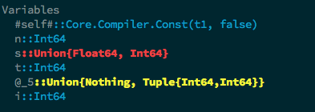
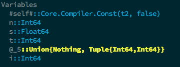
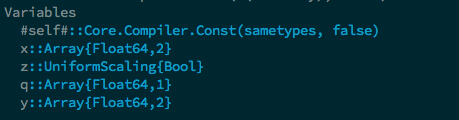
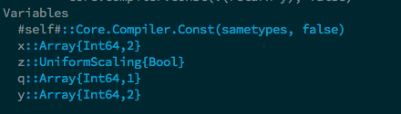

exclude: true

```{r setup}
if (!require("pacman")) install.packages("pacman")
pacman::p_load(
  xaringanExtra, JuliaCall
)
options(htmltools.dir.version = FALSE)
library(knitr)
opts_chunk$set(
  prompt = T, ## See hook below. I basically want a "$" prompt for every bash command in this lecture.
  fig.align = "center", fig.width=10, fig.height=6, 
  out.width="748px", out.length="520.75px",
  dpi = 300, #fig.path='Figs/',
  cache = F#, echo=F, warning=F, message=F
  )
## Next hook based on this SO answer: https://stackoverflow.com/a/39025054
knit_hooks$set(
  prompt = function(before, options, envir) {
    options(
      prompt = if (options$engine %in% c('sh','bash')) '$ ' else ' ',
      continue = if (options$engine %in% c('sh','bash')) '$ ' else ' '
      )
})
julia_setup(JULIA_HOME = "/Users/ir229/.juliaup/bin")
```

---

# Software and stuff

Necessary things to do:

- Install [VSCode](http://code.visualstudio.com) with these extensions: `Julia, Git Graph, Project Manager`

- Windows users: Install [Windows Subsystem for Linux](https://docs.microsoft.com/en-us/windows/wsl/install-win10) and a Unix distribution or use https://repl.it

- Install [Julia](https://julialang.org/downloads/) with these Julia packages: `Expectations, Distributions, LinearAlgebra, BenchmarkTools`
    - Or use homebrew/other package manager

---

class: inverse, center, middle
name: vscode

# Visual Studio Code

<html><div style='float:left'></div><hr color='#EB811B' size=1px width=796px></html>

---

# VSCode

- Extensions
- Terminal/command line
- Julia (interactive)
- Project manager
- Git

---

class: inverse, center, middle
name: shell

# The shell

<html><div style='float:left'></div><hr color='#EB811B' size=1px width=796px></html>


---

# Why learn the shell?

What is the shell?

The shell is the interface for interacting with your operating system,
typically we are referring to the command line interface (terminal, command prompt, bash, etc)

--

A lot of what you can do in the shell can be done in Julia itself, why bother with it?

---

# Why learn the shell?

Not everything can be done directily in your usual programming language

--

Command line is fast, powerful, and relatively easy to use,
especially with modern shells like zsh or fish

--

Writing shell scripts is reproducible and fast, unlike clicking buttons on a GUI

--

If you want to use servers or any high performance computing you are likely to need to use shell

---

# Why learn the shell?

You can automate your entire research pipeline with shell scripts (e.g. write something that calls multiple languages to execute your code then compiles your latex for the paper)

--

It really gets to the fundamentals of interacting with a computer (loops, tab-completions, saving scripts, etc)

--

It gets you understanding how to write code in terms of functions which will be important for any programming you do in scripting languages like Julia, R, MATLAB, or Stata

---

# What is the shell?

The shell is basically just a program where you can
type in commands to interact with the **kernel** and hardware

<div align="center">
  
</div>

---

# What is the shell?

The most common one is .hi[bash], Bourne again shell, because it comes default on Linux and old Macs

--

I use .hi[fish], friendly interactive shell, because it comes default with a lot of nice features,
all the commands still work identically to bash

---

# Shell basics

When you open up the shell you should see a prompt, usually starting with `$ ` (don't type this)
```{bash}

```

---

# Shell basics

We can type in one .hi[command], `ls` which lists the contents of your current directory

--

```{bash}
ls
```

My current directory is the one for this set of slides

---

# Shell basics

Commands come with potential .hi[options] or .hi[flags] that modify how they act
```{bash}
ls
```
```{bash}
ls -l # long form command
```

---

# Shell basics

Options start with a dash and then a sequence of letters denoting which options you want

e.g. this lists files in long form `l`, sorted descending by size (`S`), with sizes in a human-readable format (`h`)

```{bash}
ls -lSh
```

---

# Shell basics

Finally commands have an .hi[argument] that the command operates on

--

The previous `ls` calls were operating on the current directory,  
but we could use it on any directory we want

--

```{bash}
ls -lSh ~/Desktop/git
```

---

# Shell basics

To see what commands and their options do, use the `man` (manual) command

`q` exits the man page, and spacebar lets you skip down by a page
```{bash}
man ls
```

---

# Shell basics

Pressing `h` within a man page brings up the help page for how to navigate them

`/terms_here` lets you search within the man page for particular terms

Use `n` and `shift+n` to move forward and backward between matches

---

# Navigation

We already learned how to list the files in a particular directory, but we need a few other tools to navigate around our machine

--

We often will want to know our .hi[current working directory] so we know where we are before we start running commands

--

We do this with `pwd`

--

```{bash}
pwd
```

---

# Navigation

Directories are organized in a hierarchical structure, at the top is the root directory, `/`

```{bash}
ls /
```


---

# Navigation

The root directory contains everything else

--

Other directories are inside the root directory and come afterward in the file path separated by forward slashes `/`

```{bash}
ls -lSh /Users
```

---

# Navigation

The root directory contains everything else

Other directories are inside the root directory and come afterward in the file path separated by forward slashes `/`

```{bash}
ls -lSh /Users/ir229
```

---

# Navigation

Next we need to be able to change directories, we can do this with `cd` (change directory)

--

```{bash}
cd /Users/ir229/Desktop/git
pwd
```

--

When navigating, it is often easier and more reproducible to use .hi[relative paths]

--

This is when arguments are relative to your current working directory, instead of using absolute paths (e.g. /Users/ir229/Desktop/git)

---

# Navigation

There's a few expressions that make this possible

- `~` is your .hi[home directory]
- `.` is your current directory
- `..` is the parent directory
- `-` is the previous directory you were in

---

# Navigation

```{bash}
cd ~ # move to home directory (will vary computer-to-computer)
pwd
cd - # move to previous directory (lecture notes 2 directory)
cd .. # move to parent directory (general lecture notes directory)
pwd
cd . # move to current directory (nothing changes)
pwd
```

--

You can see `.` and `..` in your current directory when using `ls` with the `a` flag
```{bash}
ls -a
```
---

# Navigation

This makes navigation much easier

If we wanted to move from the current directory to the parent directory for this year's course we can just do

--

```{bash}
pwd
cd ../..
pwd
```

--

instead of
```{bash}
cd /Users/ir229/Desktop/git/aem7130
pwd
```

---

# Navigation

Relative paths are very important for reproducible code

--

Your directory structure starting at root `/` will not be the same as someone else's

--

Using relative paths lets you circumvent this as long as the project's directory structure is consistent 

--

If you use Git or Dropbox it should be

---

# Creating files and directories

We learned how to move around directories but how do we make them?

--

We do so with `mkdir` (make directory)

--

```{bash}
mkdir test_directory
ls
```

---

# Creating files and directories

We create blank files using `touch`

--

```{bash}
touch test_directory/test.txt test_directory/test1.txt
ls test_directory
```

`touch` is useful if you have a program that can't create a file itself but can edit them

---

# Creating files and directories

If you have a Unix system pre-installed with nano
you can use `nano` to create and edit the file
```{bash, eval = F}
nano test_directory/test.txt
```

---

# Creating files and directories

Here are some tips for naming files and directories

--

1. .hi-red[DON'T USE SPACES]
    - Spaces are used to separate commands, you generally want to avoid them in names in favor of underscores or dashes
2. Use letters, numbers, underscores, periods, and dashes only

---

# Creating files and directories

If you really, really, want to use spaces in names you'll have to do one of two things, enclose in quotes or backslash the space

--

```{bash}
mkdir "123test directory"
ls
```

---

# Creating files and directories

If you really, really, want to use spaces in names you'll have to do one of two things, enclose in quotes or backslash the space

```{bash}
mkdir 123test\ directory\ 2
ls
```

```{bash, echo = F}
rm -R "123test directory"
rm -R 123test\ directory\ 2
ls
```

---

# Moving files and directories

We can move files and directories with `mv` (move)

--

```{bash, eval = F}
mv test_directory/test.txt ..
ls ..
```

The first argument is the (relative) path of the file you want to move, the second argument is where you're moving it to

---

# Moving files and directories

```{bash}
mv test_directory/test.txt ..
ls ..
```

We moved the test.txt file from  `test_directory` to the parent directory


---

# Moving files and directories

```{bash}
mv ../test.txt test_directory
ls test_directory
```

Here we moved it from the parent directory back to `test_directory`

--

Note that `mv` will overwrite any file with the move, use the `-i` option to make it ask you for confirmation

---

# Moving files and directories

`mv` can also be used to rename files by just moving them to the same directory

--

```{bash}
mv test_directory/test.txt test_directory/test_new_name.txt
ls test_directory
```
```{bash}
mv test_directory/test_new_name.txt test_directory/test.txt
ls test_directory
```
---

# Moving files and directories

Now that we've made the directory and file, how do we get rid of them? With `rm`

--

```{bash}
rm test_directory/test.txt
ls
```

---

# Moving files and directories

We remove directories with `rmdir`

--

```{bash}
rmdir test_directory
ls
```

Notice that if a directory isn't empty you can't delete it

---

# Moving files and directories

To delete a non-empty directory, you need to use `rm` on the directory, but apply the recursive option `-r` to delete everything inside of it first

--

```{bash}
rm -r test_directory
ls
```

Sometimes you might want to add the force option `-f` so it doesn't ask you if you want to delete each file

---

# Copying files and directories

To copy files and directories just use `cp`, it works similarly to `mv`

--

```{bash}
mkdir test_directory
touch test_directory/test_copy.txt
cp test_directory/test_copy.txt .
ls test_directory
```

---

# Copying files and directories


```{bash, eval = F}
mkdir test_directory
touch test_directory/test_copy.txt
cp test_directory/test_copy.txt .
ls test_directory
```
```{bash}
ls
```

```{bash, echo = F}
rm test_copy.txt
```

---

# Copying files and directories

You copy directories the same way, but if you want to copy the full file contents you need to apply the recursive option `-r`

--

```{bash}
cp -r test_directory ..
ls .. test_directory
```
```{bash}
ls ../test_directory
```

```{bash, echo = F}
rm -r ../test_directory test_directory
```

---

# Copying multiple files

How do we copy multiple files?

Let's make two directories for copying and a set of similar files

```{bash}
mkdir main_directory copy_directory
touch main_directory/file1.txt main_directory/file2.txt main_directory/file3.txt
ls main_directory
```

---

# Copying multiple files

To copy them we can just use `cp` as we did before

--

```{bash}
cp main_directory/file1.txt main_directory/file2.txt main_directory/file3.txt copy_directory
ls copy_directory
```

--

We remove them the same way with `rm`

--

```{bash}
rm main_directory/file1.txt main_directory/file2.txt main_directory/file3.txt
```

Or we could use the `mv` rename trick into a new directory named `copy_directory`

---

# Renaming multiple files

We can rename multiple files in an easier way using `rename` (`brew install rename` to install using Homebrew)

We can change all of our txt files to csvs, `-s` indicates that the first argument is to be the text we are changing, and the second argument is the text we are changing it to, the third argument is the location of the files we are renaming

---

# Renaming multiple files

```{bash}
ls copy_directory
```

```{bash}
rename -s .txt .csv copy_directory/*
ls copy_directory
```

We can change all of our txt files to csvs, `-s` indicates that the first argument is to be the text we are changing, and the second argument is the text we are changing it to, the third argument is the location of the files we are renaming

---

# Accessing multiple files

We can access multiple things at once using .hi[wildcards] `*`,
which replaces zero to any number of characters in the expression

--

```{bash}
touch copy_directory/test1.txt copy_directory/test2.txt copy_directory/test3.txt copy_directory/test123.txt
ls copy_directory/* # return everything in copy_directory
```

```{bash, echo = F}
rm -r copy_directory main_directory
```

---

# Word count

The shell really shines when you try to combine multiple commands into one

Lets play around with the `sandbox` directory and count the number of words in `animals.txt` using `wc`


---

# Word count

```{bash}
ls sandbox
wc sandbox/animals.txt
```

The first number is the number of lines, the second is the number of words, and the third is the number of characters

---

# Word count

We can run this using the wildcard for all text files and also get the totals

```{bash}
wc sandbox/*.txt
```

---

# Redirecting

Now suppose we had 1 million files and wanted to find the one with the most words? Just printing to the screen doesn't work, we'd want to save the output and use it somewhere else, we can do that by .hi[redirecting] with the greater than symbol `>`

--

```{bash}
wc -w sandbox/*.txt > sandbox/lengths.txt
ls sandbox
```

---

# Printing and cating

We can print the file to the screen using `cat` (print the full file) or `less` (one screenful)

--

```{bash}
cat sandbox/lengths.txt
```

The `w` option made it so we only got the number of words, not characters or lines

---

# Sorting

If we want to return the output sorted we can use `sort`

--

```{bash}
sort -n sandbox/lengths.txt
```

where the `n` option means to sort numerically

---

# Sorting

We can look at only the first few lines using `head`, (`tail` gets the last lines)

--

```{bash}
head -n 1 sandbox/lengths.txt
```

Where the 1 means we only want the first line

---

# Redirecting

`>` will always overwrite a file, we can use the double greater than symbol `>>` to append to a file

--

Lets use `echo` for an example which prints text

--

```{bash}
echo Hello world!
```

```{bash}
echo \ walnut >> sandbox/trees.txt
cat sandbox/trees.txt
```

---

# Piping

We've learned a few options for manipulating text files, we can combine them in easy ways using .hi[piping] (same idea as Julia's queryverse and R's tidyverse)

--

Pipes `|` allow you sequentially write out commands that use the previous command's output as the next command's input

---

# Piping

Suppose we wanted to find the file in a directory with the most number of characters, we could do this with

--

```{bash}
wc -m sandbox/* | sort -n | tail -n 2
```

`lucy_in_the_sky.txt` is the longest in the sandbox directory

---

# Piping

Look at the file `sandbox/hey_jude.txt`, how would we get the second verse?

--

We can pipe a `head` and `tail` together:

--

```{bash}
head -n 9 sandbox/hey_jude.txt | tail -n 4
```

`head` grabs the first two verses (with the empty line inbetween),  
`tail` grabs second verse

---

# Looping example 1

What if we wanted the second verse of *multiple songs*?

--

We can do that with a loop

--

```{bash, eval = F}
for thing in list
do
    operation_using $thing    # Indentation is good style
done
```

`$` preprends any variables, here the variables are the things we're looping over

---

# Looping example 1

```{bash}
for song in sandbox/hey_jude.txt sandbox/lucy_in_the_sky.txt
do
    head -n 9 $song | tail -n 4
done
```

---

# Looping example 2

How about a more realistic one that is real world useful (taken from [Grant Mcdermott](https://raw.githack.com/uo-ec607/lectures/master/03-shell/03-shell.html#109))

--

Let's combine a bunch of csvs using the shell

This is particularly useful with many or large datasets, because when done through shell, you do not need to load them into memory

--

The files are in `/sandbox/classes` and report a fake class schedule

Let's combine them into one

---

# Looping example 2

First we need to make our class schedule file

--

```{bash}
touch sandbox/classes/class_schedule.csv
```

--

Then we need to add each day's schedule to the file

--

```{bash}
for day in $(ls sandbox/classes/*day.csv)
do
    cat $day >> sandbox/classes/class_schedule.csv
done
```

where we treat what `ls` returns as a variable since its the output of a command

---

# Looping example 2

```{bash}
cat sandbox/classes/class_schedule.csv
```

--

Looks like it worked but we have the header every other line, how do we get rid of it?

---

# Looping example 2

.hi[Hint:] we only need the header once, and then we want the last line of the csv for each file

--

First lets remove the old file

--

```{bash}
rm -f sandbox/classes/class_schedule.csv
```

--

Next create the new file by grabbing the header from Monday

--

```{bash}
head -1 sandbox/classes/monday.csv > sandbox/classes/class_schedule.csv
cat sandbox/classes/class_schedule.csv
```

---

# Looping example 2

So we've got the file started, now we need to fill in the days using our looping skills

--

We need to add each day's schedule to the file

--

```{bash}
for day in $(ls sandbox/classes/*day.csv)
do
    tail -1 $day | cat >> sandbox/classes/class_schedule.csv
done
cat sandbox/classes/class_schedule.csv
```


```{bash, echo = F}
rm -f sandbox/classes/class_schedule.csv
```

---

# Finding things

How can we find things within files?

--

We use the command `grep` (global/regular expression/print)

--

`grep` finds and prints lines that match a certain pattern

For example, lets find the lines in Hey Jude that contain "make"

--

```{bash}
grep make sandbox/hey_jude.txt
```

---

# Finding things

```{bash, eval = F}
grep make sandbox/hey_jude.txt
```

Here `make` is the pattern we are searching for inside Hey Jude


---

# Finding things

Now lets search Lucy in the Sky for "in"

--

```{bash}
grep in sandbox/lucy_in_the_sky.txt | head -5
```

--

This gave us words that contained "in" but weren't actually the word "in"

---

# Finding things

We can restrict the search to words with the `w` option

--

```{bash}
grep -w in sandbox/lucy_in_the_sky.txt | head -5
```

---

# Grepping

`grep`s real power comes from using .hi[regular expressions]

These are complex expressions that allow you to search for very specific things

--

For example, lets find lines with "a" as the second letter

--

```{bash}
grep -E "^.a" sandbox/lucy_in_the_sky.txt | head -5
```

---

# Finding things

`grep` shows up in most programming languages as well

You can imagine using it to do things like dynamically renaming a set of variables, dealing with weirdly reported FIPS codes, etc

---

# Shell scripts

A nice thing about shell that's pretty underused by economists is putting the commands into scripts so we can re-use them

--

```{bash}
# writing a shell script using echo is kind of silly
# but I want to show you what I'm doing on the slides
touch sandbox/shell_script.sh
echo echo "Hello World!" >> sandbox/shell_script.sh
cat sandbox/shell_script.sh
```

We can the execute it using bash
```{bash}
bash sandbox/shell_script.sh
```

---

class: inverse, center, middle
name: julia

# Julia

<html><div style='float:left'></div><hr color='#EB811B' size=1px width=796px></html>


---

# Why am I doing this to you?

Why are we using Julia?

1. It's a high-level language, much easier to use than C++, Fortran, etc
2. It delivers C++ and Fortran speed

<div align="center">
  
</div>

---

# Intro to programming

### Programming $\equiv$ writing a set of instructions

1. There are hard and fast rules you can't break if you want it to work
2. There are elements of style (e.g. Strunk and White) that make for clearer and more efficient code


---

# Intro to programming

If you will be doing computational work there are:

1. Language-independent coding basics you should know
    - Arrays are stored in memory in particular ways
2. Language-independent best practices you should use
    - Indent to convey program structure (or function in Python)
3. Language-dependent idiosyncracies that matter for function, speed, etc
    - Julia: type stability; R: vectorize

---

# Intro to programming

Learning these early will:

1. Make coding a lot easier
--

2. Reduce total programmer time
--

3. Reduce total computer time
--

4. Make your code understandable by someone else or your future self
--

5. Make your code flexible

---

# A broad view of programming

Your goal is to make a **program**

A program is made of different components and sub-components

--

The most basic component is a **statement**, more commonly called a **line of code**


---

# A broad view of programming

Here's pseudoprogram:
```julia
*deck = ["4 of hearts", "King of clubs", "Ace of spades"]
shuffled_deck = shuffle(deck)
first_card = shuffled_deck[1]
println("The first drawn card was " * shuffled_deck ".")
```

This program is real simple:

1. Create a deck of cards

---

# A broad view of programming

Here's pseudoprogram:
```julia
deck = ["4 of hearts", "King of clubs", "Ace of spades"]
*shuffled_deck = shuffle(deck)
first_card = shuffled_deck[1]
println("The first drawn card was " * shuffled_deck ".")
```

This program is real simple:

1. Create a deck of cards
2. Shuffle the deck

---

# A broad view of programming

Here's pseudoprogram:
```julia
deck = ["4 of hearts", "King of clubs", "Ace of spades"]
shuffled_deck = shuffle(deck)
*first_card = shuffled_deck[1]
println("The first drawn card was " * shuffled_deck ".")
```

This program is real simple:

1. Create a deck of cards
2. Shuffle the deck
3. Draw the top card

---

# A broad view of programming

Here's pseudoprogram:
```julia
deck = ["4 of hearts", "King of clubs", "Ace of spades"]
shuffled_deck = shuffle(deck)
first_card = shuffled_deck[1]
*println("The first drawn card was " * shuffled_deck ".")
```

This program is real simple:

1. Create a deck of cards
2. Shuffle the deck
3. Draw the top card
4. Print it

---

# A broad view of programming

```julia
deck = ["4 of hearts", "King of clubs", "Ace of spades"]
shuffled_deck = shuffle(deck)
first_card = shuffled_deck[1]
println("The first drawn card was " * shuffled_deck ".")
```

What are the parentheses and why are they different from square brackets?

How does shuffle work?

What’s println?

It’s important to know that a good program has understandable code

---

# Julia specifics

We will discuss coding in the context of Julia
but a lot of this ports to Python, MATLAB, etc

To do:

1. Types
2. Operators
3. Scope
4. Generic functions
5. Multiple dispatch

---

# Types

All languages have some kind of **data types** like integers or arrays

--

The first type you will often use is a boolean (`Bool`) variable that takes on a value of `true` or `false`:
```{julia}
x = true
typeof(x)
```

---

# Types

We can save the boolean value of actual statements in variables this way:
```{julia}
@show y = 1 > 2
```

`@show` is a Julia macro for showing the operation

---

# Numbers

Two other data types you will use frequently are integers
```{julia}
typeof(1)
```

--

and floating point numbers
```{julia}
typeof(1.0)
```

--

Recall from lecture 1 the 64 means 64 bits of storage for the number, which is probably the default on your machine

---

# Numbers

You can always instantiate alternative floating point number types

```{julia}
converted_int = convert(Float32, 1.0);
typeof(converted_int)
```

---

# Numbers

### Math works like you would expect:
```{julia}
a = 2; b = 1.0;
a * b
```

--

```{julia}
a^2
```

---

# Numbers

```{julia}
2a - 4b
```

--

```{julia}
@show 4a + 3b^2
```

--

You dont need `*` inbetween numeric literals (numbers) and variables

---

# Strings

Strings store sequences of characters

--

You implement them with double quotations:

```{julia}
x = "Hello World!";
typeof(x)
```

--

Note that `;` suppresses output for that line of code but is unnecessary in Julia

---

# Strings

It's easy to work with strings, use `$` to interpolate a variable/expression
```{julia}
x = 10; y = 20; println("x + y =  $(x+y).")
```

--

Use `*` to concatenate strings
```{julia}
a = "Aww"; b = "Yeah!!!"; println(a * " " * b)
```

--

You probably won't use strings too often unless you're working with text data or printing output

---

# Containers

Containers are types that store collections of data

--

The most basic container is the `Array` which is denoted by square brackets

--


```{julia}
a1 = [1 2; 3 4]; typeof(a1)
```

--

Arrays are **mutable** which means you can change their values

--

```{julia}
a1[1,1] = 5; a1
```

You reference elements in a container with square brackets

---

# Containers

An alternative to the `Array` is the `Tuple` which is denoted by parentheses

--

```{julia}
a2 = (1, 2, 3, 4); typeof(a2)
```
`a2` is a `Tuple` of 4 `Int64`s, tuples have no dimension

---

# Containers

Tuples are **immutable** which means you **can't** change their values
```{julia}
try
  a2[1,1] = 5;
catch
  println("Error, can't change value of a tuple.")
end
```

---

# Containers

Tuples don't need parentheses (but it's probably best practice for clarity)
```{julia}
a3 = 5, 6; typeof(a3)
```

---

# Containers

Tuples can be **unpacked** (see [`NamedTuple`](https://docs.julialang.org/en/v1/manual/types/#Named-Tuple-Types-1) for an alternative and more efficient container)

--

```{julia}
a3_x, a3_y = a3;
a3_x
a3_y
```

--

This is basically how functions return output when you call them

---

# Containers

A `Dictionary` is the last main container type,
they are arrays but are indexed by keys (names) instead of numbers

--

```{julia}
d1 = Dict("class" => "AEM7130", "grade" => 97);
typeof(d1)
```

--

`d1` is a dictionary where the key are strings and the values are any kind of type

---

# Containers

Reference specific values you want in the dictionary by referencing the key

--

```{julia}
d1["class"]
d1["grade"]
```

---

# Containers

If you just want all the keys or all the values you can use the base functions

--

```{julia}
keys_d1 = keys(d1)
values_d1 = values(d1)
```

---

# Iterating

As in other languages we have loops at our disposal:

`for` loops iterate over containers
```{julia}
for count in 1:10
  random_number = rand()
  if random_number > 0.2
    println("We drew a $random_number.")
  end
end
```

---

# Iterating

`while` loops iterate until a logical expression is false
```{julia}
while rand() > 0.5
  random_number = rand()
  if random_number > 0.2
    println("We drew a $random_number.")
  end
end
```

---

# Iterating

An `Iterable` is something you can loop over, like arrays

--

```{julia}
actions = ["codes well", "skips class"];
for action in actions
    println("Charlie $action")
end
```

---

# Iterating

There's a type that's a subset of iterables, `Iterator`, that are particularly convenient

--

These include things like the dictionary keys:
```{julia}
for key in keys(d1)
  println(d1[key])
end
```

---

# Iterating

Iterating on `Iterator`s is more memory efficient than iterating on arrays

--

Here's a **very** simple example, the top function iterates on an `Array`, the bottom function iterates on an `Iterator`:

--

```{julia}
function show_array_speed()
  m = 1
  for i = [1, 2, 3, 4, 5, 6]
    m = m*i
  end
end;

function show_iterator_speed()
  m = 1
  for i = 1:6
    m = m*i
  end
end;
```

---

# Iterating


```{julia}
using BenchmarkTools
@btime show_array_speed()
@btime show_iterator_speed()
```

The `Iterator` approach is faster and allocates no memory

`@btime` is a macro from `BenchmarkTools` that shows you the elasped time and memory allocation

---

# Neat looping

The nice thing about Julia vs MATLAB is your loops can be much neater since you don't need to index if you just want the container elements

--

```{julia}
f(x) = x^2;
x_values = 0:20:100;
for x in x_values
  println(f(x))
end
```

---

# Neat looping

The loop directly assigns the elements of `x_values` to `x` instead of having to do something clumsy like `x_values[i]`

--

`0:20:100` creates something called a `StepRange` (a type of `Iterator`) which starts at `0`, steps up by `20` and ends at `100`


---

# Neat looping

You can also pull out an index and the element value by enumerating

```{julia}
f(x) = x^2;
x_values = 0:20:100;
for (index, x) in enumerate(x_values)
  println("f(x) at value $index is $(f(x)).")
end
```

`enumerate` basically assigns an index vector

---

# Neat looping

There is also a lot of Python-esque functionality

--

For example: `zip` lets you loop over multiple different iterables at once

--

```{julia}
last_name = ("Lincoln", "Bond", "Walras");
first_name = ("Abraham", "James", "Leon");

for (first_idx, last_idx) in zip(first_name, last_name)
  println("The name's $last_idx, $first_idx $last_idx.")
end
```

---

# Neat looping

Nested loops can also be made very neatly

--

```{julia}
for x in 1:3, y in 3:-1:1
  println(y-x)
end
```

--

The first loop is the inner loop, the second loop is the outer loop

---

# Comprehensions: the neatest looping

Comprehensions are super nice ways to use iterables that make your code cleaner and more compact

--

```{julia}
squared = [y^2 for y in 1:2:11]
```

--

This created a 1-dimension `Array` using one line

---

# Comprehensions: the neatest looping

We can also use nested loops for comprehensions

--

```{julia}
squared_2 = [(y+z)^2 for y in 1:2:11, z in 1:6]
```

--

This created a 2-dimensional `Array`

--

Use this (and the compact nested loop) sparingly since it's hard to follow

---

# Dot syntax: broadcasting/vectorization

Vectorizing operations (e.g. applying it to a whole array or vector at once) is easy in Julia, just use dot syntax like you would in MATLAB, etc

--

```{julia}
g(x) = x^2;
squared_2 = g.(1:2:11)
```

--

This is actually called **broadcasting**

--

When broadcasting, you might want to consider **pre-allocating** arrays

---

# Dot syntax: broadcasting/vectorization

Vectorization creates *temporary allocations*, temporary arrays in the middle of the process that aren't actually needed for the final product

Julia can do broadcasting in a nicer, faster way by .hi[fusing] operations together and avoiding these temporary allocations

---

# Dot syntax: broadcasting/vectorization

Let's write two functions that do the same thing:

```{julia, results = 'hide'}
function show_vec_speed(x)
  out = [3x.^2 + 4x + 7x.^3 for i = 1:1]
end
function show_fuse_speed(x)
  out = @. [3x.^2 + 4x + 7x.^3 for i = 1:1]
end
```

The top one is vectorized for the operations, the `@.` in the bottom one vectorizes everything in one swoop: the function call, the operation, and the assignment to a variable

---

# Dot syntax: broadcasting/vectorization

First, precompile the functions

```{julia}
x = rand(10^6);
@time show_vec_speed(x);
@time show_fuse_speed(x);
```

```{julia}
@time show_vec_speed(x)
@time show_fuse_speed(x)
```

Full vectorization using `@.` is 10x faster with 1/6 of the memory allocation

---

# Dot syntax: vectorization

Not pre-allocated:

```{julia, results = 'hide'}
h(y,z) = y^2 + sin(z);   # function to evaluate
y = 1:2:1e6+1;           # input y
z = rand(length(y));     # input z
```

---

# Dot syntax

Here we are vectorizing the function call

```{julia, results = 'hide'}
# precompile h so first timer isn't picking up on compile time
h(1,2)
```
```{julia}
@time out_1 = h.(y,z)    # evaluate h.(y,z) and time
```

---
# Dot syntax: vectorization

Here we are vectorizing the function call and assignment

```{julia, results = 'hide'}
out_2 = similar(out_1)
```
```{julia}
@time out_2 .= h.(y,z)
```

---
# Dot syntax: vectorization

Here we are vectorizing the function call, assignment, and operations

```{julia, results = 'hide'}
out_3 = similar(out_1)
```
```{julia}
@time out_3 = @. h(y,z)
```

---
# Logical operators work like you'd think

- `==` (equal equal) tests for equality

--

```{julia}
1 == 1
```

--

- `!=` (exclaimation point equal) tests for inequality

--

```{julia}
2 != 2
```

--

- You can also test for approximate equality with $\approx$ (type `\approx<TAB>`)

--

```{julia}
1.00000001 ≈ 1
```

---

# Scope


The .hi[scope] of a variable name determines when it is valid to refer to it

--

Scope can be a frustrating concept

--

If you want to dive into the details: the type of scoping in Julia is called **lexical scoping**

--

Different scopes can have the same name, i.e. `saving_rate`, but be assigned to different variables

--

Let's walk through some simple examples to see how it works

---

# Scope

First, functions have their own local scope

--

```{julia}
ff(xx) = xx^2;
yy = 5;
ff(yy)
```

`xx` isn't bound to any values outside the function `ff`

This is pretty natural for those of you who have done any programming before

---
# Scope

Locally scoped functions allow us to do things like:

```{julia}
xx = 10;
fff(xx) = xx^2;
fff(5)
```

Although `xx` was declared equal to 10, the function still evaluated at 5

--

This is all kind of obvious so far

---

# Scope

But, this type of scoping also has (initially) counterintuitive results like:

```{julia}
zz = 0;
for ii = 1:10
  zz = ii
end
println("zz = $zz")
```

---

# Scope

What happened?

--

The `zz` outside the for loop has a different scope,
the .hi[global scope], than the `zz` inside it

--

The global scope is the outer most scope, outside all functions and loops

--

The `zz` inside the for loop has a scope .hi[local] to the loop

--

Since the outside `zz` has global scope the locally scoped variables in the loop can't change it

---

# Scope

Generally you want to avoid global scope because it can cause conflicts, slowness, etc, but you can use `global` to force it if you want something to have global scope

```{julia}
zz = 0;
for ii = 1:10
  global zz
  zz = ii
end
println("zz = $zz")
```

---

# Scope

Local scope kicks in whenever you have a new block keyword (i.e. you indented something) except for `if`

Global variables inside a local scope are inherted for .hi[reading], not writing

```{julia}
x, y = 1, 2;
function foo()
  x = 2        # assignment introduces a new local
  return x + y # y refers to the global
end;
foo()
x
```


---

# Scope

Important piece: nested functions can modify their parent scope's .hi[local] variables

--

```{julia, results = 'hide'}
x, y = 1, 2; # set globals

function f_outer()
  x = 2                # introduces a new local
  function f_inner()
    x = 10             # modifies the parent's x
    return x + y       # y is global
  end
  return f_inner() + x # 12 + 10 (x is modified in call of f_inner())
end;
f_outer()
x, y                   # verify that global x and y are unchanged
```

---

# Scope

```{julia}
function f_outer()
  x = 2                # introduces a new local
  function f_inner()
    x = 10             # modifies the parent's x
    return x + y       # y is global
  end
  return f_inner() + x # 12 + 10 (x is modified in call of f_inner())
end;
f_outer()
x, y                   # verify that global x and y are unchanged
```

---

# Scope

```{julia, eval = FALSE}
function f_outer()
  x = 2                # introduces a new local
  function f_inner()
    x = 10             # modifies the parent's x
    return x + y       # y is global
  end
  return f_inner() + x # 12 + 10 (x is modified in call of f_inner())
end;
f_outer()
x, y                   # verify that global x and y are unchanged
```

--

If `f_inner` was not nested and was in the global scope we'd get `14` not `22`, this is also a way to handle the issue with loops editing variables not created in their local scope

---

# Scope

We can fix looping issues with global scope by using a wrapper function that doesn't do anything but change the parent scope so it is not global

```{julia}
function wrapper()
  zzz = 0;
  for iii = 1:10
    zzz = iii
  end
  println("zzz = $zzz")
end
wrapper()
```

---

# Closures

These inner functions we've been looking at are called .hi[closures]

When a function `f` is parsed in Julia, it looks to see if any of the variables have been previously defined in the current scope

```{julia}
a = 0.2;
f(x) = a * x^2;    # refers to the `a` in the outer scope
f(1)               # univariate function
```

---

# Closures

```{julia}
function g(a)
    f(x) = a * x^2; # refers to the `a` passed in the function
    f(1);           # univariate function
end
g(0.2)
```

--

In both of these examples `f` is a closure designed to .hi[capture] a variable from an outer scope

---

# Closures

Here's a complicated example that actually returns a closure (a function!) itself:

---

# Closures

```{julia}
x = 0;
function toplevel(y)
  println("x = ", x, " is a global variable")
  println("y = ", y, " is a parameter")
  z = 2
  println("z = ", z, " is a local variable")

  function closure(v)
    println("v = ", v, " is a parameter")
    w = 3
    println("w = ", w, " is a local variable")
    println("x = ", x, " is a global variable")
    println("y = ", y, " is a closed variable (a parameter of the outer function)")
    println("z = ", z, " is a closed variable (a local of the outer function)")
  end;
  return closure
end;
```
What will be returned when we call these functions?

---

# Closures

Here's a complicated example:

```{julia}
c_func = toplevel(10)
c_func(20)
```

The returned closure still has access to the outer function's local scope!


---

# Generic functions

If you use Julia to write code for research you should aim to write .hi[generic functions]

--

These are functions that are flexible (e.g. can deal with someone using an `Int` instead of a `Float`)
and have high performance (e.g. comparable speed to C)

--

Functions are made generic by paying attention to types and making sure types are .hi[stable]


---

# Generic functions

.hi[Type stability:] Given an input into a function, operations on that input should maintain the type so Julia **knows** what its type will be throughout the full function call

--

This allows it to compile type-specialized versions of the functions, which will yield higher performance

--

The question you might have is: Type stability sounds like mandating types (e.g. what C and Fortran do, not what R/Python/etc do), so how do we make it flexible?

--

We'll see next

---

# These two functions look the same, but are they?

```{julia, results = 'hide'}
function t1(n)
  s = 0
  t = 1
  for i in 1:n
     s += s/i
     t = div(t, i)
  end
  return t
end
```
```{julia, results = 'hide'}
function t2(n)
  s  = 0.0
  t = 1
  for i in 1:n
     s += s/i
     t = div(t, i)
  end
  return t
end
```

---

# No! t1 is not type stable

--

`t1` starts with `s` as an `Int64` but then we have `s += s/i` which will mean it must hold a `Float64`

--

It must be converted to `Float` so it is not type stable

---

# No! t1 is not type stable

We can see this when calling the macro `@code_warntype` where it reports `t1` at some point handles `s` that has type `Union{Float64,Int64}`, either `Float64` or `Int64`

Julia now can't assume `s`'s type and produce pure integer or floating point code $\rightarrow$ performance degradation

<div align="center">
  
  
</div>

---

# THIS MATTERS

2x difference between two simple functions
```{julia, results = 'hide'}
# Type instable
function type_unstable()
  x = 1
  for i = 1:1e6
    x = x/2
  end
  return x
end
# Type stable
function type_stable()
  x = 1.0
  for i = 1:1e6
    x = x/2
  end
  return x
end
```

---

# THIS MATTERS

2x difference between two simple functions

```{julia}
@time type_unstable()
@time type_stable()
```

---

# Concrete vs abstract types

A **concrete type** is one that can be instantiated (`Float64` `Bool` `Int32`)

--

An **abstract type** cannot (`Real`, `Number`, `Any`)

---

# Concrete vs abstract types

Abstract types are for organizing the types

You can check where types are in the hierarchy

```{julia}
@show Float64 <: Real
@show Array <: Real
```

---

# Concrete vs abstract types

You can see the type hierarchy with the supertypes and subtypes commands

```{julia}
using Base: show_supertypes
show_supertypes(Float64)
```

---

# Creating new types

We can actually create new composite types using `struct`

--

```{julia}
struct FoobarNoType # This will be immutable by default
  a
  b
  c
end
```

---

# Creating new types

This creates a new type called `FoobarNoType`, and we can generate a variable of this type using its **constructor** which will have the same name

--

```{julia}
newfoo = FoobarNoType(1.3, 2, "plzzz");
typeof(newfoo)
newfoo.a
```

--

.hi-red[You should always declare types for the fields of a new composite type]

---

# Creating new types

You can declare types with the double colon


```{julia}
struct FoobarType # This will be immutable by default
  a::Float64
  b::Int
  c::String
end
```

---

# Creating new types

```{julia}
newfoo_typed = FoobarType(1.3, 2, "plzzz");
typeof(newfoo_typed)
newfoo.a
```

This lets the compiler generate efficient code because it knows the types of the fields when you construct a `FoobarType`

---

# Parametric types are what help deliver flexibility

We can create types that hold different types of fields
by declaring subsets of abstract types

```{julia}
struct FooParam{t1 <: Real, t2 <: Real, t3 <: AbstractArray{<:Real}}
  a::t1
  b::t2
  c::t3
end
newfoo_para = FooParam(1.0, 7, [1., 4., 6.])
```

--

The curly brackets declare all the different type subsets we will use in `FooParam`

--

This actually delivers high performance code!

---

# Delivering flexibility

We want to make sure types are stable but code is flexible

Ex: if want to preallocate an array to store data,
how do we know how to declare it's type?

--

We don't need to

---

# Delivering flexibility

```{julia}
using LinearAlgebra               # necessary for I
function sametypes(x)
  y = similar(x)                  # creates an array that is `similar` to x, use this for preallocating
  z = I                           # creates a scalable identity matrix
  q = ones(eltype(x), length(x))  # one is a type generic array of ones, fill creates the array of length(x)
  y .= z * x + q
  return y
end

x = [5.5, 7.0, 3.1];
y = [7, 8, 9];
```

---

# Delivering flexibility

We did not declare any types but the function is type stable


```{julia, results = 'hide'}
sametypes(x)
sametypes(y)
```

<div align="center">
  
  
</div>

--

There's a lot of other functions out there that help with writing flexible, type stable code

---

# Multiple dispatch

.hi-red[Why type stability really matters: multiple dispatch]

Neat thing about Julia: the same function name can perform different operations depending on the underlying type of the inputs

A function specifies different **methods**, each of which operates on a specific set of types

---

# Multiple dispatch

When you write a function that's type stable, you are actually writing many different methods, each of which are optimized for certain types

--

If your function isn't type stable, the optimized method may not be used

This is why Julia can achieve C speeds: it compiles to C (or faster) code

---

# Multiple dispatch

`/` has 103 different methods depending on the input types, these are 103 specialized sets of codes

```{julia}
methods(/)
```


---

# Coding practices etc

See [JuliaPraxis](https://github.com/JuliaPraxis) for best practices for naming, spacing, comments, etc
