exclude: true
```{r setup}
if (!require("pacman")) install.packages("pacman")
pacman::p_load(
  xaringanExtra, JuliaCall
)
options(htmltools.dir.version = FALSE)
library(knitr)
opts_chunk$set(
  prompt = T, ## See hook below. I basically want a "$" prompt for every bash command in this lecture.
  fig.align = "center", fig.width=10, fig.height=6, 
  out.width="748px", out.length="520.75px",
  dpi = 300, #fig.path='Figs/',
  cache = F#, echo=F, warning=F, message=F
  )
## Next hook based on this SO answer: https://stackoverflow.com/a/39025054
knit_hooks$set(
  prompt = function(before, options, envir) {
    options(
      prompt = if (options$engine %in% c('sh','bash')) '$ ' else ' ',
      continue = if (options$engine %in% c('sh','bash')) '$ ' else ' '
      )
})
julia_setup(JULIA_HOME = "/Applications/Julia-1.8.app/Contents/Resources/julia/bin")
```

---

# Software and stuff

Necessary things to do:

- Install the `QuantEcon` Julia package
- Install the `Optim` Julia package

---

# Optimization

All econ problems are optimization problems

--

- Min costs

--

- Max PV E[welfare]

---

# Optimization

Some are harder than others:

--

- Individual utility max: easy

--

- Decentralized electricity market with nodal pricing and market power: hard

--

- One input profit maximization problem: easy

--

- N-input profit maximization with learning and forecasts: hard

---

# Things we will do

1. Linear rootfinding
2. Non-linear rootfinding
3. Complementarity problems
4. Non-linear unconstrained maximization/minimization
5. Non-linear constrained maximization/minimization
---

# Linear rootfinding

How do we solve these?

--

Consider a simple generic problem:

$Ax = b$

--

Invert $A$

$x = A^{-1}b$

--

## THE END

---

# Non-linear rootfinding

With non-linear rootfinding problems we want to solve:

$f(x) = 0, f:\mathbb{R}\rightarrow\mathbb{R}^n$

--

What's a common rootfinding problem?

--

Can we reframe a common economic problem as rootfinding?

--

Yes!

--

Fixed point problems are rootfinding problems:

--

$g(x) = x \Rightarrow f(x) \equiv g(x) - x = 0$

---

# Basic non-linear rootfinders: Bisection method

What does the intermediate value theorem tell us?

--

If a continuous real-valued function on a given interval takes on two values $a$ and $b$, it achieves all values in the set $[a,b]$ somewhere in its domain

--

How can this motivate an algorithm to find the root of a function?

---

# Basic non-linear rootfinders: Bisection method

If we have a continuous, 1 variable function that is positive at some value and negative at another, a root must fall in between those values

--

We know a root exists by IVT, what's an efficient way to find it?

--

Continually bisect the interval!

---

# The bisection method

The bisection method works by continually bisecting the interval and only keeping the half interval with a zero until "convergence"

1. Select the midpoint of $[a,b]$, $(a+b)/2$
--

2. Zero must be in the lower or upper half
--

3. Check the sign of the midpoint, if it has the same sign as the lower bound a root must be the right subinterval
--

4. Select the midpoint of $[(a+b)/2,b]$...


.hi[Write out the code to do it]


---

# The bisection algorithm

```{julia}
function bisection(f, lower_bound, upper_bound)

    tolerance = 1e-3                                # tolerance for solution
    guess = 0.5*(upper_bound + lower_bound)         # initial guess, bisect the interval
    difference = (upper_bound - lower_bound)/2      # initialize bound difference

    while difference > tolerance                    # loop until convergence
        println("Intermediate guess of $guess.")
        difference = difference/2
        if sign(f(lower_bound)) == sign(f(guess))   # if the guess has the same sign as the lower bound
            lower_bound = guess                     # solution is in the upper half of the interval
            guess = guess + difference
        else                                        # else the solution is in the lower half of the interval
            upper_bound = guess
            guess = guess - difference
        end
        
    end
    println("The root of f(x) is at $guess.")
end
```

---

# The bisection method

```{julia}
f(x) = x^3;
bisection(f, -4, 1)
```

---

# The bisection method

```{julia}
g(x) = 3x^3 + 2x -4;
bisection(g, -6, 4)
```

---

# The bisection method

```{julia}
h(x) = cos(x);
bisection(h, -pi, pi)
```


---

# The bisection method


The bisection method is incredibly robust: if a function $f$ satisfies the IVT, it is .hi[guaranteed to converge in a specific number of iterations]

--

A root can be calculated to arbitrary precision $\epsilon$  
in a maximum of $log([b-a]/\epsilon)/log(2)$ iterations

Robustness comes with drawbacks:

--

1. It only works in one dimension
2. It is slow because it only uses information about the function's level

---

# Function iteration

Fixed points can be computed using function iteration

--

Since we can recast fixed points as rootfinding problems we can use function iteration to find roots too


---

# Function iteration

<div align="center">
  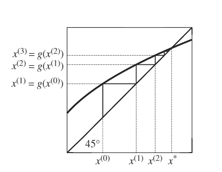
</div>

---

# Function iteration

Function iteration can be quick, but is not always guaranteed to converge

--

In general, it can be quite unstable as we will see

--

.hi[Code up a function iteration algorithm to find a fixed point of an arbitrary function f]

---

# Function iteration

Function iteration is pretty simple to implement

```{julia}
function function_iteration(f, guess)
    tolerance = 1e-2                                   # tolerance for solution
    max_it = 10                                        # maximum number of iterations
    x_old = guess                                      # initialize old x value
    x = guess                                          # initialize current x
    error = 1e10                                       # initialize error
    it = 1
    
    while abs(error) > tolerance && it < max_it
        println("Intermediate guess of $x.")
        x = f(x_old)                                   # new x = f(old x)
        error = x - x_old                              # error
        x_old = x  
        it = it + 1
    end
    println("The fixed point of f(x) is at $x.")
end;
```

---

# Function iteration

Analytic solution: 1

```{julia}
f(x) = x^(-0.5);
function_iteration(f, 2.)
```

Works!


---

# Function iteration

Analytic solution: $\sqrt{3} \approx 1.73$

```{julia}
f(x) = 3 + x - x^2;
function_iteration(f, 2.)
```

=(

---

# Function iteration

Analytic solution: $1.5$

```{julia}
f(x) = 3 - x;
function_iteration(f, 2.)
```

=(


---

# Function iteration

Analytic solution: 1 or 0

```{julia}
f(x) = x^2;
function_iteration(f, 1.01)
```

=(


---

# Function iteration

Is function iteration fundamentally flawed?
--
 Not quite

--

Some of these issues can be solved by .hi[damping]

--

Damping is where you do not do a full update of x, but a convex combination of the new value $f(x)$ and the old value $x$: $x_{new} = \alpha f(x_{old}) + (1-\alpha) x_{old}$

--

Damping improves the stability of iterative algorithms

--

Rewrite your algorithm with damping and try again

--

For some $\alpha$, you need to decrease your tolerance by a factor of $1/\alpha$ to account for how the damped error will be smaller by the same factor


---

# Function iteration

Function iteration is pretty simple to implement

```{julia}
function function_iteration_damped(f, guess)
    tolerance = 1e-4                                   # tolerance for solution
    max_it = 1000                                      # maximum number of iterations
    x_old = guess                                      # initialize old x value
    x = guess                                          # initialize current x
    error = 1e10                                       # initialize error
    it = 1
    
    while abs(error) > tolerance && it < max_it
        x = 0.1 * f(x_old) + 0.9 * x_old
        error = x - x_old                              # error
        x_old = x  
        it = it + 1
    end
    println("The fixed point of f(x) is at $x.")
end;
```

---

# Function iteration

Analytic solution: 1

```{julia}
f(x) = x^(-0.5);
function_iteration_damped(f, 2.)
```

Works!


---

# Function iteration

Analytic solution: $\sqrt{3} \approx 1.73$

```{julia}
f(x) = 3 + x - x^2;
function_iteration_damped(f, 2.)
```

Works!


---

# Function iteration

Analytic solution: $1.5$

```{julia}
f(x) = 3 - x;
function_iteration_damped(f, 2.)
```

Works!

---

# Function iteration

Analytic solution: 1 or 0

```{julia}
f(x) = x^2;
function_iteration_damped(f, 1.01)
```

=(

Function iteration does struggle with some functions even with damping

---

# Newton's method

Newton's method and variants are the workhorses of solving n-dimensional non-linear problems

--

What's the idea?

--

Take a hard non-linear problem and replace it with a sequence of linear problems

--

Under certain conditions the sequence of solutions will converge to the true solution

---

# Newton's method

Here's a graphical depiction of Newton's method:
<div align="center">
  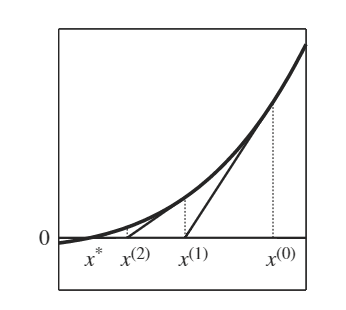
</div>


---

# Newton's method

<div style="float: right">
  
</div>

Start with an initial guess of the root at $x^{(0)}$

--

Approximate the non-linear function with its first-order Taylor expansion about $x^{(0)}$

--

This is just the tangent line at $x^0$, solve for the root of this linear approximation, call it $x^{(1)}$


---

# Newton's method

<div style="float: right">
  
</div>

Repeat starting at $x^{(1)}$ until we converge to $x^*$

--

This can be applied to a function with an arbitrary number of dimensions

---

# Newton's method

Begin with some initial guess of the root vector $\mathbf{x^{(0)}}$

--


Our new guess $\mathbf{x^{(k+1)}}$ given some arbitrary point in the algorithm, $\mathbf{x^{(k)}}$, is obtained by approximating $f(\mathbf{x})$ using a first-order Taylor expansion about $\mathbf{x^{(k)}}$ and solving for $\mathbf{x}$:
\begin{gather}
f(\mathbf{x}) \approx f(\mathbf{x^{(k)}}) + f'(\mathbf{x^{(k)}})(\mathbf{x^{(k+1)}}-\mathbf{x^{(k)}}) = 0 \notag \\
\Rightarrow \mathbf{x^{(k+1)}} = \mathbf{x^{(k)}} - \left[f'(\mathbf{x^{(k)}})\right]^{-1}f(\mathbf{x^{(k)}}) \notag
\end{gather}

---

# Newton's method

.hi[Code up a one variable Newton's method algorithm for an arbitrary function f]

--

```{julia}
function newtons_method(f, f_prime, guess)
    diff = Inf     # Initialize problem
    tol = 1e-5
    x_old = guess
    x = 1e10

    while abs(diff) > tol
        x = f(x_old) - f(x_old)/f_prime(x_old) # Root of linear approximation
        diff = x - x_old
        x_old = x
    end
    println("The root of f(x) is at $x.")
end;
```

---

# Newton's method

```{julia}
f(x) = x^3;
f_prime(x) = 3x^2;
newtons_method(f, f_prime, 1.)
```

--

```{julia}
f(x) = sin(x);
f_prime(x) = cos(x);
newtons_method(f, f_prime, pi/4)
```

---

# Newton's method

Newton's method has nice properties regarding convergence and speed:

If $f(x)$ is continuously differentiable, the initial guess is "sufficiently close" to the root, and $f(x)$ is invertible near the root, then Newton's method converges to the root

--

What is "sufficiently close"?

--

We need $f(x)$ to be invertible so the algorithm above is well defined

--

If $f'(x)$ is ill-conditioned we can run into problems with rounding error

---

# Quasi-Newton: Secant method

We usually don't want to deal with analytic derivatives unless we have access to autodifferentiation

--

Why?

--

1. Coding error / time
2. Can actually be slower to evaluate than finite differences for a nonlinear problem, see [Ken Judd's notes](http://ice.uchicago.edu/2008 presentations/Judd/Curse in Dallas.pdf)

--

Alternative: finite differences instead of analytic derivatives

--

Using our current root guess $x^{(k)}$ and our previous root guess $x^{(k-1)}$:

$f'(x^{(k)}) \approx \frac{f(x^{(k)})-f(x^{(k-1)})}{x^{(k)} - x^{(k-1)}}$

---

# Quasi-Newton: Secant method

Our new iteration rule then becomes

--

$x^{(k+1)} = x^{(k)} - \frac{x^{(k)}-x^{(k-1)}}{f(x^{(k)})-f(x^{(k-1)})}f(x^{(k)})$

--

Now we require two initial guesses so that we have an initial approximation of the derivative

---

# Quasi-Newton: Secant method

<div align="center">
  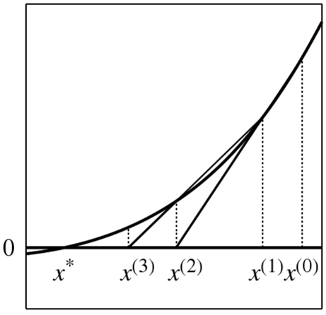
</div>

---

# Quasi-Newton: Broyden's method

Broyden's method is the most widely used rootfinding method for n-dimensional problems

--

It is a generalization of the secant method where have a sequence of guesses of the Jacobian at the root

--

We must initially provide a guess of the root, $x^{(0)}$, but also a guess of the Jacobian, $A_{(0)}$

---

# Quasi-Newton: Broyden's method

Root guess update is the same as before but with our guess of the Jacobian substituted in for the actual Jacobian or the finite difference approximation

$\mathbf{x^{(k+1)}} = \mathbf{x^{(k)}} - A_{(k)}^{-1} \, f(\mathbf{x^{(k)}}).$

--

we still need to update $A_{(k)}$: we do this update is performed by making the smallest change, in terms of the Frobenius matrix norm, that satisfies what is called the *secant condition* (under determined if $n>1$):
$f(\mathbf{x^{(k+1)}}) - f(\mathbf{x^{(k)}}) = A_{(k+1)}\left( \mathbf{x^{(k+1)}} - \mathbf{x^{(k)}} \right)$

---

# Quasi-Newton: Broyden's method

The updated differences in root guesses, and the function value at those root guesses, should align with our estimate of the Jacobian at that point

--

$$A_{(k+1)} = A_{(k)} + \\ \left[f(\mathbf{x^{(k+1)}}) - f(\mathbf{x^{(k)}}) - A_{(k+1)}\left( \mathbf{x^{(k+1)}} - \mathbf{x^{(k)}} \right)\right] \times \\ \frac{\mathbf{x^{(k+1)}} - \mathbf{x^{(k)}}}{(\mathbf{x^{(k+1)}} - \mathbf{x^{(k)}})^T(\mathbf{x^{(k+1)}} - \mathbf{x^{(k)}})}$$ 

---

# Accelerating Broyden

Why update the Jacobian and then invert when we can just update an inverted Jacobian $B = A^{-1}$

$B_{(k+1)} = B_{(k)} + \frac{[d^{(k)} - u^{(k)}]{d^{(k)}}^TB_{(k)}}{{d^{(k)}}^T u^{(k)}}$

where $d^{(k)} = (\mathbf{x^{(k+1)}} - \mathbf{x^{(k)}})$, and $u^{(k)} = B_{(k)}\left[f(\mathbf{x^{(k+1)}})-f(\mathbf{x^{(k)}})\right]$.

---

# Accelerating Broyden

Broyden converges under relatively weak conditions:

--

1. $f$ is continuously differentiable,
2. $x^{(0)}$ is close to the root of $f$
3. $f'$ is invertible around the root
4. $A_0$ is sufficiently close to the Jacobian

---

# Convergence speed

Rootfinding algorithms will converge at different speeds in terms of the number of operations

--

A sequence of iterates $x^{(k)}$ is said to converge to $x^*$ at a rate of order $p$ if there is a constant $C$ such that

$||x^{(k+1)} - x^*|| \leq C||x^{(k)} - x^*||^p$

for sufficiently large $k$

---

# Convergence speed

$||x^{(k+1)} - x^*|| \leq C||x^{(k)} - x^*||^p$

If $C < 1$ and $p = 1$, the rate of convergence is linear

If $1 < p < 2$, convergence is superlinear, and if $p = 2$ convergence is quadratic. The higher order the convergence rate, the faster it converges

---

# Convergence speed

How fast do the methods we've seen converge?

--

- Bisection: linear rate with $C = 0.5$ (kind of obvious once you see it)

--

- Function iteration: linear rate with $C = ||f'(x^*)||$

--

- Secant and Broyden: superlinear rate with $p \approx 1.62$

--

- Newton: $p = 2$

---

# Convergence speed

Convergence rates only account for the number of .hi[iterations] of the method 

The steps taken in a given iteration of each solution method may vary in computational cost 
because of differences in the number of arithmetic operations 

Although an algorithm may take more iterations to solve,  
each iteration may be solved faster and the overall algorithm takes less time

---

# Convergence speed

Ex:

- Bisection method only requires a single function evaluation during each iteration
- Function iteration only requires a single function evaluation during each iteration
- Broyden's method requires both a function evaluation and matrix multiplication
- Newton's method requires a function evaluation, a derivative evaluation, and solving a linear system

--

Bisection and function iteration are usually slow

Broyden's method can be faster than Newton's method if derivatives are costly to compute

---

# Convergence speed

Consider an example where $f(x) = x - \sqrt(x) = 0$

What does convergence look like across our main approaches in terms of the $L^1-$norm if all guesses start at $x^{(0)} = 0.5$?

<div align="center">
  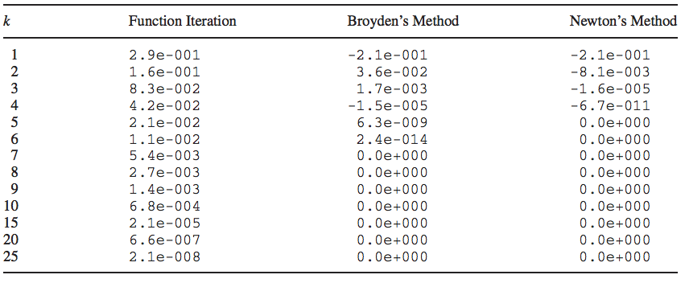
</div>


<!-- --- -->

<!-- # Complementarity problems: rootfinding -->

<!-- Let:  -->

<!-- - $x$ be an n-dimensional vector of some economic action -->
<!-- - $a_i$ denotes a lower bound on action $i$, and $b_i$ denotes the upper bound on action $i$ -->
<!-- - $f_i(x)$ denotes the marginal arbitrage profit of action $i$ -->

<!-- -- -->

<!-- There are disequilibrium profit opportunities if  -->
<!-- 1. $x_i < b_i$ and $f_i(x) > 0$ (here we can increase profits by raising $x_i$) -->
<!-- 2. $x_i > a_i$ and $f_i(x) < 0$ (we can increase profits by decreasing $x_i$) -->

<!-- --- -->

<!-- # Complementarity problems -->

<!-- We obtain a no-arbitrage equilibrium if and only if $x$ solves the complementary problem $CP(f,a,b)$ -->

<!-- -- -->

<!-- We can write out the problem as finding a vector $x \in [a,b]$ that solves -->
<!-- \begin{align} -->
<!-- 	x_i > a_i \Rightarrow f_i(x) \geq 0 \,\,\, \forall i = 1,...,n \notag\\  -->
<!-- 	x_i < b_i \Rightarrow f_i(x) \leq 0 \,\,\, \forall i = 1,...,n \notag -->
<!-- \end{align} -->

<!-- -- -->

<!-- At interior solution, the function be precisely be zero -->

<!-- Corner solution at the upper bound $b_i$ for $x_i$ $\rightarrow$ $f$ must be increasing in direction $i$ -->

<!-- The opposite is true if we are at the lower bound -->

<!-- --- -->

<!-- # Complementarity problems -->

<!-- Economic problems are complementarity problems where we are   -->
<!-- finding a root of a function (e.g. marginal profit) subject to some constraint (e.g. price floors) -->

<!-- The Karush-Kuhn-Tucker theorem shows that $x$ solves the constrained optimization problem  -->
<!-- if and only if it solves the complementarity problem -->

<!-- --- -->

<!-- # Complementarity problems -->

<!-- .hi[Example:] single commodity competitive spatial price equilibrium model -->

<!-- - $n$ regions of the world -->
<!-- - excess demand for the commodity in region $i$ is $E_i(p_i)$ -->

<!-- -- -->

<!-- If no trade $\rightarrow$ equilibrium condition is $E_i(p_i) = 0$ in all regions of the world: a simple rootfinding problem -->

<!-- -- -->

<!-- Trade between regions has marginal transportation cost between regions $i$ and $j$ of $c_{ij}$ -->

<!-- - $x_{ij}$: the amount of the good shipped from region $i$ to region $j$ -->
<!-- - capacity constraint: $b_{ij}$ -->

<!-- --- -->

<!-- # Complementarity problems -->

<!-- Marginal arbitrage profit from shipping a unit of the good from $i$ to $j$ is $p_j - p_i - c_{ij}$ -->

<!-- -- -->

<!-- If it's positive: incentive to ship more goods to region $i$ from region $j$ -->

<!-- If it's negative: incentive to decrease shipments -->

<!-- -- -->

<!-- At an equilibrium only if all the arbitrage opportunities are gone: for all region pairs $i$ and $j$ -->
<!-- \begin{gather} -->
<!-- 	0 \leq x_{ij} \leq b_{ij} \notag \\ -->
<!-- 	x_{ij} > 0 \Rightarrow p_j - p_i - c_{ij} \geq 0 \notag \\ -->
<!-- 	x_{ij} < b_{ij} \Rightarrow p_j - p_i - c_{ij} \leq 0 \notag -->
<!-- \end{gather} -->

<!-- --- -->

<!-- # Complementarity problems -->

<!-- At an equilibrium only if all the arbitrage opportunities are gone: for all region pairs $i$ and $j$ -->
<!-- \begin{gather} -->
<!-- 	0 \leq x_{ij} \leq b_{ij} \notag \\ -->
<!-- 	x_{ij} > 0 \Rightarrow p_j - p_i - c_{ij} \geq 0 \notag \\ -->
<!-- 	x_{ij} < b_{ij} \Rightarrow p_j - p_i - c_{ij} \leq 0 \notag -->
<!-- \end{gather} -->


<!-- --- -->

<!-- # Complementarity problems -->


<!-- How do we formulate this as a complementarity problem?  -->

<!-- -- -->

<!-- Market clearing in each region $i$ requires that net imports = excess demand -->

<!-- -- -->

<!-- $$\sum_k [x_{ki} - x_{ik}] = E_i(p_i)$$ -->

<!-- -- -->

<!-- This implies that we can solve for the price in region $i$, -->

<!-- $$p_i = E_i^{-1}\left( \sum_k [x_{ki} - x_{ik}]\right)$$ -->
<!-- --- -->

<!-- # Complementarity problems -->

<!-- Finally, if we define marginal arbitrage profit from shipping another unit from $i$ to $j$ as -->

<!-- $$f_{ij}(x) = E_j^{-1}\left( \sum_k[x_{kj} - x_{jk}] \right) - E_i^{-1}\left( \sum_k[x_{ki} - x_{ik}] \right) - c_{ij}$$ -->

<!-- then $x$ is an equilibrium vector of trade flows if and only if $x$ solves $CP(f,0,b)$ and $x$, $f$, and $b$ are $n^2 \times 1$  vectors -->

<!-- Even this complex trade-equilibrium model can be reduced to a simple complementarity problem -->

<!-- --- -->

<!-- # Complementarity problems -->

<!-- Decentralized models can generally be solved by reducing them to complementarity problems, e.g: -->
<!-- 1. Competitive energy markets with cross-market cap and trade or capacity constraints -->
<!-- 2. Federalism models -->
<!-- 3. etc etc  -->

<!-- --- -->

<!-- # Complementarity problems -->

<!-- Four plots of marginal arbitrage profit $f_i(x)$, what is the equilibrium choice of $x$? -->

<!-- <div align="center"> -->
<!--   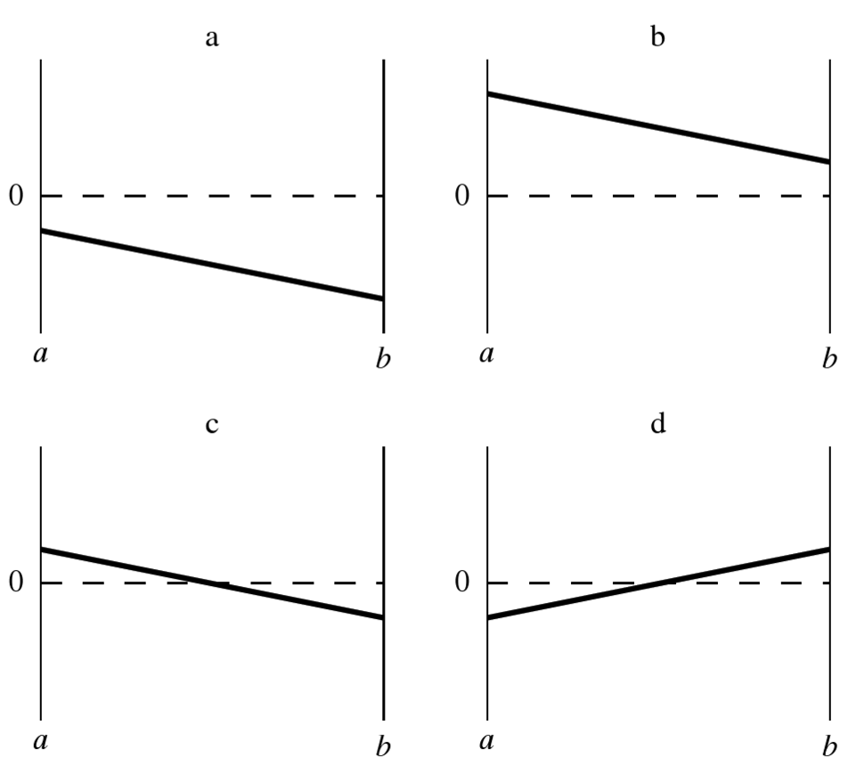 -->
<!-- </div> -->

<!-- --- -->

<!-- # How do we solve them? -->

<!-- A complementarity problem $CP(f, a, b)$ can be re-framed as a rootfinding problem easily -->
<!-- $$\hat{f}(x) = min(max(f(x),a-x),b-x) = 0$$ -->

<!-- <div align="center"> -->
<!--   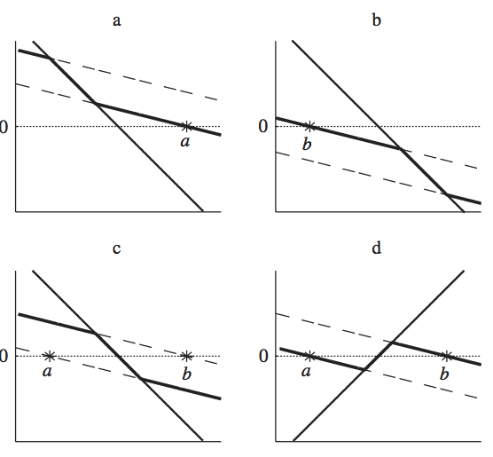 -->
<!-- </div> -->

<!-- --- -->

<!-- # How do we solve them? -->


<!-- We can then solve the problem with conventional rootfinding techniques   -->
<!-- or approximate this with a smooth function to make it easier on a rootfinder -->

<!-- -- -->

<!-- The workhorse solver for complementarity problems is the PATH solver: Julia wrapper can be found [here](https://github.com/chkwon/Complementarity.jl) -->

---

# Maximization (minimization) methods

How we solve maximization problems has many similarities to rootfinding and complementarity problems

--

I'll tend to frame problems as minimization problems because it is the convention the optimization literature

--

We make two distinctions:

--

**Local vs global:** are we finding an optimum in a local region, or globally?

--

**Derivative-using vs derivative-free:** Do we want to use higher-order information?

---

# Maximization (minimization) methods

I'll focus on local solvers, common global solvers I won't cover:
1. Genetic algorithms
2. Simulated annealing
3. DIRECT


---

# Derivative free optimization: Golden search

Similar to bisection, .hi[golden search] looks for a solution of a one-dimensional problem over smaller and smaller brackets

--

If we have a continuous one dimensional function, $f(x)$, and we want to find a local minimum in some interval $[a,b]$

---

# Derivative free optimization: Golden search

1. Select points $x_1,x_2 \in [a,b]$ where $x_2 > x_1$

--

2. If $f(x_1) < f(x_2)$ replace $[a,b]$ with $[a,x_2]$, else replace $[a,b]$ with $[x_1,b]$

--

3. Repeat until convergence criterion is met

--

Replace the endpoint of the interval next to the evaluated point with the highest value $\rightarrow$ keep the lower evaluated point in the interval $\rightarrow$ guarantees that a local minimum still exists

---

# Derivative free optimization: Golden search

How do we pick $x_1$ and $x_2$?

--

Achievable goal for selection process:
- New interval is independent of whether the upper or lower bound is replaced
- Only requires one function evaluation per iteration 

--

There's one algorithm that satisfies this

---

# Derivative free optimization: Golden search

Golden search algorithm for point selection:

\begin{gather}
	x_i = a + \alpha_i (b-a) \notag \\
	\alpha_1 = \frac{3-\sqrt{5}}{2} \qquad \alpha_2 = \frac{\sqrt{5} - 1}{2}
\end{gather}

--

The value of $\alpha_2$ is called the golden ratio and is where the algorithm gets its name

--

.hi[Write out a golden search algorithm]

---

# Golden search

```{julia}
function golden_search(f, lower_bound, upper_bound)
    alpha_1 = (3 - sqrt(5))/2  # GS parameter 1
    alpha_2 = (sqrt(5) - 1)/2  # GS parameter 2
    tolerance = 1e-2           # tolerance for convergence
    difference = 1e10
    while difference > tolerance
        x_1 = lower_bound + alpha_1*(upper_bound - lower_bound)  # new x_1
        x_2 = lower_bound + alpha_2*(upper_bound - lower_bound)  # new x_2
        if f(x_1) < f(x_2)     # reset bounds
            upper_bound = x_2
        else
            lower_bound = x_1
        end
        difference = x_2 - x_1
    end
    println("Minimum is at x = $((lower_bound+upper_bound)/2).")
end;
```

---

# Golden search

```{julia}
f(x) = 2x^2 + 9x;
golden_search(f, -10, 10)
```

```{julia}
f(x) = x^4;
golden_search(f, -5, 3)
```

```{julia}
f(x) = sin(x);
golden_search(f, 0, 1)
```

---

# Nelder-Mead: Simplex

Golden search is nice and simple but only works in one dimension

There are several derivative free methods for minimization that work in multiple dimensions,
the most commonly used one is .hi[Nelder-Mead (NM)]

--

NM works by first constructing a simplex: we evaluate the function at $n+1$ points in an $n$ dimensional problem

It then manipulates the highest value point, similar to golden search

---

# Nelder-Mead: Simplex

There are six operations:

--

- **Order:** order the value at the vertices of the simplex $f(x_1)\leq...\leq f(x_{n+1})$
--

- **Centroid:** calculate $x_0$, the centroid of the non - $x_{n+1}$ points
--

- **Reflection:** reflect $x_{n+1}$ through the opposite face of the simplex and evaluate the new point: $x_r = x_0 + \alpha(x_0 - x_{n+1})$, $\alpha > 0$
  - If this improves upon the second-highest (e.g. its lower) but is not the lowest value point, replace $x_{n+1}$ with $x_r$ and restart
  - If this is the lowest value point so far, go to step 4
  - If $f(x_r) > f(x_n)$ go to step 5

---

# Nelder-Mead: Simplex
  
- **Expansion:** push the reflected point further in the same direction
--

- **Contract:** Contract the highest value point toward the middle
  - Compute $x_c = x_0 + \gamma(x_0 - x_{n+1})$, $0 < \gamma \leq 0.5$
  - If $x_c$ is better than the worst point replace $x_{n+1}$ with $x_c$ and restart
  - Else go to step 6
--

- **Shrink:** shrink the simplex toward the best point
  - Replace all points but the best one with $x_i = x_1 + \sigma(x_i - x_1)$
  
--

Nelder-Mead is a pain to code efficiently (i.e. don't spend the time doing it yourself) but is in the `Optim.jl` package


---

# Nelder-Mead: Simplex

<div align="center">
  
</div>

Nelder-Mead is commonly used but slow and unreliable, no real useful convergence properties, avoid using it

---

# What is a solution?

We typically want to find a global extremum, here a minimum,  
of our objective function $f$

--

$x^*$ is a global minimizer if $f(x^*) \leq f(x)$ for all $x$ over the domain of the function

--

.hi[Problem:] most algorithms are *local* minimizers that find a point $x^*$  
such that $f(x^*) \leq f(x)$ for all $x \in N$, where $N$ is a neighborhood of $x^*$

--

Typically analytical problems are set up to have a unique minimum so any local solver can generally find the global optimum

---

# What is a solution?

Lots of problems have properties that don't satisfy 
the typical sufficiency conditions for a unique minimum (strictly decreasing and convex), like

--

- Concave transitions
- Games with multiple equilibria
- Etc

--

How do we find a local minimum?

--

Do we need to evaluate every single point?

---

# The general unconstrained approach

Optimization algorithms typically have the following set up:

1. Start at some $x_0$
2. Work through a series of iterates $\{x_k\}_{k=1}^\infty$ until we have "converged" with sufficient accuracy

--

If the function is smooth, we can take advantage of that information  
about the function's shape to figure out which direction to move in next

--

If $f$ is twice continuously differentiable, we can use the gradient $\nabla f$ and Hessian $\nabla^2 f$ to figure out if $x^*$ is a local minimizer

---

# The general unconstrained approach

Taylor's Theorem tells us that if $f$ is twice differentiable, then there exists a $t \in (0,1)$ such that

$$f(x^* + p) = f(x^*) + \nabla\,f(x^*)^T \, p + \frac{1}{2!}\,p^T\,\nabla^2\,f(x^*+tp)\,p$$

**This is an exact equality**

--

From here we can prove the usual necessary and sufficient conditions for a local optimum


---

# Two large classes of algorithms

All modern algorithms have that general set up but may go about it in different ways

--

Most modern optimization problems fall into one of two classes:

1. Line search
2. Trust region

--

The relationship between these two approaches has a lot of similiarities  
to the relationship between the constrained problem and the dual Lagrange problem

---

# Line search algorithms

General idea:

1. Start at some current iterate $x_k$
2. Select a direction to move in $p_k$
3. Figure out how far along $p_k$ to move


---

# Line search algorithms

How do we figure out how far to move?

--

"Approximately" solve this problem to figure out the **step length** $\alpha$
$$\min_{\alpha > 0} f(x_k + \alpha p_k)$$

--

We are finding the distance to move, $\alpha$ in direction $p_k$ that minimizes our objective $f$

---

# Line search algorithms

Typically do not perform the full minimization problem since it is costly

We only try a limited number of step lengths $\alpha$ before picking the best one and moving onto our next iterate $x_{k+1}$

--

**We still haven't answered, what direction $p_k$ do we decide to move in?**

---

# Line search: direction choice

What's an obvious choice for $p_k$?

--

The direction that yields the *steepest descent*

--

$-\nabla \, f_k$ is the direction that makes $f$ decrease most rapidly, $k$ indicates we are evaluating $f$ at iteration $k$

---

# Line search algorithms


<div align="center">
  
</div>

---

# Line search: steepest descent

We can verify this is the direction of steepest descent by referring to Taylor's theorem

--

For any direction $p$ and step length $\alpha$, we have that
$$f(x_k + \alpha p) = f(x_k) + \alpha\,p^T\,\nabla\,f_k + \frac{1}{2!}\,\alpha^2p^T\,\nabla^2\,f(x_k+tp)\,p$$

--

The rate of change in $f$ along $p$ at $x_k$ $(\alpha = 0)$ is $p^T \, \nabla\,f_k$

---

# Line search: steepest descent

The the unit vector of quickest descent solves
$$\min_p p^T\,\nabla\,f_k \,\,\,\,\, \text{subject to:    }||p|| = 1$$


--

Re-express the objective as $\min_{\theta,p} ||p||\,||\nabla\,f_k||cos\,\theta$, where $\theta$ is the angle between $p$ and $\nabla\,f_k$

--

The minimum is attained when $cos\,\theta = -1$ and $p = -\frac{\nabla\,f_k}{||\nabla\,f_k||},$ so the direction of steepest descent is simply $-\nabla\,f_k$

---

# Line search: steepest descent

The *steepest descent method* searches along this direction at every iteration $k$

It may select the step length $\alpha_k$ in several different ways

A benefit of the algorithm is that we only require the gradient of the function, and no Hessian

However it can be very slow

---

# Line search: alternative directions

We can always use search directions other than the steepest descent

--

Any descent direction, i.e. one that is within $45^\circ$ of $-\nabla\,f_k$,  
is *guaranteed* to produce a decrease in $f$ as long as the step size is sufficiently small

<div align="center">
  
</div>

---

# Line search: alternative directions

We can actually verify this with Taylor's theorem

--

$$f(x_k + \epsilon p_k) = f(x_k) + \epsilon\,p_k^T\,\nabla\,f_k + O(\epsilon^2)$$

--

If $p_k$ is in a descending direction, $\theta_k$ will be of an angle such that $cos\,\theta_k < 0$

This gives us

--

$$p_k^T\,\nabla f_k = ||p_k||\,||\nabla\,f_k||cos\,\theta_k < 0$$

--

Therefore $f(x_k + \epsilon p_k) < f(x_k)$ for positive but sufficiently small $\epsilon$

--

**Is $-\nabla\,f_k$ always the best search direction?**


---

# Newton's method


The most important search direction is not steepest descent but **Newton's direction**

--

Newton's direction comes out of the second order Taylor series approximation to $f(x_k + p)$
$$f(x_k + p) \approx f_k + p^T\,\nabla\,f_k + \frac{1}{2!}\,p^T\,\nabla^2f_k\,p$$
Define this as $\mathbf{m_k(p)}$

---

# Newton's method

We find the Newton direction by selecting the vector $p$ that minimizes $f(x_k + p)$

--

This ends up being
$$p^N_k = -\frac{\nabla f_k}{\nabla^2 f_k}$$

---

# Newton's method

--

This approximation to the function we are trying to solve has error of $O(||p||^3)$,  
so if $p$ is small, the quadratic approximation is very accurate

--

**Drawback:** requires explicit computation of the Hessian, $\nabla^2 \, f(x)$
- Quasi-Newton solvers also exist (e.g. BFGS, L-BFGS, etc)

---

# Trust region methods

Trust region methods construct an approximating model, $m_k$  
whose behavior near the current iterate $x_k$ is close to that of the actual function $f$

--

We then search for a minimizer of $m_k$

--

**Issue:** $m_k$ may not represent $f$ well when far away from the current iterate $x_k$

--

**Solution:** Restrict the search for a minimizer to be within some region of $x_k$, called a .hi[trust region]

---

# Trust region methods

Trust region problems can be formulated as
$$\min_p m_k(x_k + p)$$
where 
- $x_k+p \in \Gamma$
- $\Gamma$ is a ball defined by $||p||_2 \leq \Delta$
- $\Delta$ is called the trust region radius

---

# Trust region Methods

Typically the approximating model $m_k$ is a quadratic function (i.e. a second-order Taylor approximation)
$$m_k(x_k + p) = f_k + p^T\,\nabla\,f_k + \frac{1}{2!}\,p^T\,B_k\,p$$
where $B_k$ is the Hessian or an approximation to the Hessian

<div align="center">
  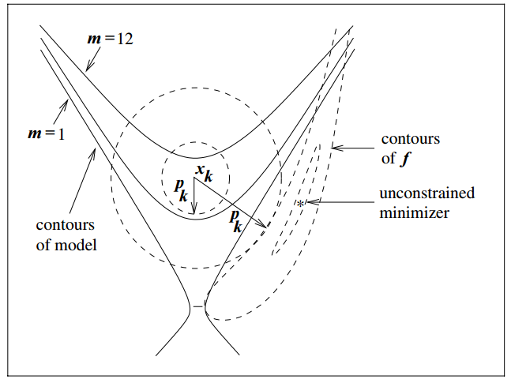
</div>

---

# Line search vs trust region

Whats the fundamental difference between line search and trust region? 

--

Line search first picks a direction then searches along that direction for the optimal step length

Trust region first defines our step length via the trust region radius, then searches for the optimal direction

---

# Line search vs trust region

There is a special case of the trust region where if we set $B_k$, the approximate Hessian, to zero,
the solution to the problem is 
$$p_k = -\frac{\Delta_k \,\nabla \,f_k}{||\nabla\,f_k||}$$

This is just the steepest descent solution for the line search problem


---

# Problem scaling

The .hi[scaling] of a problem matters for optimization performance

--

A problem is .hi[poorly scaled] if changes to $x$ in a certain direction  
produce much bigger changes in $f$ than changes to in $x$ in another direction

--

<div align="center">
  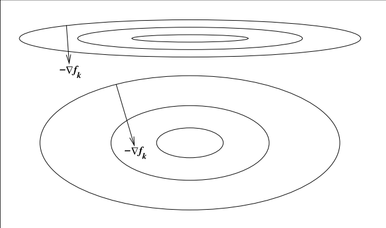
</div>

---

# Problem scaling

Ex: $f(x) = 10^9 x_1^2 + x_2^2$ is poorly scaled

--

This happens when things change at different rates:
- Investment rates between 0 and 1, but global consumption is in dollars

--

How do we solve this issue?

--

Rescale the problem: put them in units that are generally within an order of magnitude of 1
- Investment rate in percentage terms: $0\%-100\%$
- Consumption in units of trillion dollars instead of dollars


---

# Constrained optimization

How do we solve constrained optimization problems?

--

Typically as a variant of unconstrained optimization techniques

--

We will discuss three types of constrained optimization algorithms
- Penalty methods
- Active set methods
- Interior point methods

---

# Constrained optimization

These are the algorithms in workhorse commercial solvers: KNITRO

<div align="center">
  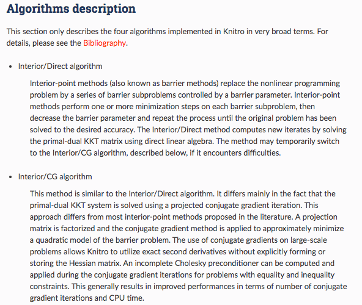
</div>

---

# Constrained optimization

These are the algorithms in workhorse commercial solvers: KNITRO

<div align="center">
  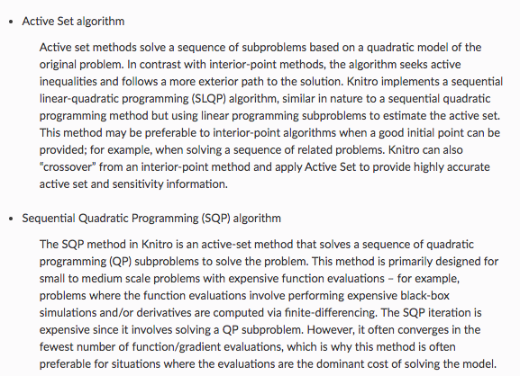
</div>

---

# Constrained optimization

These are the algorithms in workhorse commercial solvers: fmincon/MATLAB

<div align="center">
  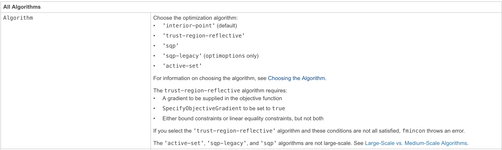
</div>

---

# Constrained optimization: Penalty methods

Suppose we wish to minimize some function subject to equality constraints (easily generalizes to inequality)
$$\min_x f(x) \,\,\, \text{subject to:} \,\, c_i(x) = 0$$

--

How does an algorithm know to not violate the constraint?

--

One way is to introduce a **penalty function** into our objective and remove the constraint:
$$Q(x;\mu) = f(x) + \frac{\mu}{2} \sum_i c_i^2(x)$$

where $\mu$ is the penalty parameter

---

# Constrained optimization: Penalty methods

$$Q(x;\mu) = f(x) + \frac{\mu}{2} \sum_i c_i^2(x)$$

--

The second term increases the value of the function, bigger $\mu \rightarrow$ bigger penalty from violating the constraint

--

The penalty terms are smooth $\rightarrow$ use unconstrained optimization techniques  
to solve the problem by searching for iterates of $x_k$

---

# Constrained optimization: Penalty methods

Also generally iterate on sequences of $\mu_k \rightarrow \infty$ as $k \rightarrow \infty$, to require satisfying the constraints as we close in

--

There are also augmented Lagrangian methods that take the quadratic penalty method and add in explicit estimates of Lagrange multipliers to help force binding constraints to bind precisely 

---

# Constrained optimization: Penalty method example

Example:
$$\min x_1 + x_2 \,\,\,\,\,\text{      subject to:    } \,\,\, x_1^2 + x_2^2 - 2 = 0$$

--

Solution is pretty easy to show to be $(-1, -1)$

--

The penalty method function $Q(x_1, x_2; \mu)$ is
$$Q(x_1, x_2; \mu) = x_1 + x_2 + \frac{\mu}{2} (x_1^2 + x_2^2 - 2)^2$$

--

Let's ramp up $\mu$ and see what happens to how the function looks

---

# Constrained optimization: Penalty method example

$\mu = 1$, solution is around $(-1.1, -1.1)$

<div align="center">
  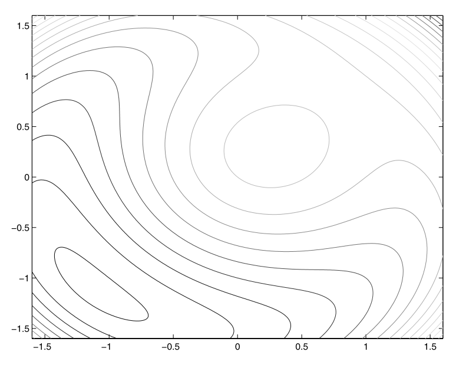
</div>

---

# Constrained optimization: Penalty method example

$\mu = 10$, solution is very close to $(-1, -1)$, can easily see trough, and rapid value increase outside $x_1^2 + x_2^2 = 2$

<div align="center">
  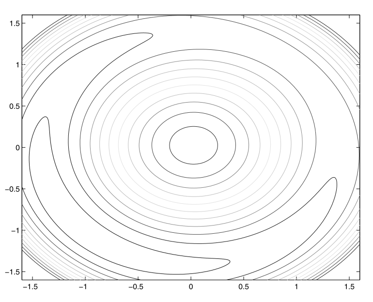
</div>


---

# Constrained optimization: Active set methods

Active set methods encapsulate sequential quadratic programming (SQP) methods

--

**Main idea:**
1. Replace the large non-linear constrained problem with a constrained quadratic programming problem  
2. Use Newton's method to solve the sequence of simpler quadratic problems

---

# Constrained optimization: Active set methods

The Lagrangian is
$$L(x,\lambda) = f(x) - \lambda^T\,c(x)$$

--

Denote $A(x)^T$ as the Jacobian of the constraints
$$A(x)^T = [\nabla\,c_1(x),...,\nabla\,c_m(x)]$$

---

# Constrained optimization: Active set methods

The first-order conditions $F(x,\lambda)$ can be written as,
\begin{gather}
	\nabla\,f(x) - A(x)^T\,\lambda = 0 \notag\\
	c(x) = 0 \notag
\end{gather}

Any solution to the equality constrained problem, where $A(x^*)$ has full rank also satisfies the first-order necessary conditions

--

Active set methods use Newton's method to find the solution $(x^*, \lambda^*)$ of $F(x,\lambda)$

---

# Constrained optimization: Active set methods

**Issue:** if we have many constraints, keeping track of all of them can be expensive

--

**Main idea:** recognize that if an inequality constraint is not binding, or **active**, then it has no influence on the solution

$\rightarrow$ in the iteration procedure we can effectively ignore it

--

Active set methods find ways to reduce the complexity of the optimization routine  
by selectively ignoring constraints that are not active (i.e. non-positive Lagrange multipliers) or close to being active

---

# Constrained optimization: Interior point methods

Interior point methods are also called barrier methods

--

These are typically used for inequality constrained problems

--

The name **interior point** comes from the algorithm traversing the domain along the interior of the inequality constraints

--

**Issue:** how do we ensure we are on the interior of the feasible set?

--

**Main idea:** impose a **barrier** to stop the solver from letting a constraint bind

---

# Constrained optimization: Interior point methods

Consider the following constrained optimization problem
\begin{gather}
	\min_{x} f(x) \notag\\
	\text{subject to:  } c_E(x) = 0, c_I(x) \geq 0
\end{gather}

--

Reformulate this problem as
\begin{gather}
	\min_{x,s} f(x) \notag\\
	\text{subject to:  } c_E(x) = 0, c_I(x) - s = 0, s \geq 0
\end{gather}

where $s$ is a vector of slack variables for the constraints

---

# Constrained optimization: Interior point methods

Final step: introduce a **barrier function** to eliminate the inequality constraint,
\begin{gather}
	\min_{x,s} f(x) - \mu \sum_{i=1}^m log(s_i) \notag\\
	\text{subject to:  } c_E(x) = 0, c_I(x) - s = 0
\end{gather}

where $\mu$ is a positive barrier parameter

---

# Constrained optimization: Interior point methods

The barrier function prevents the components of $s$ from approaching  
zero by imposing a logarithmic barrier $\rightarrow$ it maintains slack in the constraints

--

Interior point methods solve a sequence of barrier problems until $\{\mu_k\}$ converges to zero

--

The solution to the barrier problem converges to that of the original problem

---

# Best practices for optimization

Plug in your guess, let the solver go, and you're done right?

--

## WRONG

--

These algorithms are not guaranteed to always find even a local solution, 
you need to test and make sure you are converging correctly

---

# Check exitflags: KNITRO-specific numbers here

Exitflags tell you why the solver stopped, exit flags of 0 or -10X are generally good, anything else is bad

-10X can indicate bad scaling, ill-conditioning, etc

<div align="center">
  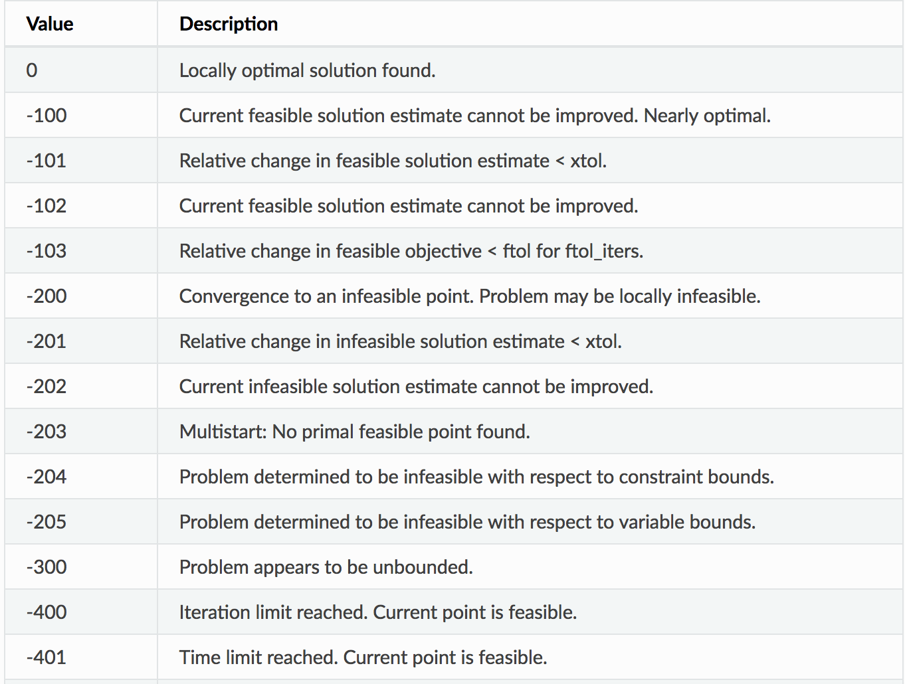
</div>

---

# Try alternative algorithms

Optimization is approximately 53% art

--

Not all algorithms are suited for every problem $\rightarrow$ it is useful to check how different algorithms perform

--

Interior-point is usually the default in constrained optimization solvers (low memory usage, fast), but try other algorithms and see if the solution generally remains the same

---

# Be aware of tolerances

Two main tolerances in optimization:

1. `ftol` is the tolerance for the change in the function value (absolute and relative)
2. `xtol` is the tolerance for the change in the input values (absolute and relative)

--

What is a suitable tolerance?


---

# Be aware of tolerances

It depends

--

Explore sensitivity to tolerance, typically pick a conservative (small) number
- Defaults in solvers are usually `1e-6`

---

# Be aware of tolerances

May be a substantial tradeoff between accuracy of your solution and speed

--

Common bad practice is to pick a larger tolerance (e.g. `1e-3`) so the problem "works" (e.g. so your big MLE converges)

--

Issue is that 1e-3 might be pretty big for your problem  
if you haven't checked that your solution is not sensitive to the tolerance

---

# Perturb your initial guesses

**Initial guesses matter**

--

Good ones can improve performance
- e.g. initial guess for next iteration of coefficient estimates should be current iteration estimates

--

Bad ones can give you terrible performance, or wrong answers if your problem isn't perfect
- e.g. bad scaling, not well-conditioned, multiple equilibria