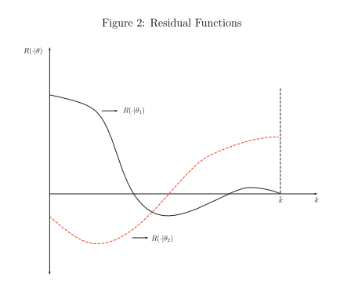

exclude: true
```{r setup}
if (!require("pacman")) install.packages("pacman")
pacman::p_load(
  xaringanExtra, JuliaCall
)
options(htmltools.dir.version = FALSE)
library(knitr)
opts_chunk$set(
  prompt = T, ## See hook below. I basically want a "$" prompt for every bash command in this lecture.
  fig.align = "center", fig.width=10, fig.height=6, 
  out.width="748px", out.length="520.75px",
  dpi = 300, #fig.path='Figs/',
  cache = F#, echo=F, warning=F, message=F
  )
## Next hook based on this SO answer: https://stackoverflow.com/a/39025054
knit_hooks$set(
  prompt = function(before, options, envir) {
    options(
      prompt = if (options$engine %in% c('sh','bash')) '$ ' else ' ',
      continue = if (options$engine %in% c('sh','bash')) '$ ' else ' '
      )
})
julia_setup(JULIA_HOME = "/Applications/Julia-1.8.app/Contents/Resources/julia/bin")
```

```{julia}
using Pkg
Pkg.add("ForwardDiff"); Pkg.add("Distributions"); Pkg.add("BenchmarkTools")
```


---

# Roadmap

1. Projection theory
2. Spectral and finite element methods

---

class: inverse, center, middle
name: theory

# Projection theory

<html><div style='float:left'></div><hr color='#EB811B' size=1px width=796px></html>

---

# Projection methods

We often need to approximate functions in economics, a common way to do this is via projection

.hi[Main idea:] build some function $\hat{V}$ indexed by coefficients that approximates the function we are interested in

--

What do I mean by approximately?

--

The coefficients of $\hat{V}$ are selected to minimize some residual function that tells us how far away our approximation is to the true function on some set of points

---

# Projection methods

How do we do this?

--

First we specify our approximating function: some linear combination of **basis functions** $\Psi_i(\mathbf{S})$
$$V^j(\mathbf{S}|c) = \sum_{i=0}^j c_i \Psi_i(\mathbf{S})$$
with coefficients $c_0,...,c_j$

---

# Projection methods

We then choose some residual function $R$ which is a function of $V^j$:
$$R(\mathbf{S}|c) = H(V^j(\mathbf{S}|c))$$


and select the coefficient values to minimize the residual, given some measure of distance

--

This step of selecting the coefficients is called .hi[projecting] $H$ against our basis

--

What basis do we select? 

How do we project (select the coefficients / residual function)?

---

# Projection methods

Let's work a simple example to get intuition

--

Ordinary least squares linear regression

--

We can think of the problem as searching for some unknown conditional expectation $E[Y|X]$, given outcome variable $Y$ and regressors $X$

---

# Projection methods

We don't know the true functional form of $E[Y|X]$, but we can approximate it using the first two monomials on $X$: $1$ and $X$
$$E[Y|X] \approx c_0 + c_1 X$$

--

These are the first two elements of the .hi[monomial basis]

--

One residual function is then: $R(Y,X|c_0,c_1) = abs(Y-c_0-c_1 X)$, the absolute error

--

For OLS we would then square this

--

OLS is within the class of projection methods

---

# Projection classes are defined by metrics

Projection methods are separated into several broad classes by the type of residual we're trying to shrink to zero

--

We need to select some metric function $\rho$, that determines how we project

--

$\rho$ tells us how close our residual function is to zero over the domain of our state space

---

# Example residuals given different projections

Example: The figure shows two different residuals on some capital domain of $[0,\bar{k}]$

<div style="float: right">
  
</div>


The residual based on the coefficient vector $c_1$ is large for small values of capital but near-zero everywhere else

--

The residual based on $c_2$ has medium values just about everywhere

--

Which is closer to zero over the interval? It will depend on our selection of $\rho$

---

# We want to use weighted residuals

We move from the plain residual to $\rho$ because we want to set a *weighted residual* equal to zero

--

Suppose we have some weight functions $\phi_i:\Omega \rightarrow \mathbb{R}$ that map from our state space to the real line

--

The one-dimensional metric is defined as
\begin{equation*}
	\rho(R\cdot|c,0) =
	\begin{cases}
		0 & \text{if } \int_\Omega\phi_i(\mathbf{S})R(\cdot|c)d\mathbf{S} = 0, i=1,...,j+1\\
		1 &\text{otherwise}
	\end{cases}
\end{equation*}

--

Where we want to solve for $c = \text{argmin} \, \rho(R(\cdot|c),0)$

---

# We want to use weighted residuals

We can then change our problem to simply solving a system of integrals ensuring the metric is zero
$$\int_\Omega\phi_i(\mathbf{S})R(\cdot|c)d\mathbf{S} = 0, i=1,...,j+1.$$ 

--

We can solve this using standard rootfinding techniques

--

.hi[Big remaining question:] how do we choose our $j+1$ weight functions?

--

First lets begin with a simple example before moving into the most commonly used weight functions

---

# Least squares projection

Suppose we selected the weight function to be
$$\phi_i(\mathbf{S}) = \frac{\partial R(\mathbf{S}|c)}{\partial c_{i-1}}$$

--

Then we would be performing least squares! Why?

---

# Least squares projection

Recall the objective of least squares is
$$\min_{\mathbf{c}} \int R^2(\cdot|c)d\mathbf{S}$$
--

The FOC for a minimum is
$$\int \frac{\partial R(\mathbf{S}|c)}{\partial c_{i-1}}R(\cdot|c)d\mathbf{S} = 0, i = 1,...,j+1$$

--

So the first order condition sets the weighted average residual to zero  
where the weights are determined by the partial derivatives of the residual

--

OLS minimizes residuals weighted by how they change in the coefficients


---

# Collocation

The simplest weight function gives us a methodology called .hi[collocation]

--

Here our weight function is
$$\phi_i(\mathbf{S}) = \delta(\mathbf{S}-\mathbf{S}_i)$$
Where $\delta$ is the *Dirac delta function* and $\mathbf{S}_i$ are j+1 points or nodes selected by the researcher, called .hi[collocation points/nodes]

--

The Dirac delta function is zero at all $\mathbf{S}$ except at $\mathbf{S} = \mathbf{S}_i$

--

What does this weight function mean?

---

# Collocation

Before we even select our coefficients, this means that the residual can only be non-zero at a finite set of points $\mathbf{S_i}$

--

So the solution to our problem must set the residual to zero at these collocation points

--

Since we have a finite set of points we do not need to solve difficult integrals but only a system of equations
$$R(\mathbf{S}_i|c) = 0, i=1,...,j+1$$

--

In class we will mostly be using collocation for function approximation

---

# Collocation

What points in our state space do we select to be collocation points?

--

We do so by selecting a specific finite number of points in our state space and use them to construct a .hi[collocation grid] that spans the domain of our problem

--

We often have continuous states in economics (capital, technology, etc.), so how does collocation manage to work?

--

Using our knowledge of how the value function behaves at the limited set of points on our grid, 
we can interpolate our approximating function at all points off the grid points, 
but *within* the domain of our grid


---

# Interpolation

Let $V$ be the function we wish to approximate with some $\hat{V}$

--

$\hat{V}$ is constructed as a linear combination of $n$ linearly independent (i.e. orthogonal) basis functions
$$\hat{V}(x)= \sum_{j=1}^n c_j \psi_j(x)$$

--

Each $\psi_j(x)$ is a basis function, and the coefficients $c_j$ determine how they are combined at some point $\bar{x}$ to yield our approximation $\hat{V}(\bar{x})$ to $V(\bar{x})$

---

# Interpolation

The number of basis functions we select, $n$, is the degree of interpolation

--

In order to recover $n$ coefficients, we need at least $n$ equations that must be satisfied at a solution to the problem

--

If we have precisely $n$ equations, we are just solving a simple system of linear equations:
we have a perfectly identified system and are solving a collocation problem

--

This is what happens we select our number of grid points in the state space  
to be equal to the number of coefficients (which induces a Dirac delta weighting function)

---

# Interpolation

Solve a system of equations, *linear in $c_j$* that equates the approximating function at the grid points to the recovered values

$$\Psi \mathbf{c} = \mathbf{v}$$

where $\Psi$ is the matrix of basis functions, $c$ is a vector of coefficients, and $v$ is a vector of the recovered values

--

We can recover $c$ by left dividing by $\Psi$ which yields
$$\mathbf{c} = \Psi^{-1}\mathbf{v}$$ 

---

# Interpolation

If we have more equations, or grid points, than coefficients, 
then we can just use OLS to solve for the coefficients by minimizing the sum of squared errors

--

$$\mathbf{c} = (\Psi'\Psi)^{-1}\Psi'\mathbf{v}$$

--

We will learn how to interpolate using two different approaches:

1. Spectral methods
2. Finite element methods


---

class: inverse, center, middle
name: theory

# Spectral methods

<html><div style='float:left'></div><hr color='#EB811B' size=1px width=796px></html>


---

# (Pseudo-)spectral methods

Spectral methods apply all of our basis functions to the entire domain of our grid: they are global

--

When using spectral methods we virtually always use polynomials

--

**Why?**

---

# (Pseudo-)spectral methods

The Stone-Weierstrass Theorem which states (for one dimension)

*Suppose $f$ is a continuous real-valued function defined on the interval $[a,b]$.  
For every $\epsilon > 0, \,\, \exists$ a polynomial $p(x)$ such that for all $x \in [a,b]$ we have $||f(x) - p(x)||_{sup} \leq \epsilon$*

--

What does the SW theorem say in words?

---

# (Pseudo-)spectral methods

For any continuous function $f(x)$, we can approximate it arbitrarily well with some polynomial $p(x)$, as long as $f(x)$ is continuous

--

Note that the SW theorem *does not* say what kind of polynomial can approximate $f$ arbitrarily well, 
just that some polynomial exists

---

# Basis choice

What would be your first choice of basis?

--

Logical choice: the monomial basis: $1, x, x^2,...$

--

It is simple, and SW tells us that we can uniformly approximate any continuous function on a closed interval using them

---

# Basis choice

## Practice

code up a function `project_monomial(f, n, lb, ub)` that takes in some function `f`,
degree of approximation `n`, lower bound `lb` and upper bound `ub`,
and constructs a monomial approximation on an evenly spaced grid via collocation

--

We will be plotting stuff, see [http://docs.juliaplots.org/latest/generated/gr/](http://docs.juliaplots.org/latest/generated/gr/) for example code using the `GR` backend

---

# Approximate `sin(x)` with monomials

```{julia}
using Plots
gr();
f(x) = sin.(x);

Plots.plot(f, 0, 2pi, line = 4, grid = false, legend = false, size = (500, 250))
```

---

# Approximating sin(x)

```{julia}

function project_monomial(f, n, lb, ub)
    # solves Ψc = y → c = Ψ\y
    # Ψ = matrix of monomial basis functions evaluted on the grid

    coll_points = range(lb, ub, length = n)                      # collocation points
    y_values = f(coll_points)                                    # function values on the grid
    basis_functions = [coll_points.^degree for degree = 0:n-1]   # vector of basis functions
    basis_matrix = hcat(basis_functions...)                      # basis matrix

    coefficients = basis_matrix\y_values                         # c = Ψ\y

    return coefficients

end
```


---

# Approximating sin(x)

```{julia}
coefficients_4 = project_monomial(f, 4, 0, 2pi);
coefficients_5 = project_monomial(f, 5, 0, 2pi);
coefficients_10 = project_monomial(f, 10, 0, 2pi)
```

---

# Approximating sin(x)

Now we need to construct a function `f_approx(coefficients, plot_points)` that takes in the `coefficients` vector,
and an arbitrary vector of points to evaluate the approximating function at (for plotting)

--

```{julia, tidy=TRUE}
function f_approx(coefficients, points)
    n = length(coefficients) - 1
    basis_functions = [coefficients[degree + 1] * points.^degree for degree = 0:n] # evaluate basis functions
    basis_matrix = hcat(basis_functions...)                                        # transform into matrix
    function_values = sum(basis_matrix, dims = 2)                                  # sum up into function value
    return function_values
end;
```

---

# Approximating sin(x)

```{julia}
plot_points = 0:.01:2pi;
f_values_4 = f_approx(coefficients_4, plot_points);
f_values_5 = f_approx(coefficients_5, plot_points);
f_values_10 = f_approx(coefficients_10, plot_points)
```

---

# Plot

```{julia, echo=FALSE}
# Plot the actual function and overlay our approximation using a dashed line
# (in practice you really should put all arguments on their own line,
# but vertical spacing is an issue on slides if we want to show the code...)
Plots.plot(f, 0, 2pi, line = 4, grid = false, label = "sin(x)", size = (600, 400),
           xlabel = "x", ylabel = "sin(x)", tickfontsize = 14, guidefontsize = 14)
```

---

# Plot

```{julia, echo=FALSE}
plot!(plot_points, f_values_4, color = :green, linewidth = 4.0, linestyle = :dashdot, label = "Approximation n = 4")
```

---

# Plot

```{julia, echo=FALSE}
plot!(plot_points, f_values_5, color = :red, linewidth = 4.0, linestyle = :dash, label = "Approximation n = 5")
```

---

# Plot

```{julia, echo=FALSE}
plot!(plot_points, f_values_10, color = :purple, linewidth = 4.0, linestyle = :dot, label = "Approximation n = 10")
```

---

# Cool!

We just wrote some code that exploits Stone-Weierstrauss and allows us to (potentially) approximate
any continuous function arbitrarily well as `n` goes to infinity

--

To approximate *any* function we'd need to feed in some basis function `g(x, n)`
as opposed to hard-coding it like I did in the previous slides

--

Now try approximating **Runge's function**: `f(x) = 1/(1 + 25x^2)`

---

# Runge's function

```{julia}
runge(x) = 1 ./ (1 .+ 25x.^2);
coefficients_5 = project_monomial(runge, 5, -1, 1);
coefficients_10 = project_monomial(runge, 10, -1, 1);
plot_points = -1:.01:1;
runge_values_5 = f_approx(coefficients_5, plot_points);
runge_values_10 = f_approx(coefficients_10, plot_points);
```

---

# Runge's function

```{julia, echo=FALSE}
Plots.plot(runge, -1, 1, line = 4, grid = false,
           label = "1/(1 + 25x^2)", size = (600, 400),
           legendfont = font(7), legend = :topright, ylims = (-.5, 1),
           xlabel = "x", ylabel = "f(x) = 1/(1 + 25x^2)", tickfontsize = 14, guidefontsize = 14)
```

---

# Runge's function

```{julia, echo=FALSE}
plot!(plot_points, runge_values_5, color = :red, linewidth = 4.0, linestyle = :dash,
    label = "Approximation n = 5")
```

---

# Runge's function

```{julia, echo=FALSE}
plot!(plot_points, runge_values_10, color = :purple, linewidth = 4.0, linestyle = :dot, label = "Approximation n = 10")
```

---

# Maybe we can just crank up n?

```{julia, echo=FALSE}
coefficients_20 = project_monomial(runge, 20, -1, 1);
runge_values_20 = f_approx(coefficients_20, plot_points);
Plots.plot(runge, -1, 1, line = 4, grid = false,
           label = "1/(1 + 25x^2)", size = (600, 400), legend = :top, ylims = (-2, 10),
           ylabel = "f(x) = 1/(1 + 25x^2)", xlabel = "x", tickfontsize = 14, guidefontsize = 14)
```

---

# Maybe we can just crank up n?

```{julia, echo=FALSE}
plot!(plot_points, runge_values_20, color = :red, linewidth = 4.0, linestyle = :dash,
    label = "Approximation n = 20")
```

---

# Monomials are not good

What's the deal?

--

The matrix of monomials, $\Phi$, is often ill-conditioned, especially as the degree of the monomials increases

--

The first 6 monomials can induce a condition number of $10^{10}$, a substantial loss of precision

--

Second, they can vary dramatically in size, which leads to scaling/truncation errors

---

# Monomials are not good

```{julia}
runge(x) = 1 ./ (1 .+ 25x.^2);
coefficients_10 = project_monomial(runge, 10, -1, 1);
points = rand(10);
n = length(coefficients_10) - 1;
basis_functions = [coefficients_10[degree + 1] * points.^degree for degree = 0:n];
basis_matrix = hcat(basis_functions...);
println("Condition number: $(cond(basis_matrix))")
```

---

# Monomials are not good
 
Example: $x^{11}$ goes from .0001 to about 90 when moving x from 0.5 to 1.5

--

Ideally we want an .hi[orthogonal basis:] when we add another element of the basis,
it has sufficiently different behavior than the elements before it so it can capture
features of the unknown function that the previous elements couldn't

---

# The Chebyshev basis

Most frequently used is the .HI[Chebyshev basis]

--

It has nice approximation properties:

1. They are easy to compute

--

2. They are orthogonal

--

3. They are bounded between $[-1,1]$

---

# The Chebyshev basis

Chebyshev polynomials are often selected because they minimize the oscillations that occur when approximating functions like Runge's function

--

The Chebyshev polynomial closely approximates the .hi[minimax polynomial]: the polynomial, given degree $d$,
that minimizes any approximation error to the true function

---

# The Chebyshev basis

Chebyshev polynomials are defined by a recurrence relation,
\begin{gather}
	T_0(x) = 1 \\
	T_1(x) = x  \\
	T_{n+1} = 2xT_n(x) - T_{n-1}(x)
\end{gather}
and are defined on the domain $[-1,1]$

--

In practice this is easy to expand to any interval $[a,b]$

--

Chebyshev polynomials look similar to monomials but have better properties that are visually distinctive

---

# The Chebyshev basis

Chebyshev polynomials are defined by a recurrence relation,
\begin{gather}
	T_0(x) = 1 \\
	T_1(x) = x  \\
	T_{n+1} = 2xT_n(x) - T_{n-1}(x)
\end{gather}

Write two functions: `cheb_polys(n, x)` and `monomials(n, x)` with a degree of approximation `n` and vector of points `x`,
that return the values of the approximating function at `x`

If you can't get the recurrence relation to work, you can use an alternative: $$T_n(x) = cos(n \, arccos(x))$$

---

# The Chebyshev basis

Next, a plotting function `plot_function(basis_function, x, n)` that takes an arbitrary basis function `basis_function` and plots all basis functions up to degree `n`

---

# The two basis functions

```{julia, tidy=TRUE}
# Chebyshev polynomial function
function cheb_polys(x, n)
    if n == 0
        return x ./ x               # T_0(x) = 1
    elseif n == 1
        return x                    # T_1(x) = x
    else
        cheb_recursion(x, n) =
            2x .* cheb_polys.(x, n-1) .- cheb_polys.(x, n-2)
        return cheb_recursion(x, n) # T_n(x) = 2xT_{n-1}(x) - T_{n-2}(x)
    end
end;

# Monomial function
monomials(x, n) = x.^n;
```

---

# The plotting function

```{julia, tidy=TRUE}
function plot_function(basis_function, x, n)

    for i = 1:n-1

        f_data = basis_function(x, i)

        if i == 1
            plot(x, f_data, linewidth = 4.0, xlabel = "x", ylabel = "Basis functions", label = "",
                 tickfontsize = 14, guidefontsize = 14, grid = false);
        else
            plot!(x, f_data, linewidth = 4.0, label = "");
        end

    end

    f_data = basis_function(x, n)
    plot!(x, f_data, linewidth = 4.0, label = "")

end;

x = -1:.01:1;
```

---

# Monomials up to degree 5

```{julia}
plot_function(monomials, x, 5)
```

---

# Chebyshev polynomials up to degree 5

```{julia}
plot_function(cheb_polys, x, 5)
```

---

# Monomials up to degree 10

```{julia}
plot_function(monomials, x, 10)
```

---

# Chebyshev polynomials up to degree 10

```{julia}
plot_function(cheb_polys, x, 10)
```

---

# Chebyshev polynomials

Chebyshev polynomials span the space

--

Monomials  clump together

--

Chebyshev polynomials are nice for approximation because they are orthogonal and they span the polynomial vector space

--

This means that you can form any polynomial of degree equal to less than the Chebyshev polynomial you are using

--

It also guarantees that $\Phi$ has full rank and is invertible

---

# Two important theorems

There are two important theorems to know about Chebyshev polynomials

--

**Chebyshev interpolation theorem:** *If $f(x) \in \mathbb{C}[a,b]$, if $\{\psi_i(x), i=0,...\}$ is a system of polynomials (where $\psi_i(x)$ is of exact degree i) orthogonal with respect to $\phi(x)$ on $[a,b]$ and if $p_j = \sum_{i=0}^j c_i \psi_i(x)$ interpolates $f(x)$ in the zeros of $\psi_{n+1}(x)$, then:
$$\lim_{j\rightarrow\infty} \left(|| f-p_j||_2 \right)^2 = \lim_{j\rightarrow\infty}\int_a^b \phi(x) \left(f(x) - p_j \right)^2 dx = 0$$*

--

What does this say?

---

# Two important theorems

If we have an approximation set of basis functions that are exact at the roots of the $n^{th}$ order polynomials,
then as $n$ goes to infinity the approximation error becomes arbitrarily small and converges at a quadratic rate

--

This holds for any type of polynomial, but if they are Chebyshev then convergence is uniform

--

Unfortunately we cant store an infinite number of polynomials in our computer, we would like to know how big our error is after truncating our sequence of polynomials

---

# Two important theorems

**Chebyshev truncation theorem:** The error in approximating $f$ is bounded by the sum of all the neglected coefficients

--

Since Chebyshev polynomials satisfy Stone-Weierstrauss, an infinite sequence of them can perfectly approximate any continuous function

--

Since Chebyshev polynomials are bounded between $[-1,1]$, the sum of the omitted terms is bounded by the sum of the magnitude of the coefficients

--

So the error in the approximation is as well!

---

# Two important theorems

We often also have that Chebyshev approximations geometrically converge which give us the following convenient property:
$$|f(x) - f^j(x|c)| \sim O(c_j)$$
The truncation error by stopping at polynomial $j$ is of the same order as the magnitude of the coefficient $c_j$ on the last polynomial

--

Thus in many situations we can simply check the size of the last polynomial to gauge how accurate our approximation is

---

# Boyd's moral principle

Chebyshev polynomials are the most widely used basis

--

This is not purely theoretical but also from practical experience

---

# Boyd's moral principle

John Boyd summarizes decades of experience with function approximation with his moral principle:

- When in doubt, use Chebyshev polynomials unless the solution is spatially periodic, in which case an ordinary fourier series is better
- Unless you are sure another set of basis functions is better, use Chebyshev polynomials
- Unless you are really, really sure another set of basis functions is better use Chebyshev polynomials

---

# Grid point selection

We construct the approximating function by evaluating the basis functions on a predefined grid in the domain of $V$

--

If we have precisely $n$ nodes, $x_i$, we then have
$$\sum_{j=1}^n c_j \phi_j(x_i) = V(x_i) \,\, \forall i=1,2,...,n$$
---

# Grid point selection

We can write this problem more compactly as
$$\Phi c = y \tag{interpolation equation}$$
where
- $y$ is the column vector of $V(x_i)$
- $c$ is the column vector of coefficients $c_j$
- $\Phi$ is an $n\times n$ matrix of the $n$ basis functions evaluated at the $n$ points

--

If we recover a set of values at our interpolation nodes, $V^*(x_i)$,
we can then simply invert $\Phi$ and right multiply it by $y$ to recover our coefficients 

--

**How do we select our set of nodes $x_i$?**

---

# Chebyshev strikes again

A good selection of points are called *Chebyshev nodes*

--

These are simply the roots of the Chebyshev polynomials on the domain $[-1,1]$

--

They are given by
$$x_k = cos\left(\frac{2k-1}{2n}\pi\right),\,\, k = 1,...,n$$
for some Chebyshev polynomial of degree $n$

---

# Chebyshev strikes again

$$x_k = cos\left(\frac{2k-1}{2n}\pi\right),\,\, k = 1,...,n$$

Mathematically, these also help reduce error in our approximation

--

We can gain intuition by looking at a graph of where Chebyshev nodes are located, plot them yourself!

---

# Chebyshev node function

```{julia}
cheb_nodes(n) = cos.(pi * (2*(1:n) .- 1)./(2n))
```

---

# Chebyshev node locations

```{julia, echo=FALSE}
plot(cheb_nodes(3), zeros(3, 1), label = "3 Nodes", ylims = (-.01, .01),
    seriestype = :scatter, xlabel = "Chebyshev Nodes", ylabel = "", size = (600, 400),
    tickfontsize = 14, guidefontsize = 14, grid = false, markersize = 5)
```

---

# Chebyshev node locations

```{julia, echo=FALSE}
plot!(cheb_nodes(6), zeros(6, 1), label = "6 Nodes", ylims = (-.01, .01),
    seriestype = :scatter, markershape = :diamond,
    markersize = 5)
```

---

# Chebyshev node locations

```{julia, echo=FALSE}
plot!(cheb_nodes(11), zeros(11, 1), label = "11 Nodes",
    seriestype = :scatter, markershape = :xcross,
    markersize = 5)
```


---

# Chebyshev zeros and alternative rep

The zeros tend to cluster quadratically towards the edges of the domain

--

You can think about this as projecting sequentially finer uniform grids from a hemicircle onto the x-axis

--

Imagine areas of our approximating function near the center of our domain but not at a node

--

These areas benefit from having multiple nodes on both the left and right

---

# Chebyshev node locations

This provides more information for these off-node areas and allows them to be better approximated
because we know whats happening nearby in several different directions

--

If we moved to an area closer to the edge of the domain, there may only one node
to the left or right of it providing information on what the value of our approximating function should be

--

Therefore, it's best to put more nodes in these areas to shore up this informational deficit
and get good approximation quality near the edges of our domain

---

# Discrete states

How do we handle a discrete state $S_d$ when trying to approximate $V$?

--

Just like you might expect, we effectively have a different approximating function over the continuous states for each value of $S_d$

---

# Multi-dimensional approximation

Thus far we have displayed the Chebyshev basis in only one dimension

--

We approximate functions of some arbitrary dimension $N$ by taking the
tensor of vectors of the one-dimensional Chebyshev polynomials

--

Ex: if we wanted to approximate a two dimensional function with a degree 3 polynomial, implying 3 grid points for each dimension, we could do the following:

Construct a vector of polynomials $[\phi_{1,1}, \, \phi_{1,2}, \, \phi_{1,3}]$ for dimensions 1

--

Construct a vector of polynomials $[\phi_{2,1}, \, \phi_{2,2}, \, \phi_{2,3}]$ for dimension 2

---

# Multi-dimensional approximation

The tensor is just the product of every possibly polynomial pair which results in:
$$[\phi_{1,1}\phi_{2,1} ,\, \phi_{1,1}\phi_{2,2}, \, \phi_{1,1}\phi_{2,3}, \\ \phi_{1,2}\phi_{2,1}, \, \phi_{1,2}\phi_{2,2}, \, \phi_{1,2}\phi_{2,3}, \\ \phi_{1,3}\phi_{2,1}, \, \phi_{1,3}\phi_{2,2}, \, \phi_{1,3}\phi_{2,3}]$$

--

We can then solve for the 9 coefficients on these two dimensional polynomials

---

# Multi-dimensional approximation

The computational complexity here grows exponentially: $\text{total # points} = (\text{points per  state})^{\text{# states}}$

--

Exponential complexity is costly, often called the **Curse of dimensionality**

---

class: inverse, center, middle
name: theory

# Finite element methods

<html><div style='float:left'></div><hr color='#EB811B' size=1px width=796px></html>


---

# Finite element methods

An alternative to spectral methods are finite element methods

--

Finite element methods use basis functions that are non-zero over .subintervals of the domain of our grid

--

For example, we can use .hi[splines] (piecewise polynomials) over segments of our domains
where they are spliced together at prespecified breakpoints, which are called knots

---

# Finite element methods

The higher the order the polynomial we use, the higher the order of derivatives that we can preserve continuity at the knots

--

For example, a linear spline yields an approximating function that is continuous,
but its first derivatives are discontinuous step functions unless the underlying value function happened to be precisely linear

--

If we have a quadratic spline, we can also preserve the first derivative's continuity at the knots,
but the second derivative will be a discontinuous step function

---

# Finite element methods

As we increase the order of the spline polynomial, we have increasing numbers of coefficients we need to determine

--

To determine these additional coefficients using the same number of points,
we require additional conditions that must be satisfied

--

These are what ensure continuity of higher order derivatives at the knots as the degree of the spline grows

---

# Finite element methods


With linear splines, each segment of our approximating function is defined by a linear function

--

For each of these linear components, we need to solve for 1 coefficient and 1 intercept term

--

Each end of a linear segment must equal the function value at the knots

---

# Finite element methods

We have two conditions and two unknowns for each segment: this is a simple set of linear equations that we can solve

--

In numerical models we typically don't use linear splines because we often care about the quality
of approximation of higher order derivatives, cubic splines are more common

---

# Cubic splines

Suppose we wish to approximate using a cubic spline on $N+1$ knots

--

We need $N$ cubic polynomials when entails $4N$ coefficients to determine

--

We can obtain $3(N-1)$ equations by ensuring that the approximating function is continuous at all interior knots,
and its first and second derivatives are continuous at all interior knots $[3\times(N+1-1-1)]$

--

This means that the value of the left cubic polynomial equals the value of the right cubic polynomial at each interior knot

---

# Cubic splines

Ensuring the approximating function equals the function's value at all of the nodes adds another $N+1$ equations

--

We therefore have a total of $4N-2$ equations for $4N$ coefficients

--

We need two more conditions to solve the problem

--

What is often used is that the approximating function's first or second derivative matches that of the function at the end points

---

# Splines can potentially handle lots of curvature

If the derivative is of interest for optimization, or to recover some variable of economic meaning,
then we may need to have these derivatives preserved well at the knots

--

One large benefit of splines is that they can handle kinks or areas of high curvature

--

**How?**

--

By having the modeler place many knots in a concentrated region

--

Useful spline packages out there: `Dierckx`, `Interpolations`, `QuantEcon`

---

# Code it up!

Let's code up our own linear spline approximation function `linear_spline_approx(f, knots)`,
where `f` is the function we are approximating and `knots` are the knots

Have it return a function a function `spline_eval` that takes in `evaluation_points` as an argument
where `evaluation_points` are the points we want to evaluate the spline approximating function at

**Hint:** Linear splines are pretty easy, given two points $(x_{i+1}, y_{i+1})$ and $(x_i, y_i)$,
the spline in between these points is given by
$$y(x) = y_i + \frac{y_{i+1} - y_i}{x_{i+1} - x_{i}}(x - x_i)$$

---
# Spline approximator
```{julia}
function linear_spline_approx(f, knots)
    function spline_eval(evaluation_points)
        prev_knot = knots[1] # initialize previous knot
        if !(typeof(evaluation_points) <: Number) # if using multiple points
            y_eval = similar(evaluation_points)
            y_index = 1
            for knot in knots[2:end]
                current_points = evaluation_points[prev_knot .<= evaluation_points .< knot]
                y_eval[y_index:y_index + length(current_points) - 1] =
                    f(prev_knot) .+ (f(knot) - f(prev_knot))/(knot - prev_knot)*(current_points .- prev_knot)
                prev_knot = knot
                y_index += length(current_points)
            end
        else # if using just a single point
            for knot in knots[2:end]
                if prev_knot .<= evaluation_points .< knot
                    y_eval = f(prev_knot) + (f(knot) - f(prev_knot))/(knot - prev_knot)*(evaluation_point - prev_knot)
                end
                prev_knot = knot
            end
        end
        return y_eval
    end
    return spline_eval
end
```

---

# Plot

```{julia}
f(x) = sin(x)
knots_coarse = 0:pi/2:2pi;
spline_func_coarse = linear_spline_approx(f, knots_coarse);
knots_fine = 0:pi/4:2pi;
spline_func_fine = linear_spline_approx(f, knots_fine);
knots_superfine = 0:pi/12:2pi;
spline_func_superfine = linear_spline_approx(f, knots_superfine);
x_vals =0:.05:2pi;
y_vals_coarse = spline_func_coarse(x_vals);
y_vals_fine = spline_func_fine(x_vals);
y_vals_superfine = spline_func_superfine(x_vals);
```

---

# Plot
```{julia, echo=FALSE}
# Plot the actual function and overlay our approximation using a dashed line
# (in practice you really should put all arguments on their own line,
# but vertical spacing is an issue on slides if we want to show the code...)
Plots.plot(f, 0, 2pi, line = 4, grid = false, label = "sin(x)", size = (600, 400),
           xlabel = "x", ylabel = "sin(x)", tickfontsize = 14, guidefontsize = 14)
```

---

# Plot
```{julia, echo=FALSE}
plot!(x_vals, y_vals_coarse, color = :red, linewidth = 4.0, linestyle = :dash, label = "4 knot spline grid")
```

---

# Plot
```{julia, echo=FALSE}
plot!(x_vals, y_vals_fine, color = :purple, linewidth = 4.0, linestyle = :dot, label = "8 knot spline grid")
```

---

# Plot
```{julia, echo=FALSE}
plot!(x_vals, y_vals_superfine, color = :orange, linewidth = 4.0, linestyle = :dashdot, label = "24 knot spline grid")
```


<!-- --- -->

<!-- # Projection methods -->

<!-- Rearrange the Bellman equation and define a new functional $H$ that maps the problem into a more general framework -->
<!-- $$H(V) = V(S_t) - \max_{q_t} u(q_t) + \beta\,V(S_{t+1}(q_t))$$ -->

<!-- -- -->

<!-- We can find some function $V$ that solves $H(V) = 0$ -->


<!-- --- -->

<!-- # Our basic dynamic model -->

<!-- An arbitrary infinite horizon problem can be represented using a Bellman equation -->
<!-- $$V(S_t) = \max_{q_t} u(q_t) + \beta\,V(S_{t+1}(q_t))$$ -->

<!-- -- -->

<!-- We can start from any arbitrary initial state vector and simulate the optimal policy paths in deterministic or stochastic settings -->

<!-- -- -->

<!-- We know that this problem has a fixed point (solution) $V^*$ from previous lectures, but *how* do we approximate $V^*$? -->

<!-- --- -->

<!-- # Our basic dynamic model -->

<!-- One way to do this is via .hi[projection] -->

<!-- -- -->

<!-- Or perturbation, or discretization, or some analytic approaches for specific models -->

<!-- -- -->

<!-- We'll focus on value functions here, but we can approximate policy functions as well -->


<!-- --- -->

<!-- # Rough idea of how we proceed -->

<!-- Collocation methods aim to approximate the value function $V(S_t)$ with  -->
<!-- some linear combination of known, and usually orthogonal $(\int f(x)g(x)w(x)=0)$, basis functions -->

<!-- -- -->

<!-- One example of a possible class of basis functions is the monomial basis: $x, x^2, x^3,...$ -->

<!-- -- -->

<!-- But how do we implement collocation? -->

<!-- --- -->

<!-- # Rough idea of how we proceed -->

<!-- Recall we solve for coefficients $c$ by setting the residual to be zero at all of our collocation points -->

<!-- -- -->

<!-- But the residual is a function of $V$, and thus will be a function of $c$, a loop seemingly impossible to escape -->

<!-- -- -->

<!-- We can solve this problem by *iterating* on the problem, continually setting the residuals equal to zero, recovering new $c$s, and repeating -->

<!-- --- -->

<!-- # Rough idea of how we proceed -->

<!-- In any given iteration, we: -->

<!-- -- -->

<!-- - Begin with a vector of coefficients on the basis functions (e.g. a random guess) -->

<!-- -- -->

<!-- - Use a linear combination of the basis functions as an approximation to the value function on the right hand side of the Bellman -->

<!-- --- -->

<!-- # Rough idea of how we proceed -->

<!-- - Solve the Bellman with the approximated value function in it, at our set of collocation points -->

<!-- -- -->

<!-- - Recover a set maximized continuation values at these points in our state space conditional on the previous value function approximant we used -->

<!-- -- -->

<!-- - Use these new maximized values to obtain updated coefficients solving the system of linear equations, and repeat the process until we have "converged" -->


<!-- --- -->

<!-- # Still have some questions -->

<!-- By the contraction mapping theorem this is guaranteed to converge from any arbitrary initial set of coefficients! (conditional on satisfying the assumptions and there being no numerical error..) -->

<!-- -- -->

<!-- This still leaves several questions unanswered -->

<!-- -- -->

<!-- - Where in the state space do we place the collocation points? -->

<!-- -- -->

<!-- - What basis functions do we use? -->

<!-- -- -->

<!-- Do your answers to the previous two questions really matter? -->

<!-- -- -->

<!-- **Yes they are crucial** -->

<!-- --- -->

<!-- # Still have some questions -->

<!-- Schemes exist to generate high quality approximations, and to obtain the approximation at low computational cost -->

<!-- -- -->

<!-- Once we have recovered an adequate approximation to the value function, we have effectively solved the entire problem! -->

<!-- -- -->

<!-- We know how the policymaker's expected discounted stream of future payoffs changes as we move through the state space -->

<!-- --- -->

<!-- # Still have some questions -->

<!-- We can solve the Bellman at some initial state and know that solving the Bellman will yield us optimal policies -->

<!-- -- -->

<!-- Therefore we can simulate anything we want and recover optimal policy functions   -->
<!-- given many different sets of initial conditions or realizations of random variables -->
