exclude: true
```{r setup}
options(htmltools.dir.version = FALSE)
knitr::opts_hooks$set(fig.callout = function(options) {
  if (options$fig.callout) {
    options$echo <- FALSE
  }
knitr::opts_chunk$set(echo = TRUE, fig.align="", message = FALSE, warning = FALSE)
  options
})
```
```{r xaringanExtra, echo = FALSE}
xaringanExtra::use_xaringan_extra(c("tile_view", "panelset", "webcam"))

```
```{r echo=FALSE}
xaringanExtra::style_panelset(panel_tab_color_active = "red")
```

---

# Roadmap

1. Intro to machine learning
2. Shrinkage estimators
3. CARTs and forests
4. Synthetic control using lasso (SCUL)

---

# What is machine learning?

Machine learning is an algorithmically-driven way to .hi-blue[predict] outcomes

--

Unlike standard econometrics, we aren't as interested in unbiased estimators or causality

--

We just care about getting the prediction right and it working rather than having formal statistical properties

--

.hi-blue[We want a good prediction of y, not good estimates of coefficients]

--

Econometricians are finding ways to do both (double selection, double ML, trees for heterogeneous causal effects, etc)

---

# Terminology

You'll run into terms that have similar meaning to what we use in economics

1. .hi-blue[Features]: regressors, your $x$s
2. .hi-blue[Supervised learning]: settings where we have an outcome $y$ and a set of features $x$, this will be called regression if $y$ is continuous, or classification if $y$ is categorical
3. .hi-blue[Unsupervised learning]: settings where we only have features $x$, there's no outcomes!

---

# Terminology

4. .hi-blue[Training sample]: the partition of the dataset used to estimate the model
5. .hi-blue[Validation sample]: the partition of the dataset used to validate the out-of-sample fit within a fold
6. .hi-blue[Test sample]: The partition of the dataset used to test out-of-sample fit of the final model

---

# The key pieces

.hi-blue[Out-of-sample validation]: we will validate our methods by checking their fit and properties out-of-sample

--

The fact that we're trying to solve prediction problems is why we can do this: we see the actual realizations of $y$, so that we can test the quality of the fit

--

For causal inference problems we never observe the true $\beta$ so we can't validate our solutions

--

We use our training sample to estimate our model and then test it on our test sample

---

# The key pieces

.hi-blue[Regularization]: impose a penalty for overfitting the model

--

You can get great (perfect) in-sample prediction by having $N=K$

--

The problem is that this will lead to an over-fit model that will do very poorly out-of-sample

--

How much regularization do we want?

--

We typically use cross-validation methods to help us choose

---

# The key pieces

.hi-blue[Scalability]: can handle a lot of data $N$ or $K$

--

Could have thousands of features, billions of observations

--

Having parallelizable algorithms is important

---

# The key pieces

.hi-blue[Bias-variance trade-off]: expected mean squared error (MSE) of a prediction is a combo of bias and variance

--

Typically as economists we want low (zero) bias estimators because we care about the sign and interpretation of coefficients

---

# The key pieces

If we want a good prediction of $y$, we may be willing to allow more bias to reduce variance and decrease MSE

\begin{align}
  E([y-\hat{f}(x)]^2)
    &= E[y^2] + E[\hat{f}^2] - 2[Ey\hat{f}]\\
    &= var(y) + E[y^2] + var(\hat{f}) + E[\hat{f}^2] - 2fE[\hat{f}] \\
    &= var(y) + var(\hat{f}) + (f-E[\hat{f}])^2 \\
    &= \sigma^2 + variance + bias^2
\end{align}

---

# Bias-variance trade-off

<div align="center">
  
</div>

---

# Bias-variance trade-off

<div align="center">
  
</div>

---

# Shrinkage/regularization methods

One way to reduce variance is to shrink the $\beta$s, or even set some to zero $(var(0) = 0)$

--

A common way we implement this is by penalizing deviation in $\beta$s different than zero:

--

$$\min_{\beta} \sum_{i=1}^N \left(y_i - (\alpha_0 + x_i' \beta) \right)^2 + \lambda \times Penalty(\beta \neq 0)$$
---

# Shrinkage/regularization methods

If we set estimates to zero we will end up with .hi-blue[sparse] representations

--

Bet on the .hi-blue[sparsity principle]: use a procedure that does well in sparse problems, since no procedure does well in dense problems (Hastie, Tibshirani and Wainwright 2015)

---

# Shrinkage/regularization methods

There are three common specifications for this approach depending on how we specify the penalty function

- .hi-blue[Ridge regression]: Penalty = $\sum_l \beta^2_l$
- .hi-blue[Least Absolute Shrinkage and Selection Operator (LASSO)]: Penalty = $\sum_l |\beta_l|$
- .hi-blue[Elastic Net]: Penalty = $(1-\alpha)\sum_l \beta^2_l + \alpha\sum_l |\beta_l|$

---

# Ridge regression

$$\min_{\beta} \sum_{i=1}^N \left(y_i - (\alpha_0 + x_i' \beta) \right)^2 + \lambda\sum_l \beta^2_l$$

$$\min_{\beta} \sum_{i=1}^N \left(y_i - (\alpha_0 + x_i' \beta) \right)^2 + \lambda (||\beta||_2)^2$$

---

# Ridge regression

Ridge regression penalizes coefficients based on their $L_2$ norm, this tends to .hi-red[shrink] coefficients toward zero

--

It rarely sets coefficients exactly equal to zero since the penalty is smooth

--

It does a good job with fixing ill-conditioning problems and in cases where $K>N$

--

It also has a closed form solution: $\hat{\beta} = (X'X + \lambda I)^{-1} X'Y$

---

# Ridge regression

Ridge has a nice Bayesian interpretation

--

If

--

- The prior distribution of $\beta$ is $\mathcal{N}(0,\tau^2 \times I)$

--

- The error term is distributed $\mathcal{N}(0,\sigma^2)$

--

- $\lambda = \sigma^2/\tau^2$

--

Then

--

$\hat{\beta}_{ridge}$ is the posterior mean, median, and mode

---

# Sidebar: normalization

When regularizing we generally want to normalize our features and outcome

--

Why?

---

# Sidebar: normalization

If features vary dramatically in magnitude or have different scales (dollars of GDP vs percent GDP), variables that are numerically large will get penalized more just because of their units

--

If we set all variables to mean zero, variance one they are on a common playing field for regularization

--

Regularizing the outcome will get rid of the intercept term as well

--

For ridge, normalizing results in coefficients being shrunk by a factor of $1/(1+\lambda)$

---

# LASSO

$$\min_{\beta} \sum_{i=1}^N \left(y_i - (\alpha_0 + x_i' \beta) \right)^2 + \lambda\sum_l |\beta_l|$$

$$\min_{\beta} \sum_{i=1}^N \left(y_i - (\alpha_0 + x_i' \beta) \right)^2 + \lambda ||\beta||_1$$

---

# LASSO

LASSO penalizes coefficients based on their $L_1$ norm, this tends to .hi-red[select] a subset of ceofficients, i.e. it sets a number of them equal precisely to zero and generates a sparse solution

--

LASSO is generally used for variable or model selection

--

LASSO has no analytic solution, need to use convex optimization routines


---

# LASSO

LASSO also has a nice Bayesian interpretation

--

If

--

- The prior distribution of $\beta$ is Laplacian

--

- The error term is distributed $\mathcal{N}(0,\sigma^2)$

--

Then

--

$\hat{\beta}_{LASSO}$ is the posterior mode

---

# $L_p$ regularization

$$\min_{\beta} \sum_{i=1}^N \left(y_i - (\alpha_0 + x_i' \beta) \right)^2 + \lambda (||\beta||_p)^{1/p}$$

--

Ridge and LASSO are special cases of a general $L_p$ regularizer


--

Another special case is subset selection is we use the $L_0$ norm


--

.hi-blue[Subset selection] induces the estimates to be the OLS estimates but it is computationally tough to solve so it is not often used

---

# Ridge vs LASSO

One way to reframe ridge and LASSO are as their dual, constrained problems

We can then plot the constraints and the contours of the unconstrained problem to see how they differ

---

# Ridge vs LASSO

Ridge: $$\min_{\beta} \sum_{i=1}^N \left(y_i - (\alpha_0 + x_i' \beta) \right)^2 \text{ subject to } \sum_l \beta^2_l \leq s$$

LASSO: $$\min_{\beta} \sum_{i=1}^N \left(y_i - (\alpha_0 + x_i' \beta) \right)^2 \text{ subject to } \sum_l |\beta_l| \leq s$$


---

# Ridge vs LASSO

.pull-left[
```{r, out.width = "100%", fig.pos="c", echo = FALSE}
knitr::include_graphics("figures/lasso_vs_ridge.png")
```
]

.pull-right[
LASSO induces a constraint set with kinks at $x_1=0; x_2=0, ...$

$\rightarrow$ solutions will generally be at the kinks and we get lots of zero coefficients

Ridge induces a spherical constraint set, it tends to shrink coefficients toward zero without setting them exactly to zero

]
---

# Elastic Net

$$\min_{\beta} \sum_{i=1}^N \left(y_i - (\alpha_0 + x_i' \beta) \right)^2 + \lambda [(1-\alpha)(||\beta||_2)^2 + \alpha||\beta||_1]$$

--

Elastic net tries to get the best of both ridge and LASSO by using a convex combination of their penalties


--

LASSO has one big problem

--

.hi-blue[Selection with Collinearity]: if features are highly correlated LASSO tends to select one and ignore the others

--

The ridge penalty helps get around these issues by allowing us to select multiple of the correlated variables

---

# Elastic Net

<div align="center">
  
</div>

---

# Validation and cross-validation

One thing we haven't discussed yet is how we select $\lambda$, our penalty parameter

--

Big lambdas tend to result in a lot of shrinkage and sparsity, as $\lambda \rightarrow 0$ our solution approaches the OLS solution

---

# Validation and cross-validation

There are two general ways to select $\lambda$

--

1. Select model with lowest AIC/BIC/other plug-in criterion
    - This uses no out-of-sample information for selection but is fast
--

2. Cross-validate by testing on our hold-out test sample
    - Variants of cross-validation are most commonly used

---

# Cross-validation

When we perform cross-validation we split our sample into three different pieces: a training sample, a validation sample, and a test sample

--

First you randomly allocate some fraction of your data to the test sample

--

Next you perform cross-validation on the remaining data

--

A common way to do this is called .hi-blue[k-fold cross-validation]

---

# k-fold cross-validation

- Create a grid of $\lambda$s, for each $\lambda$ grid point:
    - Split data into $k$ mutually-exclusive folds of about equal size, usually choose $k=5,10$
    - For $j=1,...,k$
        - fit the model using all folds but fold $j$
        - Predict out-of-sample on fold $j$
    - Compute average mean squared prediction error across the $k$ folds: $\bar{Q}(\lambda) = \frac{1}{k}\sum_{j=1}^k \sum_{i \in \text{fold j}} \left(y_i - (\alpha_0 + x_i' \beta) \right)^2 + \lambda ||\beta||_1$
- Choose $\hat{\lambda}_{min} = argmin_{\lambda} \bar{Q}(\lambda)$ or to avoid modest overfitting
choose the largest $\lambda$ such that $\bar{Q}(\lambda) \leq \hat{\lambda}_{min} + \sigma_{\hat{\lambda}_{min}}$ (1 standard deviation rule)

---

# Supervised learning examples: Preliminaries

We need `tidyverse` to work with the data, `glmnet` to do the ML, and `caret` to do some higher-level tuning

We will be working with the mtcars dataset
```{r, echo = FALSE}
if (!require("pacman")) install.packages("pacman")
pacman::p_load(tidyverse, glmnet, caret)
set.seed(123)
```
```{r, eval = FALSE}
if (!require("pacman")) install.packages("pacman")
pacman::p_load(tidyverse, glmnet, caret)
set.seed(123)
```

---

# Supervised learning examples: Preliminaries

```{r}
mtcars <- mtcars %>% as_tibble()
mtcars
```

---

# Supervised learning example: pre-processing

```{r}
y <- mtcars %>% # center and scale y's, glmnet will center and scale Xs
  select(mpg) %>%
  scale(center = TRUE, scale = FALSE) %>%
  as.matrix()
X <- mtcars %>%
  select(-mpg) %>%
  as.matrix()
```

---

# Ridge regression with glmnet

```{r}
lambdas_to_try <- 10^seq(-3, 5, length.out = 100) # penalty parameter grid
ridge_cv <- cv.glmnet(X, y,
                      alpha = 0, # alpha is the elastic net parameter, 0 -> ridge
                      lambda = lambdas_to_try, # lambda grid
                      standardize = TRUE, # standardize X's
                      nfolds = 10) # number of CV folds
```

---

# Ridge regression with glmnet
```{r, echo = T, fig.align = 'center'}
plot(ridge_cv) # plots MSE as a function of log(lambda)
```

---

# Ridge regression with glmnet

```{r, fig.align = 'center'}
res_ridge <- glmnet(X, y, alpha = 0, lambda = lambdas_to_try, standardize = TRUE)
plot(res_ridge, xvar = "lambda") # shows coefficients as a function of log(lambda)
legend("bottomright", lwd = 1, col = 1:6, legend = colnames(X), cex = .7)
```

---

# LASSO with glmnet

```{r}
lambdas_to_try <- 10^seq(-3, 5, length.out = 100) # penalty parameter grid
lasso_cv <- cv.glmnet(X, y,
                      alpha = 1, # alpha is the elastic net parameter, 1 -> LASSO
                      lambda = lambdas_to_try, # lambda grid
                      standardize = TRUE, # standardize X's
                      nfolds = 10) # number of CV folds
```

---

# LASSO with glmnet
```{r, fig.align = 'center'}
plot(lasso_cv) # LASSO generates sparse solutions
```

---

# LASSO with glmnet

```{r, fig.align = 'center'}
res_lasso <- glmnet(X, y, alpha = 1, lambda = lambdas_to_try, standardize = TRUE)
plot(res_lasso, xvar = "lambda")
legend("bottomright", lwd = 1, col = 1:6, legend = colnames(X), cex = .7)
```

---

# Elastic net with glmnet

```{r}
lambdas_to_try <- 10^seq(-3, 5, length.out = 100) # penalty parameter grid
elastic_net_cv <- cv.glmnet(X, y,
                      alpha = 0.45, # alpha is the elastic net parameter
                      lambda = lambdas_to_try, # lambda grid
                      standardize = TRUE, # standardize X's
                      nfolds = 10) # number of CV folds
```

---

# Elastic net with glmnet

```{r, echo = F, fig.align = 'center'}
plot(elastic_net_cv) # elastic net generates sparse solutions
```

---

# Elastic net with glmnet

```{r, fig.align = 'center'}
res_en <- glmnet(X, y, alpha = 0.45, lambda = lambdas_to_try, standardize = TRUE)
plot(res_en, xvar = "lambda")
legend("bottomright", lwd = 1, col = 1:6, legend = colnames(X), cex = .7)
```

---

# Elastic net with caret

Elastic net has a second hyper-parameter, $\alpha$ that we can tune in addition to $\lambda$

`glmnet` doesn't let you tune both, but `caret` does

```{r}
train_control <- trainControl(method = "cv", # use repeated cv
                              number = 10, # number of folds
                              search = "random",
                              verboseIter = TRUE)
```

---

# Elastic net with caret

use `train` to train the model in `caret` using `glmnet`
```{r, fig.align = 'center'}
elastic_net_model <- train(mpg ~ .,
                           data = cbind(y, X), # data
                           method = "glmnet", # use glmnet package
                           preProcess = c("center", "scale"), # already centered and scaled
                           tuneLength = 100, # 100 point grid for tuning parameters
                           trControl = train_control)
```

---

# Elastic net with caret
We can figure out the best set of tuning parameters by looking at `bestTune`
```{r, fig.align = 'center'}
elastic_net_model$bestTune
```

Here we selected something close to ridge regression

---

# Elastic net with caret

```{r, fig.align = 'center'}
plot(elastic_net_model)
```

---

# Non-parametric regression: Regression Trees

.hi-blue[Regression trees] sequentially split the feature space into subspaces where the function is estimated as the average outcome for units with features in that subspace

--

These are called .hi-blue[trees] because the splitting is sequential, one feature at a time, so when you plot all the splits it begins to look like an upside down tree where


---

# Non-parametric regression: Regression Trees

Each split is called a .hi-blue[node], and the first split is called your .hi-blue[root node]

--

Each terminal point of your tree is called a .hi-blue[leaf node]

--

Trees effectively partition the space into a bunch of hyperrectangles in a way that reduces RSS

---

# Growing a regression tree

How do we grow our regression tree?

--

- Let $g(x) = \bar{y}$ and let the sum of squared errors be
$$Q(g) = \sum_{i=1}^N(y_i-g(x_i))^2 = \sum_{i=1}^N (y_i - \bar{y})^2$$

---

# Growing a regression tree

- For a feature $j$ and split point $s$ consider splitting the data depending on whether $x_{i,j} \leq s$ or $x_{i,j} > s$, and let $\bar{y}_{left}$ and $\bar{y}_{right}$ be the average values in the two subspaces

--

- If $x_j \leq t$ let $g_{j,t}(x) = \bar{y}_{left}$ else $g_{j,t}(x) =\bar{y}_{right}$

--

- Find the $j^*,s^* = argmin_{j,s} Q(g_{j,s}(\cdot))$

---

# Growing a regression tree

This gives us the covariate $j^*$ to split, and where to split it into separate subspaces $s^*$ in order to minimize the sum of squared errors

--

This first split will end up being our root node

--

We then continue this process for each of the subspaces, splitting on the best covariates and creating new nodes and growing our tree

--

This is called a .hi-blue[greedy] approach because we are selecting the best split at each step instead of looking ahead

---

# What do regression trees look like?

Whats the probability of kyphosis after surgery given age and the starting vertabrae?

<div align="center">
  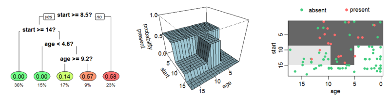
</div>

The left shows the tree diagram

The middle shows the actual regression function

The right shows a 2d projection of the regression function

---

# Regularizing regression trees

If we just followed the regression tree algorithm we could minimize error by splitting until there is just one observation in each feature subspace, this will have perfect in-sample prediction but terrible out-of-sample prediction

--

We solve this problem similar to how we did linear regression: we penalize complexity (the number of leaves)

--

$$Q(g) + \lambda \cdot \#leaves$$

--

The penalty (if large enough) will keep the tree from having too many nodes

---

# Cross-validating trees

- Create a grid of $\lambda$s, for each $\lambda$:
    - Split data into $k$ mutually-exclusive folds of about equal size, usually choose $k=5,10$
    - For $j=1,...,k$
        - Grow the tree using all folds but fold $j$
        - Predict out-of-sample on fold $j$
    - Compute squared prediction error across the $k$ folds: $Q(\lambda) = \sum_{j=1}^k \sum_{i \in \text{fold j}} \left(y_i - g(j,\lambda)\right)$
- Choose $\hat{\lambda}_{min} = argmin_{\lambda} Q(\lambda)$

This is very similar to how we cross-validated for LASSO/ridge

---

# Pruning trees

Using this simple cross-validation approach may stop growing the tree *too early*, one split may not help immediately, but it may help us find future profitable splits

--

This is a drawback of a greedy algorithm

--

This suggests that one way we can improve is by .hi-blue[pruning] the tree

--

1. Grow a big tree, select some rule to stop like 5 observations per leaf, or a very small $\lambda$
--

2. Prune branches or leaves that don't improve the prediction by a sufficient amount

---

# Pruning trees: examples

The simplest way to prune is called .hi-blue[reduced error pruning]

--

1. Starting at the leaves, remove each node
--

2. Check if prediction accuracy on the validation sample is the same or better
--

3. If 2 is true, remove the node
--

4. Continue until we cannot improve the tree any further

--

This is simple and fast

--

There are other more complex ways to prune

---

# Bagging predictors

Single trees typically are not great predictors

--

One way to improve upon a single tree is to bootstrap aggregate (bag) a prediction

--

This generally reduces variance and helps with avoiding overfitting

---

# Bagging predictors

Bagging is easy:

1. Bootstrap resample B datasets
2. Estimate a tree on each dataset (can use data-driven cross-validation, pruning, whatever)
3. Average all the predictions: $\frac{1}{B}\sum_{j=1}^B g_j(x)$

--

This only matters because trees are non-linear,
so bagging smooths out the end predictions

---

# Random forests

The problem with bagging is that the $B$ bagged estimated are correlated

--

Important regressors will always appear near the top of the tree in the bootstrapped samples

--

This means all the trees will look similar

--

Predictions won't actually be as good as you might think

--

How can we break this correlation?

---

# Random forests

Randomly select only $L$ out of $K$ features: feature bagging

--

How big should $L$ be?

--

Not obvious, no real theoretical guidance

--

For classification problems $\sqrt{K}$ is recommended

For regression $K/3$ is recommended

---

# Boosted trees

.hi-blue[Boosting] is another method to improve prediction from weak learners (better than random chance predictors)

--

We can improve on a regression tree by repeatedly applying shallow trees to residualized data

Let $g(x|X,Y)$ be a simple regression tree

--

Define the residual as $\varepsilon_{1i} = Y_i - g_1(X_i|X,Y)$

--

With a boosted tree we then estimate a regression tree on the new data $(X,\varepsilon_{1})$

---

# Boosted trees

Repeat this process many times to get a set of $g$s

--

These give you an additive approximation to the actual regression tree:
$$\sum_{m=1}^M g_m(x|X,\varepsilon_{m-1}) = \sum_{k=1}^K h_k(x_k) \text{ where } \varepsilon_0 = Y$$

---

# Boosted trees

By continually residualizing and re-estimating, its like we are adding functions $h_k$ sequentially to our regression

--

When boosting, we typically use shallow trees of only around 4-8 splits, but we grow many, many trees

--

We generally fix tree depth but select number of trees in a quasi-cross-validation procedure

---

# Trees examples: Preliminaries

We need `ISLR` for our tree data, `tree` to do the regression tree, `randomForest` to estimate a random forest, and `gbm` to estimate a boosted forest

We will be working with the carseats dataset
```{r, echo = FALSE}
if (!require("pacman")) install.packages("pacman")
pacman::p_load(ISLR, tree, randomForest, gbm, tidyverse)
set.seed(123)
```
```{r, eval = FALSE}
if (!require("pacman")) install.packages("pacman")
pacman::p_load(ISLR, tree, randomForest, gbm, tidyverse)
set.seed(123)
```


---

# Supervised learning examples: Preliminaries

```{r}
carseats <- Carseats %>% as_tibble()
carseats
```

---

# Supervised learning example: estimating a tree

Lets estimate our regression tree with car sales as the outcome

```{r}
tree_carseats <- tree(Sales ~ ., data = carseats)
summary(tree_carseats)
```

---

# Supervised learning example: the tree

```{r, fig.align = 'center', fig.width = 15, fig.height = 7.5}
plot(tree_carseats)
text(tree_carseats, pretty = 0)
```

---

# Supervised learning example: the tree

```{r, fig.align = 'center', fig.width = 15, fig.height = 7}
set.seed(101)
train <- sample(1:nrow(carseats), 320)
tree_carseats <- tree(Sales ~ ., carseats, subset = train)
plot(tree_carseats)
text(tree_carseats, pretty = 0)
```

---

# Supervised learning example: the tree's error

```{r, fig.align = 'center', fig.width = 15, fig.height = 7}
tree_pred <- predict(tree_carseats, carseats[-train,])
mse <- mean((carseats[-train,]$Sales - tree_pred)^2)
mse
```

---

# Supervised learning example: cross-validation

```{r, fig.align = 'center'}
cv_carseats = cv.tree(tree_carseats)
plot(cv_carseats)
```

---

# Supervised learning example: pruning

```{r, fig.align = 'center'}

set.seed(123)
prune_carseats <- prune.tree(tree_carseats, best = 10)
plot(prune_carseats)
text(prune_carseats, pretty = 0)
```

---

# Supervised learning example: pruning

```{r, fig.align = 'center'}
tree_pred_prune = predict(prune_carseats, carseats[-train,])
mse_prune <- mean((carseats[-train,]$Sales - tree_pred_prune)^2)
mse
mse_prune
```

---

# Supervised learning example: random forests

```{r, fig.align = 'center'}
set.seed(101)
train = sample(1:nrow(carseats), 320)
rf_carseats = randomForest(Sales~., data = carseats, subset = train)
rf_carseats
mse
mse_prune
```

---

# Random forests: variable importance

```{r, fig.align = 'center'}
varImpPlot(rf_carseats)
```

---

# Random forests: tuning feature bagging

```{r, fig.align = 'center'}
oob_err = double(10)
test_err = double(10)
for (mtry in 1:10) {
  set.seed(101)
  fit = randomForest(Sales~., data = carseats, subset = train, mtry = mtry, ntree = 350)
  oob_err[mtry] = mean(fit$mse)
  pred = predict(fit, carseats[-train,])
  test_err[mtry] = with(carseats[-train,], mean( (Sales - pred)^2 ))
}
```

---

# Random forests: tuning feature bagging

```{r, fig.align = 'center'}
matplot(1:mtry, cbind(test_err, oob_err), pch = 23, col = c("red", "blue"), type = "b", ylab = "Mean Squared Error")
legend("topright", legend = c("OOB", "Test"), pch = 23, col = c("red", "blue"))
```

---

# Boosted trees

```{r, fig.align = 'center'}
boost_carseats = gbm(Sales~., data = carseats[train,],
                     distribution = "gaussian", n.trees = 10000, shrinkage = 0.01, interaction.depth = 4)
summary(boost_carseats)
```

---

# Boosted trees, the important variables

```{r, fig.align = 'center'}
plot(boost_carseats, i = "Price")
plot(boost_carseats, i = "CompPrice")
```

---

# Boosted trees, prediction error

```{r, fig.align = 'center', fig.width = 8, fig.height = 6}
n_trees = seq(from = 100, to = 10000, by = 100)
predmat = predict(boost_carseats, newdata = carseats[-train,], n.trees = n_trees)
boost_err = with(carseats[-train,], apply( (predmat - Sales)^2, 2, mean) )
plot(n_trees, boost_err, pch = 23, ylab = "Mean Squared Error", xlab = "# Trees", main = "Boosting Test Error")
abline(h = min(test_err), col = "red")
```


---

# ML for inference: SCUL

One new method using machine learning for causal inference is .hi[synthetic control using lasso (SCUL)] by Hollingsworth and Wing

--

Here's the intuition:

--

With synthetic control, we have a treated unit

--

We want to construct a *synthetic* control group for this treated unit using combinations of untreated units in our data

--

We construct this group using .hi-red[pre-treatment] data, and then its post-treatment behavior is our counterfactual

---

# Synthetic control

SCM has:

1. A time series of outcomes for a treated unit
2. A time series of outcomes for $N$ untreated units (also called the donor pool)

--

SCM then uses a weighted average of the $N$ donors as a counterfactual for the treated unit

--

You can think of SCM as .hi[matching:] we are trying to match our treated series to a set of our donor series based on factors that determine the data generating process *prior to treatment*

---

# Synthetic control

Every time series has some data generating process:
$$y_{it} = \delta_t \alpha_i + \varepsilon_{it}$$
where $y_{it}$ is the observed outcome, and $\alpha_i$ is some unobserved unit-specific factor

--

Ideally we would match on $\alpha_i$, but we don't have these in our data

--

So we have to match on the observed $y_{it}$, which has some error component $\varepsilon_{it}$

---

# Synthetic control

We "match" using a weighted combination of the donor pool:
$$y_{t}^* = \sum_{i=1}^N y_{it} \pi_i$$
where $\pi_i$ is some weight assigned to donor unit $i$

--

The challenge in synthetic control is determining the weights $\pi_i$, how they are determined (i.e. how they minimize prediction error) is what differentiates the classes of synthetic control methods

--

SCUL uses LASSO to choose the donor pool and weights

---

# Synthetic control in figures

Consider this target/treated series
.center[
```{r, out.width = "50%", fig.pos="c", echo = FALSE}

```
]

---

# Synthetic control in figures

Some treatment occurs
.center[
```{r, out.width = "50%", fig.pos="c", echo = FALSE}
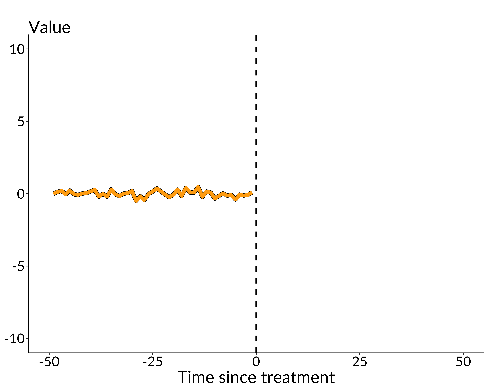
```
]

---

# Synthetic control in figures

There seems to be a treatment effect
.center[
```{r, out.width = "50%", fig.pos="c", echo = FALSE}
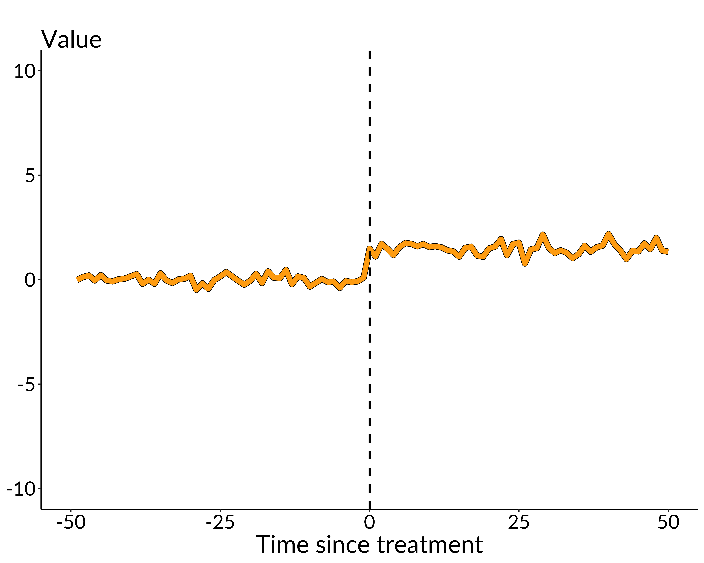
```
]

---

# Synthetic control in figures

Can we use untreated units to estimate the size?
.center[
```{r, out.width = "50%", fig.pos="c", echo = FALSE}

```
]

---

# Synthetic control in figures

Untreated units are the .hi[donor pool]
.center[
```{r, out.width = "50%", fig.pos="c", echo = FALSE}
knitr::include_graphics("figures/placebo_plot.png")
```
]


---

# Synthetic control in figures

Restrict focus to the .hi[untreated] time period
.center[
```{r, out.width = "50%", fig.pos="c", echo = FALSE}
knitr::include_graphics("figures/placebo_plot_treatment.png")
```
]


---

# Synthetic control in figures

Is there a combo of donors that's a good match for the treated unit?
.center[
```{r, out.width = "50%", fig.pos="c", echo = FALSE}
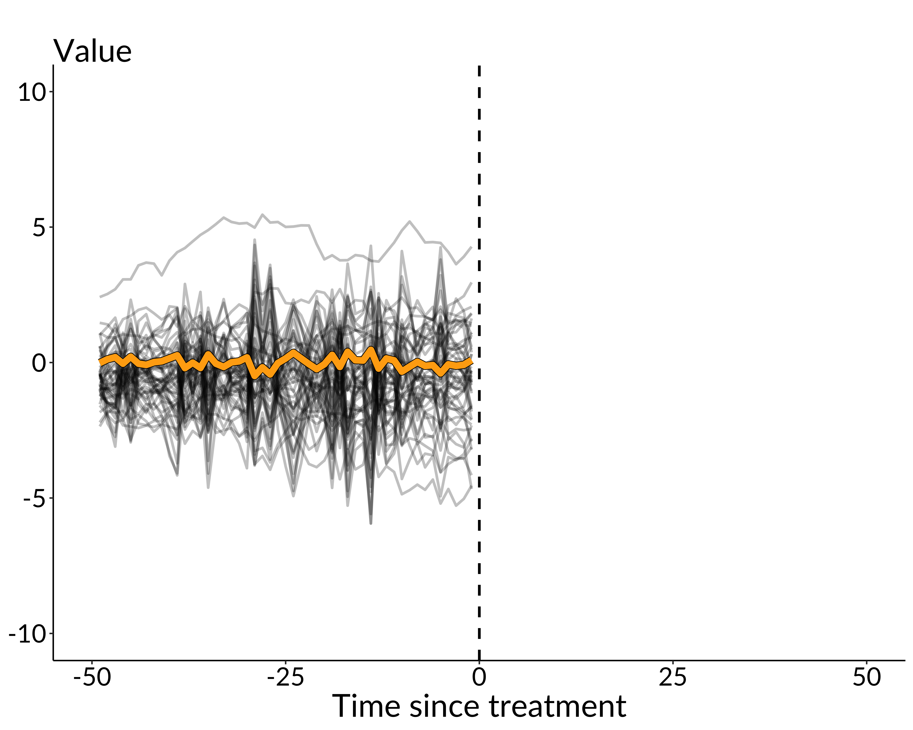
```
]

---

# Synthetic control in figures

Yes!
.center[
```{r, out.width = "50%", fig.pos="c", echo = FALSE}

```
]

---

# Synthetic control in figures

Let's focus on the "good" donors
.center[
```{r, out.width = "50%", fig.pos="c", echo = FALSE}
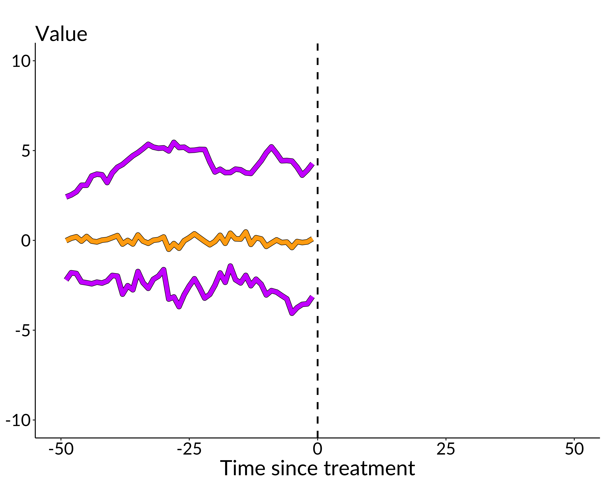
```
]


---

# Synthetic control in figures

Use these to form a pre-treatment prediction
.center[
```{r, out.width = "50%", fig.pos="c", echo = FALSE}
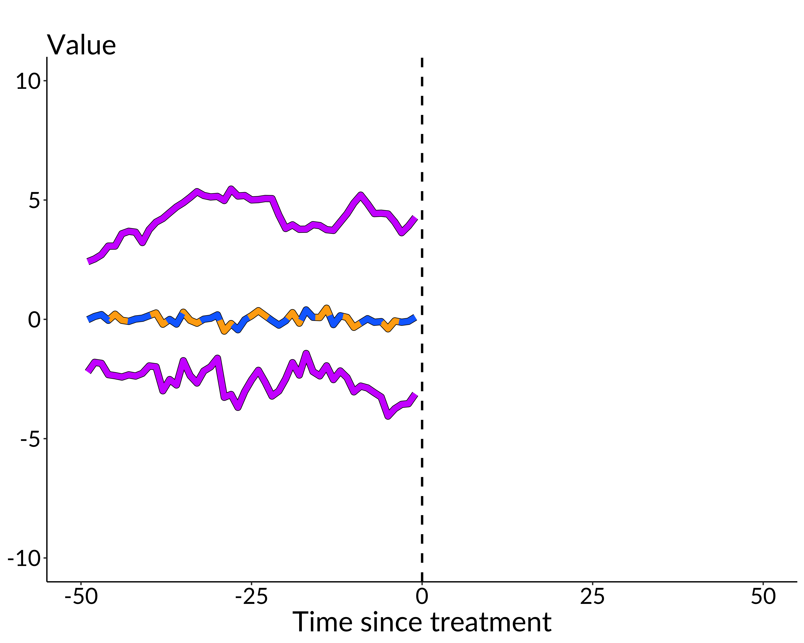
```
]

---

# Synthetic control in figures

Extend this to the post-treatment period
.center[
```{r, out.width = "50%", fig.pos="c", echo = FALSE}
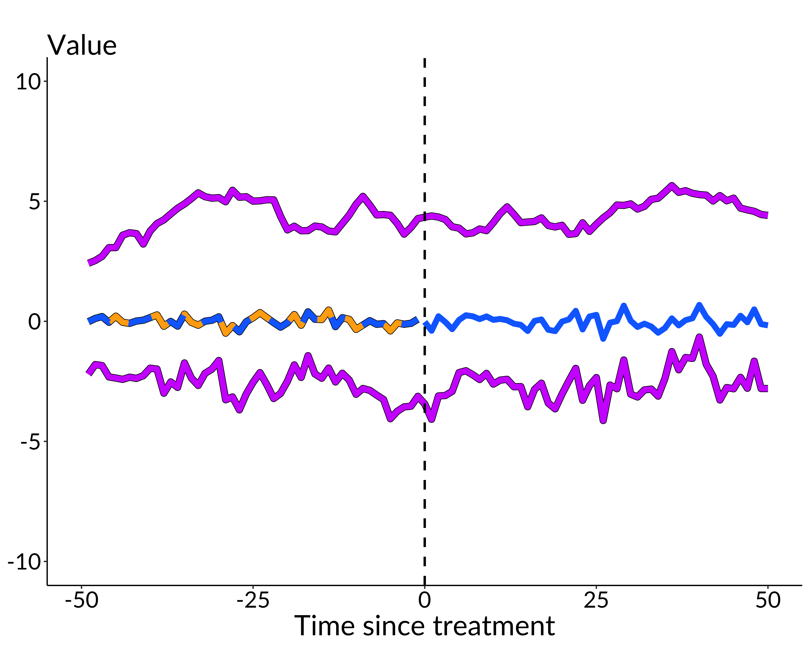
```
]

---

# Synthetic control in figures

This is our counterfactual prediction of the treated unit
.center[
```{r, out.width = "50%", fig.pos="c", echo = FALSE}
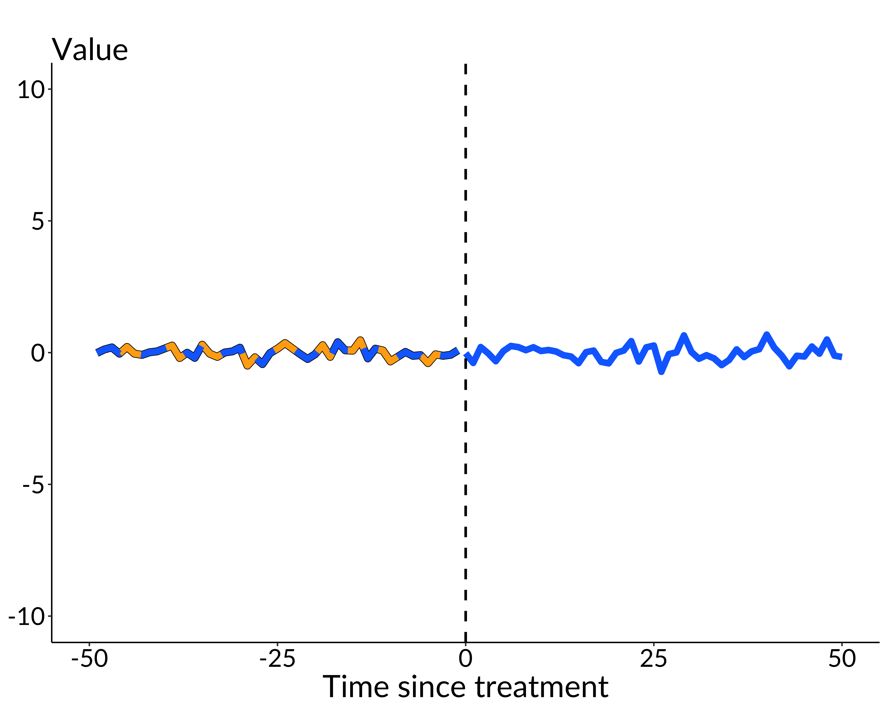
```
]

---

# Synthetic control in figures

Compare to the observed series
.center[
```{r, out.width = "50%", fig.pos="c", echo = FALSE}
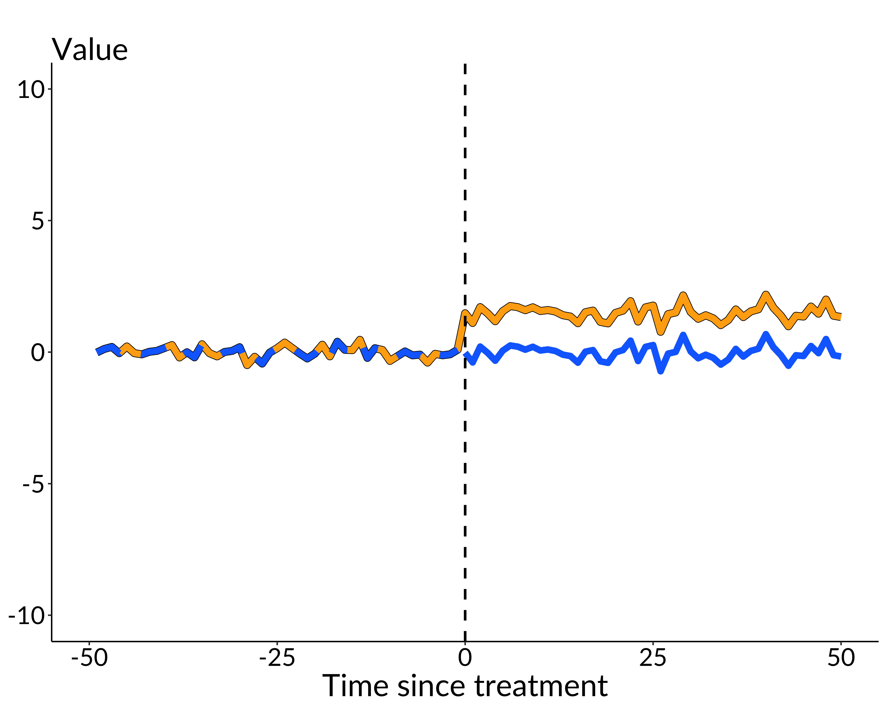
```
]

---

# Synthetic control in figures

The difference is the treatment effect
.center[
```{r, out.width = "50%", fig.pos="c", echo = FALSE}
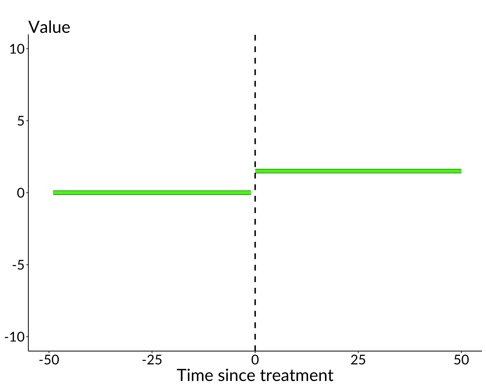
```
]

---

# Synthetic control weights

SCM weights are often chosen by simple OLS: select the weights that minimize the difference between the pre-treatment values of the synthetic control time series, and the treated time series
$$\widehat{\omega}_{OLS} = arg\ min_{\omega}\left(\sum_{t=1}^{T_0}(y_{0t}-x_t \omega)^2 \right)$$

--

The weights are simply the coefficients that arise from a regression of outcomes for the treated unit on the outcomes from each of the comparison units using only the $t=1...T_{0}$ observations from the pre-treatment period

--

The synthetic control group is the predicted value from the regression for each period

---

# Synthetic control weights

Why is OLS potentially not good here?

--

We want good .hi[predictions]

--

OLS may overfit and have bad out-of-sample properties (i.e. post-treatment)

--

If there are more donor units than pre-treatment observations there is no unique solution


---

# Synthetic control drawbacks

Classic synthetic control has two other major drawbacks
.center[
```{r, out.width = "60%", fig.pos="c", echo = FALSE}
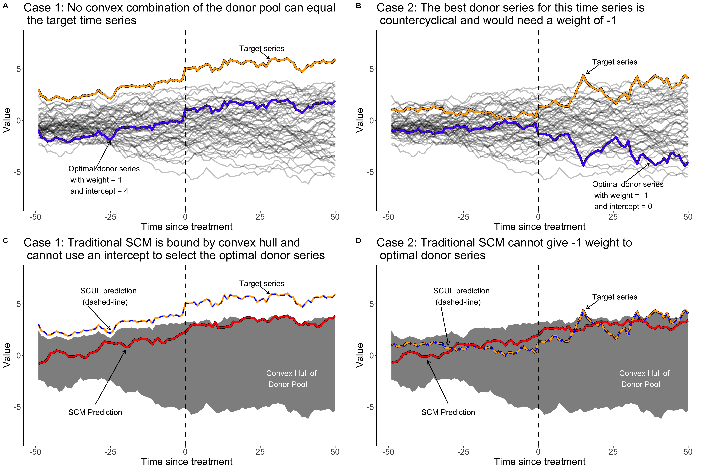
```
]


---

# SCUL

SCUL uses LASSO to be disciplined with weight selection:
\begin{align}
 \widehat{\omega}_{lasso} = arg \ min_{\omega } \left(\sum_{t=1}^{T_0}(y_{0t}-x_t \omega)^2+\lambda|\omega|_1  \right)
\end{align}

--

We penalize choosing additional units as donors like we penalize extra regressors in OLS

--

How do we cross-validate $\lambda$ here?

--

The tricky thing is that we have full .hi[time series], future and present observations are related, so full random sampling doesn't seem right...


---

# SCUL: rolling-origin cross-validation

SCUL uses .hi[rolling-origin cross-validation]

.center[
```{r, out.width = "75%", fig.pos="c", echo = FALSE}
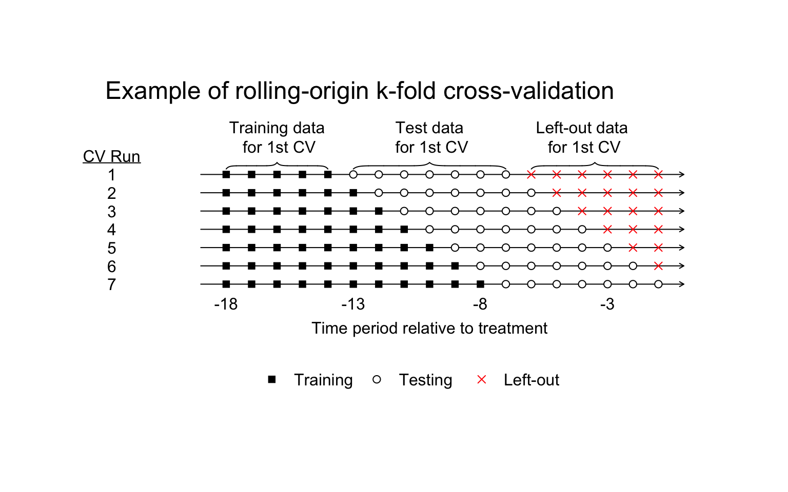
```
]

---

# SCUL in practice

Now let's actually .hi[use] SCUL

--

We will be using state-year level data from 1970-1997 on cigarette sales per capita and prices

--

SCUL requires data to be in .hi[wide] format, rows are time periods, columns are unit-specific variables

--

Sort the data so earliest dates are first

---

# SCUL in practice

```{r install scul}
if (!require("devtools")) install.packages("devtools")
devtools::install_github("hollina/scul")
library(scul)
library(tidyverse)
```

---

# SCUL in practice

Let's look at the data

```{r data look}
dim(cigarette_sales)
head(cigarette_sales[,1:6])
```


---

# SCUL in practice

Next we need to break the data in two dataframes, one for the treated group `treated_data` and one for the donor pool `donor_data`
```{r break data into two}
target_data <- cigarette_sales[, 1:2] # target/treated product
donor_data <- cigarette_sales %>% # donors
  select(-year, -cigsale_6, -retprice_6)
```


---

# SCUL in practice: pre-process

SCUL has a function `Preprocess` that lets ensures the data are in the correct format
```{r preprocess}
processed.target <- Preprocess(target_data)
processed.donor <- Preprocess(donor_data)
processed.target
```


---

# SCUL in practice: pre-process subsets

We will be using CV to avoid overfitting, CV works on subsets of the data so we need to preprocess the subsets as well

```{r preprocess subsets}
TreatmentBeginsAt <- 19 # Here the 18th row is 1988
PostPeriodLength <- nrow(processed.target) - TreatmentBeginsAt + 1
PrePeriodLength <- TreatmentBeginsAt - 1
NumberInitialTimePeriods <- 5
processed.target <- PreprocessSubset(processed.target,
                                       TreatmentBeginsAt ,
                                       NumberInitialTimePeriods,
                                       PostPeriodLength,
                                       PrePeriodLength)
```

---

# SCUL in practice: clean donor and placebo pool

Next we want to clean the donor pool and the pool we will use for placebo analysis

```{r organize}
SCUL.input <- OrganizeDataAndSetup (
    time =  data.frame(processed.target[, 1]),
    y = data.frame(processed.target[, 2]),
    TreatmentBeginsAt = TreatmentBeginsAt,
    x.DonorPool = processed.donor[, -1],
    CohensDThreshold = 0.25,
    NumberInitialTimePeriods = NumberInitialTimePeriods,
    TrainingPostPeriodLength = 7,
    x.PlaceboPool = processed.donor[, -1],
    OutputFilePath="vignette_output/"
)
```


---

# SCUL in practice: examine data

Let's look at our actual data before we proceed using `GraphTargetData()`

```{r examine data, warning = FALSE, fig.width = 10, results = 'hide', eval = FALSE}
GraphTargetData()
```

---

# SCUL in practice: examine data

```{r examine data2, warning = FALSE, fig.width = 10}
GraphTargetData()
```


---

# SCUL in practice: run it

```{r run scul}
SCUL.output <- SCUL()
SCUL.output
```


---

# SCUL in practice: run it

`SCUL.output` contains a number of useful things:

- `time`: A vector of the running time variable
- `TreatmentBeginsAt`: A scalar indicating the row that treatment begins
- `y.actual`: The observed target series
- `y.scul`: The counterfactul prediction from SCUL of the target series

---

# SCUL in practice: run it

`SCUL.output` contains a number of useful things:
- `CrossValidatedLambda`: The median cross-validated lambda from all of the cross-validation runs that is used to create `y.scul`. For this example, $\lambda$ = `r round(SCUL.output$CrossValidatedLambda, digits = 2)`
- `CohensD`: A unit-free measure of fit between `y.actual` and `y.scul`. Discussed more below. For this example the fit is `r round(SCUL.output$CohensD, digits = 2)`
- `coef.exact`: A matrix of the coefficients for each donor variable which are used to create the synthetic prediction

---

# SCUL in practice: plot results

```{r plot actualvsSCUL, fig.width = 10, fig.align = 'center'}
PlotActualvSCUL()
```


---

# SCUL in practice: pre-period fit

At this point you also want to evaluate the pre-period fit, there's no guarantee any SCM approach can find a weighted combo of donors that matches the treated unit well

--

Hollingsworth and Wing have some suggestions on how to do this specifically for this approach

---

# SCUL in practice: pre-period fit

The common approach is to say we have a good fit if the .hi[Cohen's D statistic] $D_s$ is less than 0.25 where:
$$D_s = \frac{1}{T_0}\sum_{t=1}^{T_0}|\frac{y_{st} - y^{*}_{st}}{\sigma_{s}}|$$
and
$$\sigma_{s} = \frac{1}{T_0}\sum_{t=1}^{T_0}(y_{st} - \overline{y_s})^2$$


---

# SCUL in practice: pre-period fit

If $D_s < 0.25$ then the imbalance is less than a quarter of a standard deviation

--

This is arbitrary, but its unit-free and standardized


---

# SCUL in practice: looking at the weights

Next we can look at the weights with `PlotShareTable()`

```{r plot weights}
PlotShareTable()
```


---

# SCUL in practice: inference

So now we have our counterfactual time series, and we know how it was constructed

--

Next we want to actually do statistical inference

--

We need a measure of uncertainty

--

We do this using randomization inference (Cavallo et al. 2013; Dube and Zipperer 2015)


---

# SCUL in practice: inference

We construct a rank-based two-sided p-value by comparing:

--

- Absolute values of the .hi[actual] standardized treatment estimates
- Relative to absolute values of standardized treatment estimates using placebo time series

--

The latter serves as a null distribution

--

We then can basically count what percent of placebo treatment effects were larger than the actual


---

# SCUL in practice: inference

Now we need to estimate the pseudo/placebo treatment effects:

```{r placebo effects}
SCUL.inference <- CreatePlaceboDistribution()
```

---

# SCUL in practice: plot placebos

Now we can make a smoke plot using `SmokePlot()`

--

A smoke plot plots our estimated treatment effect time series relative to the placebos

--

It gives us a visualization of the p-value

---

# SCUL in practice: plot placebos

```{r smoke, fig.width = 8, fig.align = 'center'}
smoke_plot <- SmokePlot()
smoke_plot
```

---

# SCUL in practice: two-sided p value

```{r p value}
Results.y.StandardizedDiff <- (SCUL.output$y.actual-SCUL.output$y.scul) /
    sd(unlist(SCUL.output$y.actual[1:(SCUL.input$TreatmentBeginsAt-1),]))
PValue(
    CohensD = 999,
    StartTime = SCUL.input$TreatmentBeginsAt,
    EndTime = nrow(Results.y.StandardizedDiff)
)
```


---

# SCUL in practice: two-sided p value

```{r p value2}
PValue(
    CohensD = .25,
    StartTime = SCUL.input$TreatmentBeginsAt,
    EndTime = nrow(Results.y.StandardizedDiff)
)
```