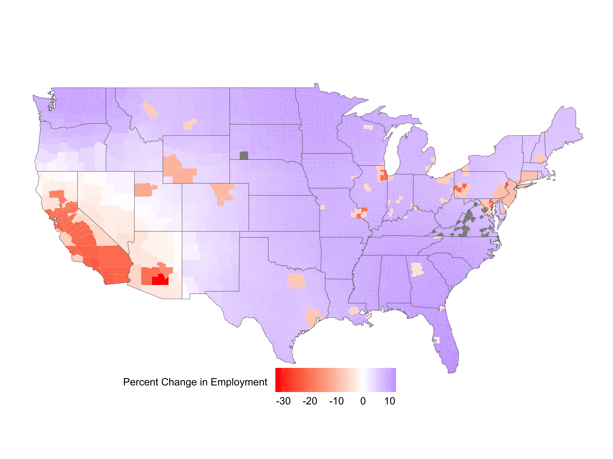

exclude: true
```{r setup}
options(htmltools.dir.version = FALSE)
knitr::opts_hooks$set(fig.callout = function(options) {
  if (options$fig.callout) {
    options$echo <- FALSE
  }
knitr::opts_chunk$set(echo = TRUE, fig.align="", message = FALSE, warning = FALSE)
  options
})
```
```{r xaringanExtra, echo = FALSE}
xaringanExtra::use_xaringan_extra(c("tile_view", "panelset", "webcam"))

```
```{r echo=FALSE}
xaringanExtra::style_panelset(panel_tab_color_active = "red")
```

---

# Roadmap

1. Spatial model simple set up
2. Function iteration solutions
3. Exact hat algebra

---

# Spatial models

With spatial models we are now going to allow for:

- heterogeneity across space
- migration
- trade
- etc

Basically, more consideration of general equilibrium effects

---

# Spatial models

These features better allow us to understand the impacts of things like:

- the costs of sea level rise (Desmet et al. 2021)
- the food problem with productivity shocks (Nath 2020)
- climate and agricultural adaptation (Costinot, Donaldson, Smith 2016)
- the value of transportation infrastructure (Donaldson, 2018)
- the welfare impact of environmental regulation (Hollingsworth, Jaworski, Kitchens and Rudik, 2021)

---

# Simple set up: a model of market access

We're going to start off with a simple .hi[market access] model

--

This model is similar to Donaldson and Hornbeck (2016) and Jaworski and Kitchens (2019)

--

It is a simplified version of the canonical Eaton and Kortum (2002) Ricardian trade model

---

# Simple set up: a model of market access

Here's what we are going to do:

1. Develop the model
2. Show how to solve for model unknowns using data and calibration of parameters
3. Simulate counterfactual outcomes where exogenous model terms (e.g. productivity, trade costs) are different

--

.hi[New computational piece here:] we will be solving for things up to a .hi-blue[normalization], we won't necessarily be able to get the levels of variables, only relative differences

---

# Households

$L_i$ households are in location $i = 1,\dots,N$

--

Households supply labor inelastically, and are perfectly mobile across locations

--

This means that in equilibrium it must be true that 
--
utility is equalized across locations

---

# Households: utility and prices

Household utility is
$$U(C_i) = C_i$$

--

Each industry produces a continuum of varieties (more later) such that $C_i$ is a .hi[constant elasticity of substitution] aggregate of the varieties with elasticity $\sigma$

--

With the CES assumption, we have the .hi[price index] in location $i$ for the final good $C_i$:
$$P_i = \left(\int_0^N P(\omega)^{1-\sigma}d\omega \right)^{\frac{1}{1-\sigma}}$$

---

# Households: equilibrium utility and wages

With Cobb-Douglas preferences, a consumer's indirect utility is given by their .hi[real wage:]
$$V_{i} = \frac{w_{i}}{P_{i}}$$

--

With perfectly mobile labor, utility is equalized in equilibrium and wages $w_i$ satisfy:
$$w_i = \bar{U} P_i$$
where $\bar{U}$ is the level of utility achieved in all counties

---

# Firms

Firms maximize profits and take prices as given

--

For each location, $z_{i}(\omega)$ is .hi[efficiency]

--

This is the quantity of variety $\omega$ that can be produced using one unit of labor in location $i$

---

# Firms: EK assumption

We assume that $z_{i}(\omega)$ is a random variable distributed according to the Frechet distribution (Eaton and Kortum, 2002):
$$F_{i}\left(z\right) = \exp\left[-T_{i} \left(z\right)^{-\theta}\right]$$


--

This distributional assumption is what will buy us tractability in our model later

---

# Firms: EK assumption

$$F_{i}\left(z\right) = \exp\left[-T_{i} \left(z\right)^{-\theta}\right]$$

--

$\theta > 1$ is the trade elasticity parameter common across all states and counties and measures the level of intra-industry heterogeneity

--

Bigger $\theta$ $\rightarrow$ more heterogeneity $\rightarrow$ stronger comparative advantage effects

--

$T_{i}$ measures fundamental productivity

--

Larger values of $T_{i}$ increase the probability of larger efficiency draws $z_{i}(\omega)$ and indicate larger absolute advantage

---

# Firms: Production technology

Perfectly competitive firms use labor, capital, and .hi[Cobb-Douglas] technologies to produce different varieties of goods

--

The marginal cost of producing variety $\omega$ in location $i$ is:
$$MC_i(\omega) = \frac{1}{z_i(\omega)}{(w_i)}^\gamma {(r_i)}^{1-\gamma}$$

--

Total output in location $i$ is given by $Y_i = z_i(\omega) L_i^\gamma K_i^{1-\gamma}$

--


$\gamma_i$ is the share of value added and $r_i$ is the rental rate of capital

--

Capital is perfectly mobile so $r_i = r$ for all $i$

---

# Firms: Trade

Trade costs are .hi[iceberg]

--

Delivering 1 unit of the good from $j$ to $i$ requires shipping $\tau_{ij} \geq 1$ units, this represents the costs of shipping/trade

--

With a bit of math we can solve for the .hi[ideal price index:]
$$P_{i} = \kappa \left(\sum_{n=1}^N T_{n} \left[{(w_n)}^\gamma \tau_{in} \right]^{-\theta} \right)^{-1/\theta}$$

which is the price of a bundle of goods in location $i$, $\kappa$ is a constant

---

# Firms: Trade

$$P_{i} = \kappa \left(\sum_{n=1}^N T_{n} \left[{(w_n)}^\gamma \tau_{in} \right]^{-\theta} \right)^{-1/\theta}$$

Notice $P_i$ is increasing in sellers' trade costs $\tau_{in}$ and input costs $w_n$, and decreasing in productivity $T_n$

--

${(P_{i})}^{-\theta}$ is often called consumer market access $(CMA_i)$ and captures location $i$'s access to cheaper products

---

# Firms: Trade

.hi[Bilateral trade expenditures] of location $i$ on goods from location $j$ are given by:
$$X_{ij} = \kappa T_{j} Y_i\left(\frac{ {(w_j)}^\gamma \tau_{ij}}{{P_{i}}}\right)^{-\theta}$$

--

$i$ purchases more products from $j$ if:

- the costs of products from $j$ are lower: smaller $w_j, \tau_{ij}$, larger $T_j$
- $i$ is richer $Y_i$
- Consumer market access ${(P_{i})}^{-\theta}$ is lower


---

# Firms: Market access

Firms also have a .hi[market access] term $FMA_j$ that we can derive from combining the equilibrium real wage, price index, and trade expenditures expressions:
$$FMA_j = \sum_{i=1}^N \frac{\tau_{ij}^{-\theta}Y_i}{CMA_i}$$

--

Firm market access captures the firm side: their access to higher price markets

---

# Firms: Market access

$$FMA_j = \sum_{i=1}^N \frac{\tau_{ij}^{-\theta}Y_i}{CMA_i}$$

FMA is higher if:

- Trade costs are lower $(\tau_{ij})$
- Other locations are richer $(Y_i)$


---

# We did it

So that is the model

--

Now we need to solve it

--

One of the key pieces in our model are the .hi[market access terms]

--

It turns out, FMA and CMA are .hi-blue[equivalent up to a normalization by a constant:]
$$MA_i \equiv FMA_i = \rho CMA_i$$


---

# Solving the model

What we need in order to fully solve the model is pretty simple: 

--

.hi[the N unobserved exogenous] $T_i$ .hi[terms]
--
, all other exogenous terms are just parameters we calibrate/estimate (e.g. trade costs) or data (labor)

--

To recover the $T_i$s, we first need to solve for the factual equilibrium of the model

--

This means we need to recover the market access terms MA

--

Now lets see how we solve for MA and T

---

# Solving the model: market access

$$FMA_j = \sum_{i=1}^N \frac{\tau_{ij}^{-\theta}Y_i}{CMA_i}$$

--

using the equivalency between FMA and CMA, and that $Y_i = \frac{w_i L_i}{\gamma}$ from labor market clearing we have our condition allowing us to solve for market access:
$$MA_j = \rho \sum_{i=1}^N \tau_{ij}^{-\theta} MA_i^{\frac{-(1+\theta)}{\theta}} L_i$$

For $j=1,\dots,N$ this is a system of N equations

---

# Solving the model: market access

$$MA_j = \rho \sum_{i=1}^N \tau_{ij}^{-\theta} MA_i^{\frac{-(1+\theta)}{\theta}} L_i$$

$N$ unknown MA terms, everything else is a parameter $(\tau_{ij}, \theta)$ or data $L_i$

--

$\rho$ is the remaining unknown, but is just a scalar

--

.hi[Fujimoto-Krause] shows that we can solve for the vector $MA$ up to this normalization using function iteration, but where our update is:
$$MA_{new} = \frac{RHS(MA_{old})}{||RHS(MA_{old})||}$$


---

# Solving the model: market access

```
function solve_price(data, params, labor)

    # set up intial guesses
    ma_temp = collect(1:size(data.L)[1])
    ma_new = data.tau_theta * (ma_temp .^ (-(1 + params.theta) / params.theta) .* labor)
    ma_temp = ma_new / sqrt(sum(ma_new .^ 2))
    error = Inf

    # use Fujimoto-Krause to solve for MA up to a normalization
    while error > params.tol * params.damping
        ma_new = data.tau_theta * (ma_temp .^ (-(1 + params.theta) / params.theta) .* labor) # RHS of MA equation
        ma_new = ma_new / sqrt(sum(ma_new .^ 2)) # normalize
        error = sqrt.(sum((ma_new .- ma_temp) .^ 2))
        ma_temp = params.damping * ma_new + (1 - params.damping) * ma_temp # damp the update
    end
    
    # Convert to price index
    price = ma_new .^ (-1 / params.theta)
    return price
    
end
```

---

# Solving the model: productivity

Now we need to solve for productivity $T_j$

--

How do we do this?

--

Recall:
$$X_{ij} = \kappa T_{j} Y_i\left(\frac{ {(w_j)}^\gamma \tau_{ij}}{{P_{i}}}\right)^{-\theta}$$

and

$$P_{i} = \kappa \left(\sum_{n=1}^N T_{n} \left[{(w_n)}^\gamma \tau_{in} \right]^{-\theta} \right)^{-1/\theta}$$
 
---

# Solving the model: productivity

$$X_{ij} = \kappa T_{j} Y_i\left(\frac{ {(w_j)}^\gamma \tau_{ij}}{{P_{i}}}\right)^{-\theta}$$


Plug in $P_i$, and use $\bar{U} = \frac{w_i}{P_i}$ to get an expression for equilibrium labor allocations as a function of productivity and market access:
$$L_j = \underbrace{\kappa \gamma T_j \bar{U}^{-(1+\gamma \theta)}}_{\eta_j} MA_j^{\frac{\theta(1+\gamma)+1}{\theta}}$$
where $\kappa$ is some constant, and $\eta_j$ is $T_j$ up to a normalization by a constant


---

# Solving the model: productivity


$$L_j = \eta_j MA_j^{\frac{\theta(1+\gamma)+1}{\theta}}$$

--

We can solve for $\eta_j$ which is just $T_j$ up to a normalization by a constant $\kappa \gamma \bar{U}^{-(1+\gamma \theta)}$
$$\eta_j = L_j MA_j^{-\frac{\theta(1+\gamma)+1}{\theta}}$$

--

Labor is higher areas with greater market access (cheaper goods), or higher productivity (higher wage)

---

# Solving the model: productivity

```
function solve_productivity(data, params)

    # Iterate on equation to solve for market access
    # Then invert to recover P
    price = solve_price(data, params, data.L)

    # recover T up to a normalization
    T =
        exp.(
            log.(data.L) .-
            ((1 + params.theta * (1 + params.gamma)) / params.theta) .*
            log.(price .^ (-params.theta)),
        )

    return T

end
```

--

Now we have all the unknown exogenous pieces of the model and can simulate it given changes in model parameters

---

# Simulating the model

Suppose we want to measure the effect of a change in productivity to $T^c_j$ where superscript $c$ denotes counterfactual quantities

--

We have 2N+1 unknowns: $MA^c_j, L^c_j, \bar{U}^c$ for $j=1,\dots,N$

---

# Simulating the model

First rearrange the labor expression to solve for market access:
$$MA^c_j = \left[\frac{L^c_j}{\eta^c_j}\right]^{\frac{\theta}{\theta(1 + \gamma) + 1}}$$

where $\eta^c_j$ is a function of $T^c_j$

--

This is a set of $N$ equations that pins down MA conditional on L

---

# Simulating the model

$$MA^c_j = \left[\frac{L^c_j}{\eta^c_j}\right]^{\frac{\theta}{\theta(1 + \gamma) + 1}}$$

--

Next we can insert the $MA^c_j$ terms into the MA fixed point equation:
$$MA^c_j = \rho \sum_{i=1}^N \tau_{ij}^{-\theta} {MA^c_i}^{\frac{-(1+\theta)}{\theta}} L^c_i$$

--

This is another $N$ equations that now pins down L

--

We still need to pin down $\bar{U}^c$


---

# Simulating the model

Pinning down $\bar{U}^c$ is where the *up to a normalization* part comes in

--

The pinned down $L^c_j$s above won't necessarily sum up to $\sum_{i=1}^N L_i$

--

We pin down $\bar{U}^c$ by inflating all the $L^c_j$ terms by some constant factor $\zeta$ so they sum up to the factual level of labor $\sum_{i=1}^N L_i$

--

We are just imposing the last remaining equation, the labor resource constraint:
$$\sum_{i=1}^N L^c_i = \sum_{i=1}^N L_i$$

---

# Simulating the model

$$MA^c_j = \left[\frac{L^c_j}{\eta^c_j}\right]^{\frac{\theta}{\theta(1 + \gamma) + 1}}$$

$$MA^c_j = \rho \sum_{i=1}^N \tau_{ij}^{-\theta} {MA^c_i}^{\frac{-(1+\theta)}{\theta}} L^c_i$$

$$\sum_{i=1}^N L^c_i = \sum_{i=1}^N L_i$$

2N+1 equations and 2N+1 unknowns, we can solve this system of equations to get our new equilibrium under $\bar{T}^c_j$


---

# Simulating the model

We can then compute the change in welfare from this new equilibrium:
$$\frac{\bar{U}^c}{\bar{U}} = \left({\eta^c / \eta}\right)^{-1/(1+\gamma \theta)}$$

--

All the constant terms that we never explicitly solved for in $\eta$ cancel out so we can still identify the .hi[change] in welfare and employment

--

Now lets look at the code


---

# Simulating the model: solving for a change in welfare

Suppose we change eta from `eta_bar` to `eta_counter`

--

Our code might look like:

```{julia, eval = F}
function solve_counterfactual_base(eta_bar, data, params, regulation_counter)

    eta_counter = eta_bar .* regulation_counter

    # solve for labor allocation
    labor_counter = solve_labor(data, params, eta_counter)
    .
    .
```

What does `solve_labor` do?

---

# Simulating the model: solving for labor

```{julia, eval = F}
function solve_labor(data, params, eta_counter)

    # insert L into market access
    g = 1 + params.theta * (1 + params.gamma)
    L_temp = data.L
    L_new =
        eta_counter .*
        (data.tau_theta * ((L_temp ./ eta_counter) .^ (-(1 + params.theta) / g) .* L_temp)) .^
        (g / params.theta)
    L_temp = L_new / sqrt(sum(L_new .^ 2))
    error = Inf
    .
    .
    # next do function iteration
```

---

# Simulating the model: solving for labor

```{julia, eval = F}
    .
    .
    # use Fujimoto-Krause to solve for L up to a normalization
    while error > params.tol
        L_new =
            eta_counter .*
            (data.tau_theta * ((L_temp ./ eta_counter) .^ (-(1 + params.theta) / g) .* L_temp)) .^
            (g / params.theta)
        L_new = L_new / sqrt(sum(L_new .^ 2))
        error = sqrt.(sum((L_new .- L_temp) .^ 2))
        L_temp = L_new
    end
    return L_new
end
```


---

# Simulating the model: solving for a change in welfare

```{julia, eval = F}
    .
    labor_counter = solve_labor(data, params, T_counter)
    labor_counter = labor_counter ./ sum(labor_counter) .* sum(data.L) # normalize
    price_counter = solve_price(data, params, labor_counter) # get price index

    eta_counter = # with P^c, L^c we can solve for eta^c
        exp.(log.(labor_counter) .-
            ((1 + params.theta * (1 + params.gamma)) / params.theta) .*
            log.(price_counter .^ (-params.theta)),
        ) ./ regulation_counter
    delta_U = (eta_counter ./ eta_bar) .^ (-1 / (1 + params.gamma * params.theta))

    results = DataFrame(
        eta_bar = vec(eta_bar), T_bar_counter = vec(eta_bar_counter),
        cf_reg = vec(regulation_counter),
        labor_before = vec(data.L), labor_after = vec(labor_counter),
        labor_change = vec(labor_counter ./ data.L), welfare_change = vec(delta_U))

    return results
 
end
```


---

# Simulating the model

What was the effect of the Clean Air Act on manufacturing employment?
.center[
```{r, out.width = "60%", fig.pos="c", echo = FALSE}

```
]


---

# Exact hat algebra

We can reframe how we solve this in a different way

Suppose we want to know the effect of a change in productivity $\hat{T_j} = \frac{T^c_j}{T_j}$

--

Hats denote changes in a variable from factual to counterfactual

--

It turns out it's relatively easy to solve these models in terms of *changes*

---

# Exact hat algebra

First we need to define a new variable, .hi[expenditure shares:]
$$\lambda_{ij} = \frac{X_{ij}}{\sum_{h=1}^N X_{ih}}$$

--

This is just the share of total expenditures on products from location $j$

--

Substitute in for the $X_{ih}$ terms to get:
$$\lambda_{ij} = \frac{T_{j} \left( {(w_j)}^\gamma \tau_{ij}\right)^{-\theta}}{\sum_{h=1}^N T_{h} \left( {(w_h)}^\gamma \tau_{ih}\right)^{-\theta}}$$

---

# Exact hat algebra

Also notice that labor's share of total income $w_i L_i = \gamma Y_i$ can be written as a function of the sum of expenditures by $j$ on products from $i$
$$w_i L_i = \gamma \sum_{j=1}^N \lambda_{ji} w_j L_j$$
---

# Exact hat algebra

$$\lambda_{ij} = \frac{T_{j} \left( {(w_j)}^\gamma \tau_{ij}\right)^{-\theta}}{\sum_{h=1}^N T_{h} \left( {(w_h)}^\gamma \tau_{ih}\right)^{-\theta}}$$

$$w_i L_i = \gamma \sum_{j=1}^N \lambda_{ji} w_j L_j$$

Suppose we have a productivity shock $\hat{T}_j$, and that $\hat{\tau}_{ij} = \hat{L} = 1$

--

What we are going to do is manipulate these two expressions into *hat form*

---

# Exact hat algebra

Let's start with the counterfactual labor market clearing condition:
$$w^c_i L^c_i = \gamma \sum_{j=1}^N \lambda^c_{ji} w^c_j L^c_j$$

Notice that $\lambda^c_{ji} w^c_j L^c_j$ is just how much $j$ spends on products from $i$ so that:
$$w^c_i L^c_i = \gamma \sum_{j=1}^N X^c_{ji}$$

---

# Exact hat algebra

Next let's put it into hat form:
$$\hat{w}_i \hat{L}_i = \frac{w^c_i L^c_i}{w_i L_i} = \gamma \sum_{j=1}^N \frac{X^c_{ji}}{w_i L_i} = \gamma \sum_{j=1}^N \frac{X^c_{ji}}{\gamma Y_i}\frac{X_{ji}}{X_{ji}} = \frac{1}{\gamma} \sum_{j=1}^N \frac{X_{ji}}{w_i L_i} \hat{X}_{ji}$$

The change in income due to $\hat{T}_j$ is given by the change in bilateral expenditures, as well as the .hi[factual/observed] income and bilateral expenditures


---

# Exact hat algebra

Now let's look at the counterfactual expenditure shares:
$$\lambda^c_{ij} = \frac{T^c_{j} \left( {(w^c_j)}^\gamma \tau_{ij}\right)^{-\theta}}{\sum_{h=1}^N T^c_{h} \left( {(w^c_h)}^\gamma \tau_{ih}\right)^{-\theta}}$$

And remember that trade costs .hi[do not] change in this example

--

Next, put it in hat form

---

# Exact hat algebra

$$\hat{\lambda}_{ij} = \frac{\lambda^c_{ij}}{\lambda_{ij}} = \frac{\hat{T}_{j} \left( {(\hat{w}_j)}^\gamma\right)^{-\theta}}{\frac{\sum_{h=1}^N T^c_{h} \left( {(w^c_h)}^\gamma \tau_{ih}\right)^{-\theta}}{\sum_{h=1}^N T_{h} \left( {(w_h)}^\gamma \tau_{ih}\right)^{-\theta}}} = \frac{\hat{T}_{j} \left( {(\hat{w}_j)}^\gamma\right)^{-\theta}}{\hat{P_i}^{-\theta}}$$
The change in expenditure shares is given by the changes in productivity, wages, and market access

--

We still need to solve for $\hat{P}^{-\theta}_i$


---

# Exact hat algebra

We can do so with the price index expression:
$$P_{i} = \kappa \left(\sum_{j=1}^N T_{j} \left[{(w_j)}^\gamma \tau_{ij} \right]^{-\theta} \right)^{-1/\theta}$$

Which gives us:
$$\hat{P}_{i}^{-\theta} = \frac{\left(\sum_{j=1}^N T^c_{j} \left[{(w^c_j)}^\gamma \tau_{ij} \right]^{-\theta} \right)}{\left(\sum_{h=1}^N T_{h} \left[{(w_h)}^\gamma \tau_{ih} \right]^{-\theta} \right)}$$
---

# Exact hat algebra

Next we make a few (seemingly odd) substitutions

--

Since $n$ is not in the denominator, we can treat the denominator as a constant and move it inside the sum over $n$:
$$\hat{P}_{i}^{-\theta} = \sum_{j=1}^N \frac{\left(T^c_{j} \left[{(w^c_j)}^\gamma \tau_{ij} \right]^{-\theta} \right)}{\left(\sum_{h=1}^N T_{h} \left[{(w_h)}^\gamma \tau_{ih} \right]^{-\theta} \right)}$$


---

# Exact hat algebra

Next., multiply and divide each term in the sum by the .hi[factual] productivity and wage terms
$$\hat{P}_{i}^{-\theta} = \sum_{j=1}^N \left[\frac{\left(T^c_{j} \left[{(w^c_j)}^\gamma \tau_{ij} \right]^{-\theta} \right)}{\left(\sum_{h=1}^N T_{h} \left[{(w_h)}^\gamma \tau_{ih} \right]^{-\theta} \right)} \frac{T_j \left[w_j^\gamma\right]^{-\theta}}{T_j \left[w^\gamma_j\right]^{-\theta}} \right]$$

We can then switch out the factual and counterfactual terms up top:

$$\hat{P}_{i}^{-\theta} = \sum_{j=1}^N \left[\frac{\left(T_{j} \left[{(w_j)}^\gamma \tau_{ij} \right]^{-\theta} \right)}{\left(\sum_{h=1}^N T_{h} \left[{(w_h)}^\gamma \tau_{ih} \right]^{-\theta} \right)} \frac{T^c_j \left[{(w^c_j})^\gamma\right]^{-\theta}}{T_j \left[w^\gamma_j\right]^{-\theta}} \right]$$

---

# Exact hat algebra

$$\hat{P}_{i}^{-\theta} = \sum_{j=1}^N \left[\frac{\left(T_{j} \left[{(w_j)}^\gamma \tau_{ij} \right]^{-\theta} \right)}{\left(\sum_{h=1}^N T_{h} \left[{(w_h)}^\gamma \tau_{ih} \right]^{-\theta} \right)} \frac{T^c_j \left[{(w^c_j})^\gamma\right]^{-\theta}}{T_j \left[w^\gamma_j\right]^{-\theta}} \right]$$

This gives us:

$$\hat{P}_{i}^{-\theta} = \sum_{j=1}^N \left[\lambda_{ij} \hat{T}_j \left(\hat{w}_j^\gamma\right)^{-\theta} \right]$$

---

# Exact hat algebra

Here's the three sets of equations again, they are all in terms of changes or data, so we do not need to solve for .hi[many] model fundamentals:

$$\hat{w}_i \hat{L}_i = \frac{1}{\gamma} \sum_{j=1}^N \frac{X_{ji}}{w_i L_i} \hat{X}_{ji}$$
$$\hat{\lambda}_{ij} = \frac{\hat{T}_{j} \left( {(\hat{w}_j)}^\gamma\right)^{-\theta}}{\hat{P_i}^{-\theta}}$$
$$\hat{P}_{i}^{-\theta} = \sum_{j=1}^N \left[\lambda_{ij} \hat{T}_j \left(\hat{w}_j^\gamma\right)^{-\theta} \right]$$

---

# Exact hat algebra

$$\hat{P}_{i}^{-\theta} = \sum_{j=1}^N \left[\lambda_{ij} \hat{T}_j \left(\hat{w}_j^\gamma\right)^{-\theta} \right]$$

along with the change in equilibrium requirement that:
$$\frac{\hat{w_i}}{\hat{P}_i} = \widehat{\bar{U}} \,\,\, \forall i$$

allows us to iterate and solve for $\hat{P}_i$ up to a normalization since $\hat{L} = \frac{\sum_{i=1}^N L^c_i}{\sum_{i=1}^N L_i} = 1$ will later pin down $\widehat{\bar{U}}$

---

# Exact hat algebra

$$\hat{\lambda}_{ij} = \frac{\hat{T}_{j} \left( {(\hat{w}_j)}^\gamma\right)^{-\theta}}{\hat{P_i}^{-\theta}}$$

then lets us solve for $\hat{\lambda}_{ij}$ given $\hat{P}_i$ and $\hat{w}_j$

--

Last we need expenditures and labor using the first condition:
$$\hat{w}_i \hat{L}_i = \frac{1}{\gamma} \sum_{j=1}^N \frac{X_{ji}}{w_i L_i} \hat{X}_{ji}$$

---

# Exact hat algebra

$$\hat{w}_i \hat{L}_i = \frac{1}{\gamma} \sum_{j=1}^N \frac{X_{ji}}{w_i L_i} \hat{X}_{ji}$$

Expenditures by $i$ $X_i$ will be equal to labor income so we have that:
$$\hat{X}_i = \frac{1}{\gamma} \sum_{j=1}^N \frac{X_{ji}}{w_i L_i} \hat{X}_{ji}$$

--

The definition of expenditure shares gives us:
$$\hat{\lambda}_{ij} = \frac{\hat{X}_{ij}}{\hat{X}_i}$$
---

# Exact hat algebra

Combine these two to get:

$$\frac{\hat{X}_{ih}}{\hat{\lambda}_{ih}} = \frac{1}{\gamma} \sum_{j=1}^N \frac{X_{ji}}{w_i L_i} \hat{X}_{ji}$$
which is a set of $n$ equations and $n$ unknown $\hat{X}_{ji}$ for any $h$ we choose

--

We have solved for all the unobserved hat terms!
