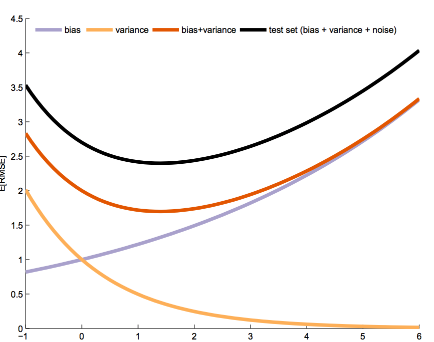
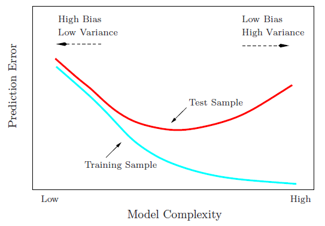
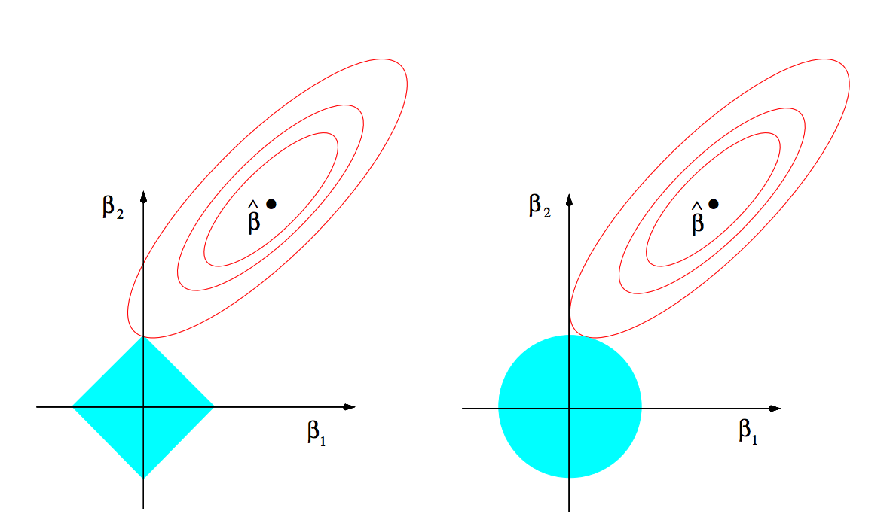
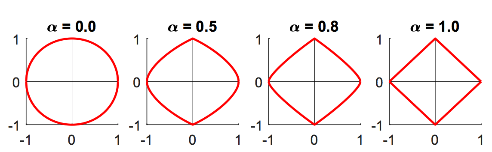
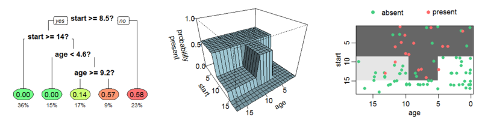

# Roadmap

1. Intro to machine learning
2. Supervised methods, validation, and cross-validation
4. Unsupervised methods

---

# What is machine learning?

Machine learning is an algorithmically-driven way to .hi-blue[predict] outcomes

--

Unlike standard econometrics, we aren't as interested in unbiased estimators or causality

--

We just care about getting the prediction right and it working rather than having formal statistical properties

--

.hi-blue[We want a good prediction of y, not good estimates of coefficients]

--

Econometricians are finding ways to do both (double selection, double ML, trees for heterogeneous causal effects, etc)

---

# Terminology

You'll run into terms that have similar meaning to what we use in economics 

1. .hi-blue[Features]: regressors, your $x$s
2. .hi-blue[Supervised learning]: settings where we have an outcome $y$ and a set of features $x$, this will be called regression if $y$ is continuous, or classification if $y$ is categorical
3. .hi-blue[Unsupervised learning]: settings where we only have features $x$, there's no outcomes!
4. .hi-blue[Training sample]: the partition of the dataset used to estimate the model
5. .hi-blue[Validation sample]: the partition of the dataset used to validate the out-of-sample fit within a fold
6. .hi-blue[Test sample]: The partition of the dataset used to test out-of-sample fit of the final model

---

# The key pieces

.hi-blue[Out-of-sample validation]: we will validate our methods by checking their fit and properties out-of-sample

The fact that we're trying to solve prediction problems is why we can do this: we see the actual realizations of $y$, so that we can test the quality of the fit

For causal inference problems we never observe the true $\beta$ so we can't validate our solutions

We use our training sample to estimate our model and then test it on our test sample

---

# The key pieces

.hi-blue[Regularization]: impose a penalty for overfitting the model

You can get great (perfect) in-sample prediction by having $N=K$

The problem is that this will lead to an over-fit model that will do very poorly out-of-sample

How much regularization do we want? 

We typically use cross-validation methods to help us choose

---

# The key pieces

.hi-blue[Scalability]: can handle a lot of data $N$ or $K$

Could have thousands of features, billions of observations

Having parallelizable algorithms is important

---

# The key pieces

.hi-blue[Bias-variance trade-off]: expected mean squared error (MSE) of a prediction is a combo of bias and variance

Typically as economists we want low (zero) bias estimators because we care about the sign and interpretation of coefficients

If we want a good prediction of $y$, we may be willing to allow more bias to reduce variance and decrease MSE

\begin{align}
  E(y-\hat{f}(x)^2) 
    &= E[y^2] + E[\hat{f}^2] - 2[Ey\hat{f}]\\
    &= var(y) + E[y^2] + var(\hat{f}) + E[\hat{f}^2] - 2fE[\hat{f}] \\
    &= var(y) + var(\hat{f}) + (f-E[\hat{f}])^2 \\
    &= \sigma^2 + variance + bias^2
\end{align}

---

# Bias-variance trade-off

<div align="center">
  
</div>

---

# Bias-variance trade-off

<div align="center">
  
</div>

---

# Shrinkage/regularization methods

One way to reduce variance is to shrink the $\beta$s, or even set some to zero $(var(0) = 0)$

A common way we implement this is by penalizing deviation in $\beta$s different than zero:

$$\min_{\beta} \sum_{i=1}^N \left(y_i - (\alpha_0 + x_i' \beta) \right)^2 + \lambda \times Penalty(\beta \neq 0)$$

If we set estimates to zero we will end up with .hi-blue[sparse] representations

Bet on the .hi-blue[sparsity principle]: use a procedure that does well in sparse problems, since no procedure does well in dense problems (Hastie, Tibshirani and Wainwright 2015)

---

# Shrinkage/regularization methods

There are three common specifications for this approach depending on how we specify the penalty function

- .hi-blue[Ridge regression]: Penalty = $\sum_l \beta^2_l$
- .hi-blue[Least Absolute Shrinkage and Selection Operator (LASSO)]: Penalty = $\sum_l |\beta_l|$
- .hi-blue[Elastic Net]: Penalty = $(1-\alpha)\sum_l \beta^2_l + \alpha\sum_l |\beta_l|$

---

# Ridge regression

$$\min_{\beta} \sum_{i=1}^N \left(y_i - (\alpha_0 + x_i' \beta) \right)^2 + \lambda\sum_l \beta^2_l$$

$$\min_{\beta} \sum_{i=1}^N \left(y_i - (\alpha_0 + x_i' \beta) \right)^2 + \lambda (||\beta||_2)^2$$

Ridge regression penalizes coefficients based on their $L_2$ norm, this tends to .hi-red[shrink] coefficients toward zero

It rarely sets coefficients exactly equal to zero since the penalty is smooth

It does a good job with fixing ill-conditioning problems and in cases where $K>N$

It also has a closed form solution: $\hat{\beta} = (X'X + \lambda I)^{-1} X'Y$

---

# Ridge regression

Ridge has a nice Bayesian interpretation

If 

- The prior distribution of $\beta$ is $\mathcal{N}(0,\tau^2 \times I)$
- The error term is distributed $\mathcal{N}(0,\sigma^2)$
- $\lambda = \sigma^2/\tau^2$

Then

$\hat{\beta}_{ridge}$ is the posterior mean, median, and mode

---

# Sidebar: normalization

When regularizing we generally want to normalize our features and outcome

Why?

If features vary dramatically in magnitude or have different scales (dollars of GDP vs percent GDP), variables that are numerically large will get penalized more just because of their units

If we set all variables to mean zero, variance one they are on a common playing field for regularization

Regularizing the outcome will get rid of the intercept term as well

For ridge, normalizing results in coefficients being shrunk by a factor of $1/(1+\lambda)$

---

# LASSO

$$\min_{\beta} \sum_{i=1}^N \left(y_i - (\alpha_0 + x_i' \beta) \right)^2 + \lambda\sum_l |\beta_l|$$

$$\min_{\beta} \sum_{i=1}^N \left(y_i - (\alpha_0 + x_i' \beta) \right)^2 + \lambda ||\beta||_1$$

LASSO penalizes coefficients based on their $L_1$ norm, this tends to .hi-red[select] a subset of ceofficients, i.e. it sets a number of them equal precisely to zero and generates a sparse solution

LASSO is generally used for variable or model selection

LASSO has no analytic solution, need to use convex optimization routines


---

# LASSO

LASSO also has a nice Bayesian interpretation

If 

- The prior distribution of $\beta$ is Laplacian
- The error term is distributed $\mathcal{N}(0,\sigma^2)$

Then

$\hat{\beta}_{ridge}$ is the posterior mode

---

# $L_p$ regularization

$$\min_{\beta} \sum_{i=1}^N \left(y_i - (\alpha_0 + x_i' \beta) \right)^2 + \lambda (||\beta||_p)^{1/p}$$

Ridge and LASSO are special cases of a general $L_p$ regularizer

Another special case is subset selection is we use the $L_0$ norm

.hi-blue[Subset selection] induces the estimates to be the OLS estimates but it is computationally tough to solve so it is not often used

---

# Ridge vs LASSO

One way to reframe ridge and LASSO are as their dual, constrained problems:

Ridge: $$\min_{\beta} \sum_{i=1}^N \left(y_i - (\alpha_0 + x_i' \beta) \right)^2 \text{ subject to } \sum_l \beta^2_l \leq s$$

LASSO: $$\min_{\beta} \sum_{i=1}^N \left(y_i - (\alpha_0 + x_i' \beta) \right)^2 \text{ subject to } \sum_l |\beta_l| \leq s$$

We can then plot the constraints and the contours of the unconstrained problem to see how they differ

---

# Ridge vs LASSO

<div style="float: right">
  
</div>

LASSO induces a constraint set with kinks at $x_1=0; x_2=0, ...$

$\rightarrow$ solutions will generally be at the kinks and we get lots of zero coefficients

Ridge induces a spherical constraint set, it tends to shrink coefficients toward zero without setting them exactly to zero

---

# Elastic Net

$$\min_{\beta} \sum_{i=1}^N \left(y_i - (\alpha_0 + x_i' \beta) \right)^2 + \lambda [(1-\alpha)(||\beta||_2)^2 + \alpha||\beta||_1]$$

Elastic net tries to get the best of both ridge and LASSO by using a convex combination of their penalties

LASSO has one big problem:

.hi-blue[Selection with Collinearity]: if features are highly correlated LASSO tends to select one and ignore the others

The ridge penalty helps get around these issues by allowing us to select multiple of the correlated variables

---

# Elastic Net

<div align="center">
  
</div>

---

# Validation and cross-validation

One thing we haven't discussed yet is how we select $\lambda$, our penalty parameter

Big lambdas tend to result in a lot of shrinkage and sparsity,  
as $\lambda \rightarrow 0$ our solution approaches the OLS solution

There are two general ways to select $\lambda$

1. Select model with lowest AIC/BIC/other plug-in criterion
    - This uses no out-of-sample information for selection but is fast
2. Cross-validate by testing on our hold-out test sample
    - Variants of cross-validation are most commonly used

---

# Cross-validation

When we perform cross-validation we split our sample into three different pieces: a training sample, a validation sample, and a test sample

First you randomly allocate some fraction of your data to the test sample

Next you perform cross-validation on the remaining data

A common way to do this is called .hi-blue[k-fold cross-validation]

---

# k-fold cross-validation

In k-fold cross-validation we do the following:

- Create a grid of $\lambda$s
- For each $\lambda$:
    - Split data into $k$ mutually-exclusive folds of about equal size, usually choose $k=5,10$
    - For $j=1,...,k$
        - fit the model using all folds but fold $j$
        - Predict out-of-sample on fold $j$
    - Compute average mean squared prediction error across the $k$ folds: $\bar{Q}(\lambda) = \frac{1}{k}\sum_{j=1}^k \sum_{i \in \text{fold j}} \left(y_i - (\alpha_0 + x_i' \beta) \right)^2 + \lambda ||\beta||_1$
- Choose $\hat{\lambda}_{min} = argmin_{\lambda} \bar{Q}(\lambda)$ or to avoid modest overfitting   
choose the largest $\lambda$ such that $\bar{Q}(\lambda) \leq \hat{\lambda}_{min} + \sigma_{\hat{\lambda}_{min}}$ (1 standard deviation rule)

---

# Supervised learning examples: Preliminaries

We need `tidyverse` to work with the data, `glmnet` to do the ML, , `caret` to do some higher-level tuning, and `tidymodels` to use a similar grammar and structure to `tidyverse`

We will be working with the mtcars dataset
```{r, echo = FALSE}
if (!require("pacman")) install.packages("pacman")
pacman::p_load(tidymodels, tidyverse, glmnet, caret)
set.seed(123)
```
```{r, eval = FALSE}
if (!require("pacman")) install.packages("pacman")
require(devtools)
devtools::install_github("tidymodels/tidymodels")
pacman::p_load(tidymodels, tidyverse, glmnet)
set.seed(123)
```

---

# Supervised learning examples: Preliminaries

```{r}
mtcars <- mtcars %>% as_tibble()
mtcars
```

---

# Supervised learning example: pre-processing

```{r}
y <- mtcars %>% # center and scale y's, glmnet will center and scale Xs
  select(mpg) %>% 
  scale(center = TRUE, scale = FALSE) %>% 
  as.matrix()
X <- mtcars %>% 
  select(-mpg) %>% 
  as.matrix()
```

---

# Ridge regression with glmnet

```{r}
lambdas_to_try <- 10^seq(-3, 5, length.out = 100) # penalty parameter grid
ridge_cv <- cv.glmnet(X, y, 
                      alpha = 0, # alpha is the elastic net parameter, 0 -> ridge
                      lambda = lambdas_to_try, # lambda grid
                      standardize = TRUE, # standardize X's
                      nfolds = 10) # number of CV folds
```

---

# Ridge regression with glmnet
Here's MSE as a function of the choice of $\log(\lambda)$, notice we keep all variables
```{r, echo = F, fig.align = 'center'}
plot(ridge_cv)
```

---

# Ridge regression with glmnet

```{r, fig.align = 'center'}
res_ridge <- glmnet(X, y, alpha = 0, lambda = lambdas_to_try, standardize = TRUE)
plot(res_ridge, xvar = "lambda")
legend("bottomright", lwd = 1, col = 1:6, legend = colnames(X), cex = .7)
```

---

# LASSO with glmnet

```{r}
lambdas_to_try <- 10^seq(-3, 5, length.out = 100) # penalty parameter grid
lasso_cv <- cv.glmnet(X, y, 
                      alpha = 1, # alpha is the elastic net parameter, 1 -> LASSO
                      lambda = lambdas_to_try, # lambda grid
                      standardize = TRUE, # standardize X's
                      nfolds = 10) # number of CV folds
```

---

# LASSO with glmnet
Here's MSE as a function of the choice of $\log(\lambda)$, LASSO generates sparse solutions
```{r, echo = F, fig.align = 'center'}
plot(lasso_cv)
```

---

# LASSO with glmnet

```{r, fig.align = 'center'}
res_lasso <- glmnet(X, y, alpha = 1, lambda = lambdas_to_try, standardize = TRUE)
plot(res_lasso, xvar = "lambda")
legend("bottomright", lwd = 1, col = 1:6, legend = colnames(X), cex = .7)
```

---

# Elastic net with glmnet

```{r}
lambdas_to_try <- 10^seq(-3, 5, length.out = 100) # penalty parameter grid
elastic_net_cv <- cv.glmnet(X, y, 
                      alpha = 0.45, # alpha is the elastic net parameter
                      lambda = lambdas_to_try, # lambda grid
                      standardize = TRUE, # standardize X's
                      nfolds = 10) # number of CV folds
```

---

# Elastic net with glmnet
Here's MSE as a function of the choice of $\log(\lambda)$, elastic net generates sparse solutions
```{r, echo = F, fig.align = 'center'}
plot(elastic_net_cv)
```

---

# Elastic net with glmnet

```{r, fig.align = 'center'}
res_en <- glmnet(X, y, alpha = 0.45, lambda = lambdas_to_try, standardize = TRUE)
plot(res_en, xvar = "lambda")
legend("bottomright", lwd = 1, col = 1:6, legend = colnames(X), cex = .7)
```

---

# Elastic net with caret

Elastic net has a second hyper-parameter, $\alpha$ that we can tune in addition to $\lambda$

`glmnet` doesn't let you tune both, but `caret` does

```{r}
train_control <- trainControl(method = "cv", # use repeated cv
                              number = 10, # number of folds
                              search = "random",
                              verboseIter = TRUE)
```

---

# Elastic net with caret

use `train` to train the model in `caret` using `glmnet`
```{r, fig.align = 'center'}
elastic_net_model <- train(mpg ~ .,
                           data = cbind(y, X), # data
                           method = "glmnet", # use glmnet package
                           preProcess = c("center", "scale"), # already centered and scaled
                           tuneLength = 100, # 100 point grid for tuning parameters
                           trControl = train_control)
```

---

# Elastic net with caret
We can figure out the best set of tuning parameters by looking at `bestTune`
```{r, fig.align = 'center'}
elastic_net_model$bestTune
```

Here we selected something close to ridge regression

---

# Elastic net with caret

```{r, fig.align = 'center'}
plot(elastic_net_model)
```

---

# Non-parametric regression: Regression Trees

.hi-blue[Regression trees] sequentially split the feature space into subspaces where the function is estimated as the average outcome for units with features in that subspace

--

These are called .hi-blue[trees] because the splitting is sequential, one feature at a time, so when you plot all the splits it begins to look like an upside down tree where

Each split is called a .hi-blue[node], and the first split is called your .hi-blue[root node]

Each terminal point of your tree is called a .hi-blue[leaf node]

--

Trees effectively partition the space into a bunch of hyperrectangles in a way that reduces RSS

---

# Growing a regression tree

How do we grow our regression tree?

1. Let $g(x) = \bar{y}$ and let the sum of squared errors be 
$$Q(g) = \sum_{i=1}^N(y_i-g(x_i))^2 = \sum_{i=1}^N (y_i - \bar{y})^2$$

2. For a feature $j$ and split point $s$ consider splitting the data depending on whether $x_{i,j} \leq s$ or $x_{i,j} > s$, and let $\bar{y}_{left}$ and $\bar{y}_{right}$ be the average values in the two subspaces

3. If $x_j \leq t$ let $g_{j,t}(x) = \bar{y}_{left}$ else $g_{j,t}(x) =\bar{y}_{right}$
4. Find the $j^*,s^* = argmin_{j,s} Q(g_{j,s}(\cdot))$

---

# Growing a regression tree

This gives us the covariate $j^*$ to split, and where to split it into separate subspaces $s^*$ in order to minimize the sum of squared errors

This first split will end up being our root node

We then continue this process for each of the subspaces, splitting on the best covariates and creating new nodes and growing our tree

--

This is called a .hi-blue[greedy] approach because we are selecting the best split at each step instead of looking ahead

---

# What do regression trees look like?

Whats the probability of kyphosis after surgery given age and the starting vertabrae?

<div align="center">
  
</div>

The left shows the tree diagram

The middle shows the actual regression function

The right shows a 2d projection of the regression function where darker colors are higher probabilities

---

# Regularizing regression trees

If we just followed the regression tree algorithm we could minimize error by splitting until there is just one observation in each feature subspace, this will have perfect in-sample prediction but terrible out-of-sample prediction

--

We solve this problem similar to how we did linear regression: we penalize complexity (the number of leaves)

$$Q(g) + \lambda \cdot \#leaves$$

The penalty (if large enough) will keep the tree from having too many nodes

---

# Cross-validating trees

How do we choose $\lambda$? Basically the same way as we did for linear regression

- Create a grid of $\lambda$s
- For each $\lambda$:
    - Split data into $k$ mutually-exclusive folds of about equal size, usually choose $k=5,10$
    - For $j=1,...,k$
        - Grow the tree using all folds but fold $j$
        - Predict out-of-sample on fold $j$
    - Compute squared prediction error across the $k$ folds: $Q(\lambda) = \sum_{j=1}^k \sum_{i \in \text{fold j}} \left(y_i - g(j,\lambda)\right)$
- Choose $\hat{\lambda}_{min} = argmin_{\lambda} Q(\lambda)$

---

# Pruning trees

Using this simple cross-validation approach may stop growing the tree too early, one split may not help immediately, but it may help us find future profitable splits 
    - This is a drawback of a greedy algorithm

This suggests that one way we can improve is by .hi-blue[pruning] the tree

1. Grow a big tree, select some rule to stop like 5 observations per leaf, or a very small $\lambda$
2. Prune branches or leaves that don't improve the prediction by a sufficient amount

---

# Pruning trees: examples

The simplest way to prune is called .hi-blue[reduced error pruning]

It works as follows

1. Starting at the leaves, remove each node
2. Check if prediction accuracy on the validation sample is the same or better
3. If 2 is true, remove the node
4. Continue until we cannot improve the tree any further

This is simple and fast

There are other more complex ways to prune (e.g. cost complexity)

---

# Bagging predictors

Single trees typically are not great predictors 

--

One way to improve upon a single tree is to bootstrap aggregate (bag) a prediction

--

This generally reduces variance and helps with avoiding overfitting

--

Bagging is easy:

1. Bootstrap resample B datasets
2. Estimate a tree on each dataset (can use data-driven cross-validation, pruning, whatever)
3. Average all the predictions: $\frac{1}{B}\sum_{j=1}^B g_j(x)$

--

This only matters because trees are non-linear,  
so bagging smooths out the end predictions

---

# Random forests

The problem with bagging is that the $B$ bagged estimated are correlated

Important regressors will always appear near the top of the tree in the bootstrapped samples

This means all the trees will look similar

Predictions won't actually be as good as you might think

How can we break this correlation?

---

# Random forests

Randomly select only $L$ out of $K$ features: feature bagging

--

How big should $L$ be?

--

Not obvious, no real theoretical guidance

--

For classification problems $\sqrt{K}$ is recommended

For regression $K/3$ is recommended

---

# Boosted trees

.hi-blue[Boosting] is another method to improve prediction from weak learners (better than random chance predictors)

--

We can improve on a regression tree by repeatedly applying shallow trees to residualized data

Let $g(x|X,Y)$ be a simple regression tree

--

Define the residual as $\varepsilon{1i} = Y_i - g_1(X_i|X,Y)$

--

With a boosted tree we then estimate a regression tree on the new data $(X,\varepsilon_{1})$

---

# Boosted trees

Repeat this process many times to get a set of $g$s

--

These give you an additive approximation to the actual regression tree:
$$\sum_{m=1}^M g_m(x|X,\varepsilon_{m-1}) = \sum_{k=1}^K h_k(x_k) \text{ where } \varepsilon_0 = Y$$

--

By continually residualizing and re-estimating, its like we are adding functions $h_k$ sequentially to our regression

--

When boosting, we typically use shallow trees of only around 4-8 splits, but we grow many, many trees

--

We generally fix tree depth but select number of trees in a quasi-cross-validation procedure

---

# Trees examples: Preliminaries

We need `ISLR` to get our dataset, `tree` to do the regression tree, `MASS` for our random forest dataset, and `randomForest` to estimate a random forest

We will be working with the carseats dataset
```{r, echo = FALSE}
if (!require("pacman")) install.packages("pacman")
pacman::p_load(ISLR, tree, randomForest, gbm, tidyverse)
set.seed(123)
```
```{r, eval = FALSE}
if (!require("pacman")) install.packages("pacman")
pacman::p_load(ISLR, tree, randomForest, gbm, tidyverse)
set.seed(123)
```


---

# Supervised learning examples: Preliminaries

```{r}
carseats <- Carseats %>% as_tibble()
carseats
```

---

# Supervised learning example: estimating a tree

Lets estimate our regression tree with car sales as the outcome

```{r}
tree_carseats <- tree(Sales ~ ., data = carseats)
summary(tree_carseats)
```

---

# Supervised learning example: the tree

```{r, fig.align = 'center', fig.width = 15, fig.height = 7.5}
plot(tree_carseats)
text(tree_carseats, pretty = 0)
```

---

# Supervised learning example: the tree

```{r, fig.align = 'center', fig.width = 15, fig.height = 7}
set.seed(101)
train <- sample(1:nrow(carseats), 320)
tree_carseats <- tree(Sales ~ ., carseats, subset = train)
plot(tree_carseats)
text(tree_carseats, pretty = 0)
```

---

# Supervised learning example: the tree's error

```{r, fig.align = 'center', fig.width = 15, fig.height = 7}
tree_pred <- predict(tree_carseats, carseats[-train,])
mse <- mean((carseats[-train,]$Sales - tree_pred)^2)
mse
```

---

# Supervised learning example: cross-validation

```{r, fig.align = 'center'}
cv_carseats = cv.tree(tree_carseats)
plot(cv_carseats)
```

---

# Supervised learning example: pruning

```{r, fig.align = 'center'}

set.seed(123)
prune_carseats <- prune.tree(tree_carseats, best = 10)
plot(prune_carseats)
text(prune_carseats, pretty = 0)
```

---

# Supervised learning example: pruning

```{r, fig.align = 'center'}
tree_pred_prune = predict(prune_carseats, carseats[-train,])
mse_prune <- mean((carseats[-train,]$Sales - tree_pred_prune)^2)
mse
mse_prune
```

---

# Supervised learning example: random forests

```{r, fig.align = 'center'}
set.seed(101)
train = sample(1:nrow(carseats), 320)
rf_carseats = randomForest(Sales~., data = carseats, subset = train)
rf_carseats
mse
mse_prune
```

---

# Random forests: variable importance

```{r, fig.align = 'center'}
varImpPlot(rf_carseats)
```

---

# Random forests: tuning feature bagging

```{r, fig.align = 'center'}
oob_err = double(10)
test_err = double(10)
for (mtry in 1:10) {
  set.seed(101)
  fit = randomForest(Sales~., data = carseats, subset = train, mtry = mtry, ntree = 350)
  oob_err[mtry] = mean(fit$mse)
  pred = predict(fit, carseats[-train,])
  test_err[mtry] = with(carseats[-train,], mean( (Sales - pred)^2 ))
}
```

---

# Random forests: tuning feature bagging

```{r, fig.align = 'center'}
matplot(1:mtry, cbind(test.err, oob.err), pch = 23, col = c("red", "blue"), type = "b", ylab = "Mean Squared Error")
legend("topright", legend = c("OOB", "Test"), pch = 23, col = c("red", "blue"))
```

---

# Boosted trees

```{r, fig.align = 'center'}
boost_carseats = gbm(Sales~., data = carseats[train,], 
                     distribution = "gaussian", n.trees = 10000, shrinkage = 0.01, interaction.depth = 4)
summary(boost_carseats)
```

---

# Boosted trees, the important variables

```{r, fig.align = 'center'}
plot(boost_carseats, i = "Price")
plot(boost_carseats, i = "CompPrice")
```

---

# Boosted trees, prediction error

```{r, fig.align = 'center', fig.width = 8, fig.height = 6}
n_trees = seq(from = 100, to = 10000, by = 100)
predmat = predict(boost_carseats, newdata = carseats[-train,], n.trees = n_trees)
boost_err = with(carseats[-train,], apply( (predmat - Sales)^2, 2, mean) )
plot(n_trees, boost_err, pch = 23, ylab = "Mean Squared Error", xlab = "# Trees", main = "Boosting Test Error")
abline(h = min(test_err), col = "red")
```


---

# Econ-specific stuff

Often times we may want to predict using FEs

Aproblem with LASSO is that it may only select a few of them (recall they're just a vector of dummy variables)

How do we force LASSO to either select all or none?

.hi-blue[Group LASSO]